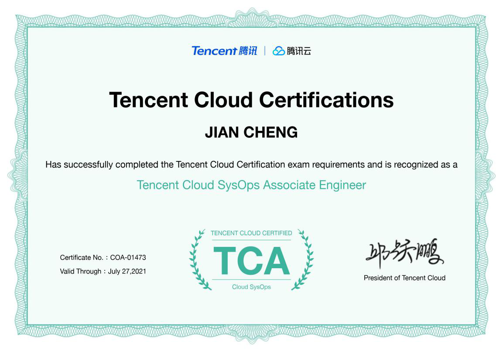

# 个人简历 - 程健

## 求职意向: 交付架构师

## 基本信息

- 年龄：`25`

- 地址：深圳

- 电话：`18317938235`

- 邮箱：[esimesest@gmail.com](esimesest@gmail.com)

- 主页：[github.com](https://github.com/esimest)

## 自我评价

&nbsp;　　我是一名具备较高综合技术水平的交付运维工程师。曾参与过多个 
项目的运维与交付工作，具备多个项目的部署、运维工具的开发经验， 
拥有多个规模不一的集群运维管理经验。具备较强的突发问题处理能力、 
良好的沟通能力与高效的执行力。热爱开源技术，勤奋好学，具备刻苦的 
钻研精神，乐于探索新兴技术。

## 专业技能

- 熟悉 `Ansible` 进行批量自动化管理；

- 熟悉腾讯云产品与微瓴平台的使用与架构；

- 熟悉 `Linux` 及各种常用服务的运维管理与性能优化；

- 熟悉 `Kubernetes` 架构原理与云原生生态，有多个实际项目经验；

- 熟悉 `Kubeadm`、`Helm`、`Harbor` 等 `Kubernetes` 生态相关组件；

- 熟悉 `Flask` `requests` `sqlalchemy` 等常用 `Python` 模块与框架；

- 熟悉 `Kafka`、`ZooKeeper`、`ETCD`、`Redis` 等中间件的使用与工作原理；

- 熟悉 `Python`/`Go`/`Shell` 等开发语言，具备良好的代码规范与源码阅读能力；

## 工作经验

### 华云中盛科技股份有限公司　　2019.3 - 至今　交付&运维工程师

工作职责：

- 负责相关产品的部署、运维工具的开发；

- 负责容器云平台的部署、配置及性能调优；

- 负责相关产品的实施上线、及故障排除和处理；

### 深圳市思乐数据技术有限公司　2018.6 - 2019.3　运维开发工程师

工作职责：

- 负责 Web 服务与数据库服务的运维；

- 负责参与产品的部分功能模块的开发；

- 负责相关应用与服务器的运维及运维工具的开发；

## 项目经历

### tops(TCNP Operations)开发　　　　　　　　华云中盛　　　　2020.1 - 至今

项目描述：

  &nbsp;　　 `tops` 是一个使用 `Ansible` `、Shell` 开发的用于运维 `TCNP` 平台的工具。该 
   工具包含平台的日常运维及管理功能，如：K8S 集群的生命周期管理，镜像更新、 
   集群资源 (deployment/statefulset/daemonset) 版本管理等。

项目职责(开发)：

- 应用组件的 `hlem chart` 及版本管理脚本开发；

- 使用 `Ansible` 进行容器集群与应用组件的管理工具开发；

- 根据相关运维文档，提取核心运维逻辑进行相关 Shell 脚本开发；

项目职责(运维):

- 更新、维护集群运维管理文档；

- 负责平台集群的部署与运维管理；

### 微瓴产品交付　　　　　　　　华云中盛　　　　2019.10 - 2019.12

项目职责：

- 负责项目交付的计划排期与问题跟进；

- 负责所有子系统与服务器的交付阶段的运维；

- 负责与客户和各个子系统对接人一起协同完成产品的交付；

- 负责部分子系统的高可用架构调整与根据客户需求的改变及时输出解决方案；

###  专有云产品升级与扩容　　　　华云中盛　　　　2019.4 - 2019.9

项目职责：

- 负责产品部署工具及运维工具的开发；

- 负责两个集群的支撑组件的分布式改造；

- 负责部署新集群的管理平台（`Kubernetes` 集群）的部署；

- 负责新集群的支撑组件（`MySQL` `ZooKeeper` `HDFS`...）的部署；

- 负责部分云产品组件（前端组件，存储组件，平台管理组件）的升级；

### E 乐福产品运维开发　　　　　思乐数据　　　　2018.6 - 2019.3

项目介绍：

  该系统主要目的是将移动互联网技术融合到维修、耗材、咨询等业务各环节上， 
  使得客户与服务提供商在业务处理上更加高效、便捷；

项目职责(开发)：

- 文件迁移与数据同步工具开发；

- 负责产品部分 `Python` 功能模块的开发；

- 根据项目组提出的需求，开发相应产品运维工具；

- 使用 `js`/`html`/`css`/`Flask` 进行报表前端页面开发；

- 服务器监控工具开发，主要用于收集服务器资源使用情况并生成相应的报表；

项目职责(运维):

- 负责服务应用于数据库的运维管理；

- 负责产品所涉及的云服务器与资源的运维管理；

## 教育

### 江西农业大学　　　　信息与计算科学专业　　　2014 - 2018

## 专业证书

