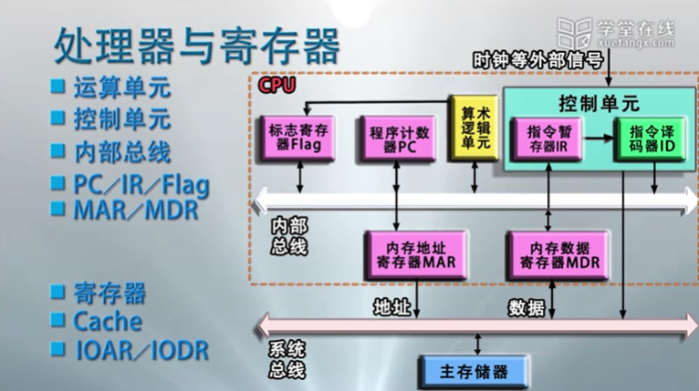
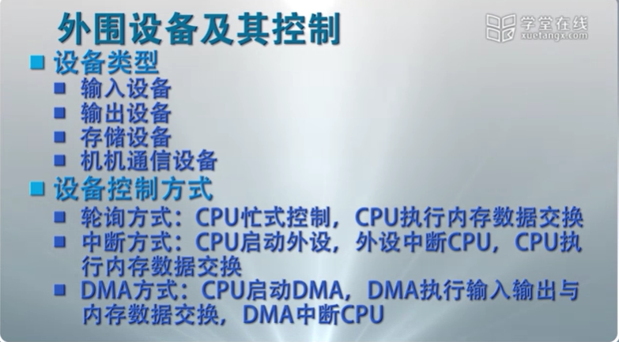
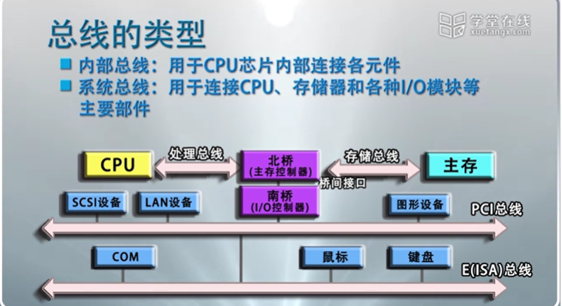
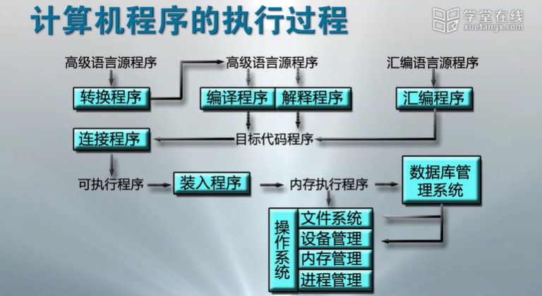

# 计算机系统

计算机系统由硬件子系统和软件子系统组成

## 硬件子系统

硬件子系统:

由借助电, 磁, 光, 机械等原理构成的各个硬件部件的有机结合, 是*计算机系统功能做的实体*.

### 存储程序计算机(冯诺依曼计算机)

1. 以运算单元为中心, 控制流由指令流产生

2. 采用存储程序原理, 面向主存组织数据流

3. 主存是按地址访问, 线性编制的空间

4. 指令由操作码和地址码组成

5. 数据以二进制编码

### CPU(中央处理器)

- 运算逻辑部件
   > 用于执行具体的机器指令

- 寄存器部件
   > 用于在指令执行过程中存放指令, 操作数和中间结果

- 控制部件
   > 实现各部件间联系的数据, 控制及状态的内部总线.
   > 负责对指令译码.
   > 发出为完成每条执行所要执行的操作的控制信号.
   > 实现数据传输.

### 存储器

用于存储正在执行的程序和数据

- CPU 内部的存储器
  1. L0 寄存器
  2. L1 Cache
  3. L2 Cache
  4. L3 Cache

- L4 主存

- L5 SSD

- L6 本地外存储

- L7 远程外存储

### 外围设备

外围设备包括输入输出设备, 存储设备以及网络通信设备等.

### I/O 控制系统

### 总线(Bus)

计算机的硬件设备通过总线进行连接.
按照所传输的信息种类, 总线包括一组控制线, 一组数据线和一组地址线.

1. 总线是计算机各个功能部件之间传送信息的公共通信干线, 它是 CPU, 内存, 输入输出设备传递信息的公用通道.

2. 计算机的各个部件通过总线相连接, 外围设备通过相应的接口电路再与总线相连接, 从而形成了完整的计算机硬件系统.

- 内部总线(处理内部)
   > 用于连接 CPU 各内部元件

- 系统总线
   > 用于连接 CPU 处理器和各中 I/O 模块

- 通信总线
   > 用于计算机之间通信

## 软件子系统

软件:

各种程序与文件, 用于指挥计算机系统按指定的要求进行协同工作.

### 系统软件

系统软件主要的系统软件包括**操作系统**, 实用程序, 语言处理程序, 数据库管理系统

#### 操作系统

操作系统使计算机系统最基础的系统软件, 管理软硬件资源, 控制程序的执行,
改善人机界面, 合理组织计算机工作流程, 为用户使用计算机提供良好运行环境.

#### 实用程序

为方便用户方便所设置的操作系统外围的扩展程序, 如文本编辑器.

#### 语言处理程序

负责把由汇编语言/高级语言编写的程序, 翻译成可执行的机器语言程序.

### 支撑软件

支撑软件主要有接口软件, 工具软件, 环境数据库等。用于支持用户使用计算机的环境, 提供开发工具.

### 应用软件
