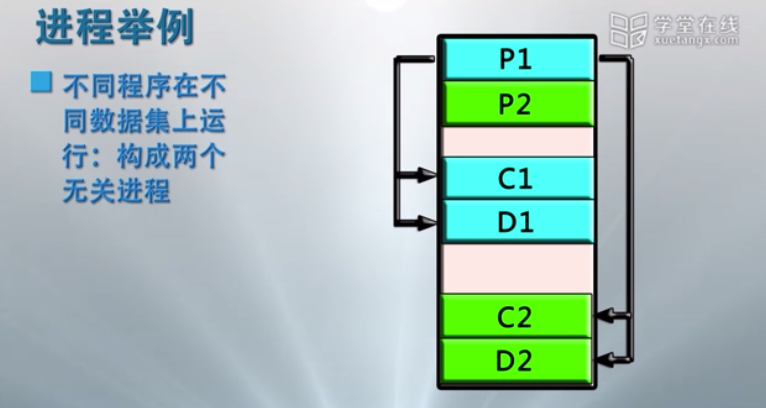
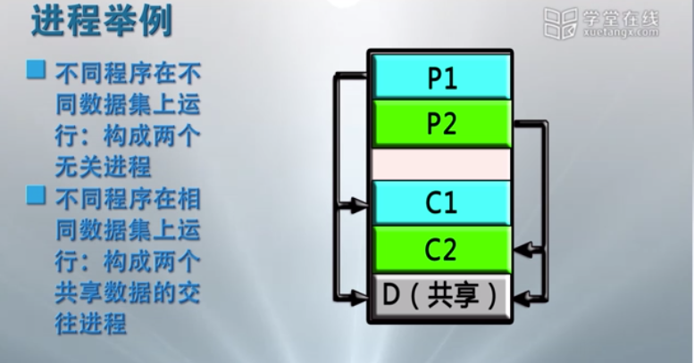
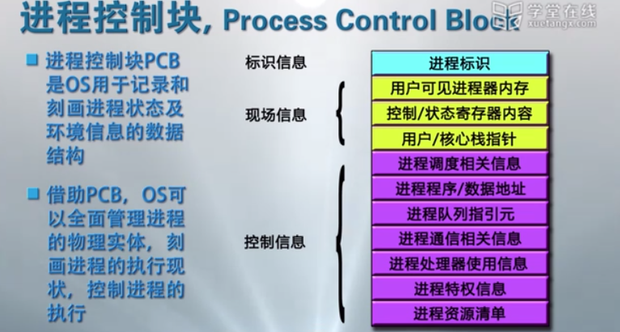
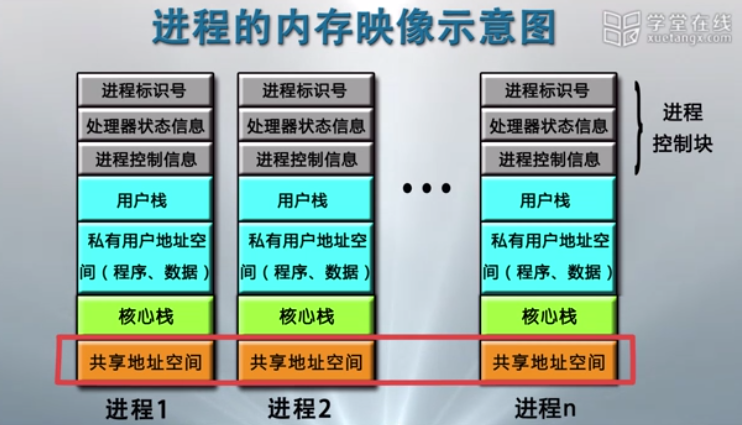
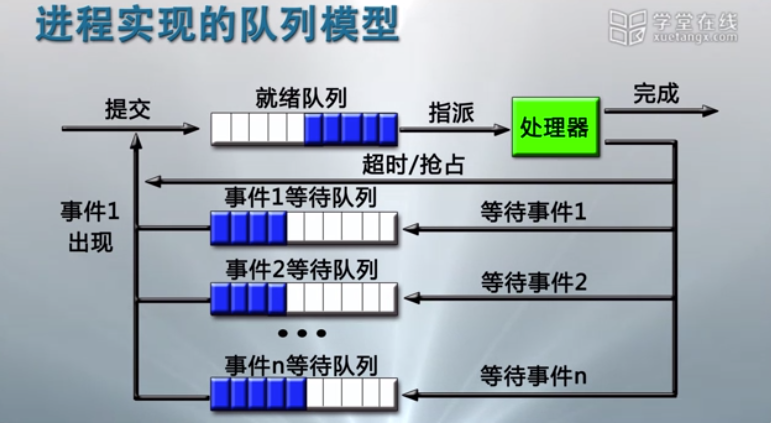
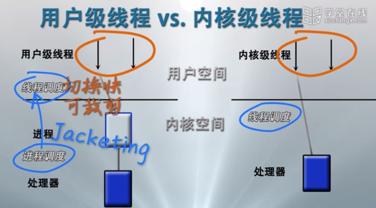
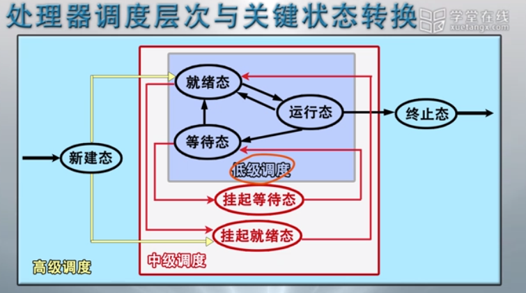
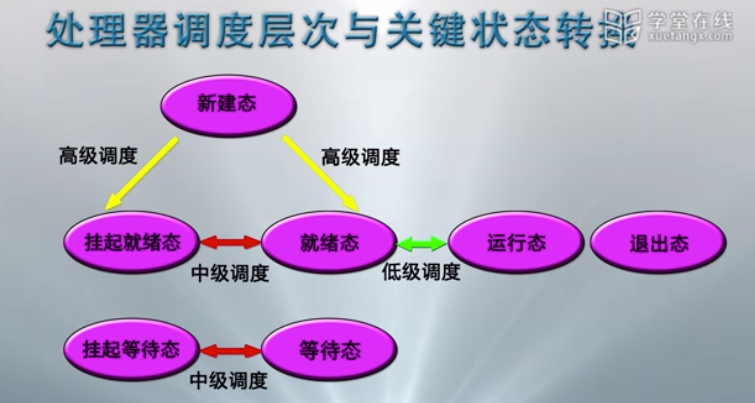

# 进程

## 概念提出

操作系统必须全方位的管理计算机系统中运行的程序.
因此, 操作系统为正在运行的程序建立一个管理实体 -- 进程.

## 概念

- 进程是一个具有一定独立功能的程序关于某个数据集合的一次运行活动.

- 进程是操作系统进行资源分配和调度的一个独立单位.

### 进程实体

一个进程包括五个实体部分:

- (OS 管理运行程序的) 数据结构 `P`;

- (运行程序的) 内存代码 `C`;

- (运行程序的) 内存数据 `D`;

- (运行程序的) 通用寄存器信息 `R`;

- (OS 控制程序执行的) 程序状态字信息 `PSW`;

## 进程举例

下述举例中提到的程序与数据集均为内存级别的;
对于外存级别的相同程序文件，在不同时刻运行所产生的 `P C D R PSW` 都是不同的,
所以两次运行构成的是不同的进程;

### 数据独立进程

不同程序在不同数据集上运行: 构成两个无关进程.

### 共享数据进程

不同程序在相同数据集上运行: 构成两个共享数据的交往进程.

### 共享代码进程

相同代码在不同数据集上运行: 构成两个共享代码的无关进程;
共享的代码称为可再入程序, 如编辑器;
可再入程序必须是纯代码的(不包含任何局部变量);

## 概念级进程状态

- 运行态:

      指进程占有处理器运行.

- 就绪态:

      指进程具备运行条件等待处理器运行.

- 等待态:

      指进程等待资源, 输入输出, 信号等而不具备运行条件.

- 挂起态:

      进程暂时无法申请计算资源, 不能参加调度, 等待合适的时候再调入内存, 恢复资源, 参与调度.

挂起态进程不占用资源, 等待态进程占用已经申请到的资源.

.png)
.png)

## 进程控制块(Process Control Bolck)

进程控制块 (PCB) 是 OS 用于记录和刻画进程状态及环境信息的数据结构;

借助 PCB, OS 可以全面管理进程的物理实体, 刻画进程的执行状态, 控制进程的执行;

### 标识信息

用于存放唯一标识该进程的信息, 包含:

- 系统分配的标识号;

- 系统分配的进程组标识号;

- 用户定义的进程名;

- 用户定义的进程组名;

### 现场信息

用于存放该进程运行时的处理器现场信息, 包含:

- 用户可见寄存器内容: 数据寄存器, 地址寄存器;

- 控制与状态寄存器内容: PC, IR, PSW...;

- 栈指针内容: 核心栈与用户栈指针;

### 控制信息

用于存放, 与`管理, 调度`进程相关的信息, 包含:

- 调度相关信息: 状态, 等待事件/等待原因, 优先级;

- 进程组成信息: 代码/数据地址, 外存映像地址;

- 队列指引元: 进程队列指针, 父子兄弟进程指针;

- 通信相关信息: 消息队列, 信号量, 锁;

- 进程特权信息: 内存访问权限, 处理器特权;

- 处理器使用信息: 占用的处理器, 时间片, 处理器使用时间/已执行总时间, 记账信息;

- 资源清单信息: 正在占有的资源, 已使用的资源;

## 进程映像(Process Image)

PI 是内存级的物理实体.

某一时刻进程的内容及其执行状态集合, 包含:

- 进程控制块: 保存进程的标识信息, 状态信息, 控制信息;

- 进程程序块: 进程执行的程序空间;

- 进程数据块: 进程处理的数据空间, 包括数据, 处理函数的用户栈和可修改的程序;

- 核心栈: 进程在内核模式下运行时使用的堆栈, 中断或系统调用;

## 进程上下文(Process Context)

操作系统中进程实体和支持进程运行的环境合成进程上下文, 包括:

- 用户级上下文: 用户程序, 用户数据区, 用户栈, 用户共享内存;

- 寄存器上下文: PSW, 栈指针, 通用寄存器;

- 系统级上下文: PCB, 内存区表, 核心栈;

## 进程实现的队列模型

## 进程控制管理

- 进程创建:
   > 进程表加一项, 申请 PCB 并初始化, 生成标识, 建立映像, 分配资源, 移入就绪队列;

- 进程撤销:
   > 从队列中移除, 归还资源, 撤销标识, 回收 PCB, 移除进程表项;

- 进程阻塞:
   > 保存现场信息, 修改 PCB, 移入等待队列, 调度其他进程执行;

- 进程唤醒:
   >  等待队列中移出, 修改 PCB, 移入就绪队列 (该进程优先级高于运行进程将出发抢占);

- 进程挂起:
   > 修改状态并出入相关队列, 收回内存等资源送至磁盘缓冲区;

- 进程激活:
   > 分配内存, 修改状态并出入相关队列;

## 进程切换

概念:

   进程切换指从正在运行的进程中收回处理器, 让待运行的进程来占有处理器运行.
   进程切换实质上就是被中断运行进程与待运行进程的上下文切换.

基本过程:

1. 保存被中断进程的上下文;

2. 转向进程调度;

3. 恢复待运行进程的上下文;

进程切换必须在操作系统内核模式下完成, 这就需要模式切换.

模式切换又称为处理器状态切换, 包括:

- 用户模式到内核模式中断/异常/系统调用: 中断用户进程执行而触发.

- 内核模式到用户模式 OS 执行中断返回指令: 将控制权交换用户进程而触发.

中断装置完成正向模式切换, 包括:

1. 处理器模式转为内核模式;

2. 保存当前进程的 PC/PSW 值到核心栈;

3. 转向中断/异常/系统调用处理程序;

中断返回指令完成逆向模式转换, 包括:

1. 从待运行进程核心栈中弹出 PSW/PC 值;

2. 处理器模式转为用户模式;

进程切换的工作过程:

1. (中断/异常等触发) 正向模式切换并压入 PSW/PC;

2. 保存被中断进程的现场信息;

3. 处理具体中断/异常;

4. 把被中断进程的系统堆栈指针 SP 保存到 PCB;

5. 调整被中断进程的 PCB 信息, 如进场状态;

6. 把被中断进程的 PCB 加入相关队列;

7. 选择下一个占用 CPU 运行的进程;

8. 修改被选中进程的 PCB 信息, 如进程状态;

9. 设置被选中进程的地址空间, 恢复存储管理信息;

10. 恢复被选中进程的 SP 到处理器寄存器 SP 中;

11. 恢复被选中进程的现场信息进入处理器;

12. (中断返回执行触发) 逆向模式转换并弹出 PSW/PC

## 单线程结构进程的问题

单线程结构进程在并发程序设计上存在的问题:

1. 进程切换开销大;

2. 进程通信开销大;

3. 限制了进程并发的粒度;

4. 降低了并行计算的效率;

## 多线程结构进程

在多线程环境中, 进程是操作系统中进行保护和资源分配的独立单位.
用来容纳进程映像的虚拟地址空间. 对进程, 文件和设备的存取保护机制.

线程是进程的一条执行路径.
是调度的基本单位, 同一个进程中的所有线程共享进程获得的主存空间和资源.
它具有:

- 线程执行状态

- 受保护的线程上下文, 当线程不运行时, 用于存储现场信息

- 独立的程序指令计数器

- 执行堆栈

- 容纳局部变量的静态存储器

## 内核级多线程(KLT)

KLT 直接由内核调度.

特点:

- 进程中的一个线程被阻塞了, 内核能调度同一进程的其它线程占有处理器运行;

- 多处理器环境中, 内核能同时调度同一进程中多个线程并执行;

- 内核自身也可用多线程技术实现, 能提高操作系统的执行速度和效率;

- 应用程序线程在用户态运行, 线程**调度**和管理在内核实现, 在同一进程中, 控制权从一个线程传到另一个线程时需要模式切换, 系统开销较大.

## 用户级多线程(ULT)

ULT 调度由用户调度, 内核调度线程所属的进程.

用户级多线程的实现由编程语言实现.

优点:

- 所有线程管理数据均在进程的用户空间中, 线程切换不需要内核模式, 减少了切换的开销;

- 允许进程按照应用特定需要选择调度算法;

- 不需要 OS 的支持(跨平台);

缺点:

- 无法利用多处理器实现真正的多线程并行;

- 一个 ULT 的阻塞会导致整个进程的阻塞(可使用 jacketing 技术来避免);

### Jacketing 技术

作用:

     把阻塞式系统调用改为非阻塞式.

场景:

    当线程陷入系统调用时, 执行 jacketing 程序.

## 处理器调度层次

