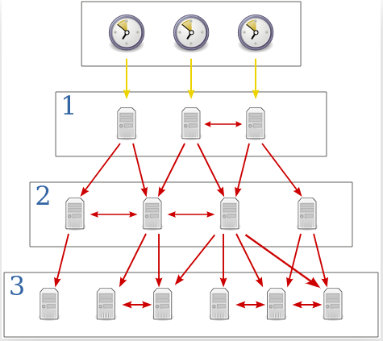
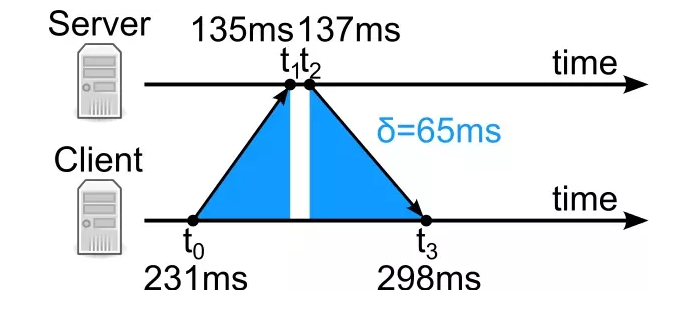

# NTP 协议与 Chrony 服务

## NTP 报文

```shell
# tcpdump 抓包输出
[root@localhost ~]# tcpdump -i eth0 port 123 -nnvv
tcpdump: listening on eth0, link-type EN10MB (Ethernet), capture size 262144 bytes
11:42:17.144462 IP (tos 0x0, ttl 62, id 34424, offset 0, flags [DF], proto UDP (17), length 76)
    172.16.10.67.49306 > 172.18.30.44.123: [udp sum ok] NTPv4, length 48
	Client, Leap indicator:  (0), Stratum 0 (unspecified), poll 0 (1s), precision 0
	Root Delay: 0.000000, Root dispersion: 0.000000, Reference-ID: (unspec)
	  Reference Timestamp:  0.000000000
	  Originator Timestamp: 0.000000000
	  Receive Timestamp:    0.000000000
	  Transmit Timestamp:   2272063536.491138112 (1972/01/01 08:45:36)
	    Originator - Receive Timestamp:  0.000000000
	    Originator - Transmit Timestamp: 2272063536.491138112 (1972/01/01 08:45:36)

# NTP 数据报文报文头格式
 0                   1                   2                   3
 0 1 2 3 4 5 6 7 8 9 0 1 2 3 4 5 6 7 8 9 0 1 2 3 4 5 6 7 8 9 0 1
+-+-+-+-+-+-+-+-+-+-+-+-+-+-+-+-+-+-+-+-+-+-+-+-+-+-+-+-+-+-+-+-+
|LI | VN  |Mode |    Stratum     |     Poll      |  Precision   |
+-+-+-+-+-+-+-+-+-+-+-+-+-+-+-+-+-+-+-+-+-+-+-+-+-+-+-+-+-+-+-+-+
|                         Root Delay                            |
+-+-+-+-+-+-+-+-+-+-+-+-+-+-+-+-+-+-+-+-+-+-+-+-+-+-+-+-+-+-+-+-+
|                         Root Dispersion                       |
+-+-+-+-+-+-+-+-+-+-+-+-+-+-+-+-+-+-+-+-+-+-+-+-+-+-+-+-+-+-+-+-+
|                          Reference ID                         |
+-+-+-+-+-+-+-+-+-+-+-+-+-+-+-+-+-+-+-+-+-+-+-+-+-+-+-+-+-+-+-+-+
|                                                               |
+                     Reference Timestamp (64)                  +
|                                                               |
+-+-+-+-+-+-+-+-+-+-+-+-+-+-+-+-+-+-+-+-+-+-+-+-+-+-+-+-+-+-+-+-+
|                                                               |
+                      Origin Timestamp (64)                    +
|                                                               |
+-+-+-+-+-+-+-+-+-+-+-+-+-+-+-+-+-+-+-+-+-+-+-+-+-+-+-+-+-+-+-+-+
|                                                               |
+                      Receive Timestamp (64)                   +
|                                                               |
+-+-+-+-+-+-+-+-+-+-+-+-+-+-+-+-+-+-+-+-+-+-+-+-+-+-+-+-+-+-+-+-+
|                                                               |
+                      Transmit Timestamp (64)                  |
+-+-+-+-+-+-+-+-+-+-+-+-+-+-+-+-+-+-+-+-+-+-+-+-+-+-+-+-+-+-+-+-+

# NTP 报文报文头格式
 0                   1                   2                   3
 0 1 2 3 4 5 6 7 8 9 0 1 2 3 4 5 6 7 8 9 0 1 2 3 4 5 6 7 8 9 0 1
+-+-+-+-+-+-+-+-+-+-+-+-+-+-+-+-+-+-+-+-+-+-+-+-+-+-+-+-+-+-+-+-+
| 0 | VN  |  6| REM |   Op    |      Sequence                   |
+-+-+-+-+-+-+-+-+-+-+-+-+-+-+-+-+-+-+-+-+-+-+-+-+-+-+-+-+-+-+-+-+
|          Status             |      Association ID             |
+-+-+-+-+-+-+-+-+-+-+-+-+-+-+-+-+-+-+-+-+-+-+-+-+-+-+-+-+-+-+-+-+
|                         Root Dispersion                       |
+-+-+-+-+-+-+-+-+-+-+-+-+-+-+-+-+-+-+-+-+-+-+-+-+-+-+-+-+-+-+-+-+
|           Offset            |         Count                   |
+-+-+-+-+-+-+-+-+-+-+-+-+-+-+-+-+-+-+-+-+-+-+-+-+-+-+-+-+-+-+-+-+
```

### 数据报文

- LI(Leap Indicator)

    用来警告是否有闰秒或者未和上级同步

    ```shell
        +-------+----------------------------------------+
        | Value | Meaning                                |
        +-------+----------------------------------------+
        | 0     | no warning                             |
        | 1     | last minute of the day has 61 seconds  |
        | 2     | last minute of the day has 59 seconds  |
        | 3     | unknown (clock unsynchronized)         |
        +-------+----------------------------------------+
    ```

- VN(Version Number)

- Mode(mode)

    指定工作模式

    ```shell
        +-------+--------------------------+
        | Value | Meaning                  |
        +-------+--------------------------+
        | 0     | reserved                 |
        | 1     | symmetric active         |
        | 2     | symmetric passive        |
        | 3     | client                   |
        | 4     | server                   |
        | 5     | broadcast                |
        | 6     | NTP control message      |
        | 7     | reserved for private use |
        +-------+--------------------------+
    ```

- Stratum

    通常Server更新该字段.
    顶层分配为数字0。一个通过阶层n同步的服务器将运行在阶层n + 1.
    阶层为0的是高精度计时设备，例如原子钟（如铯、铷）、GPS时钟或其他无线电时钟.
    它们生成非常精确的脉冲秒信号，触发所连接计算机上的中断和时间戳.
    阶层0设备也称为参考（基准）时钟. 阶层1服务器连接阶层0的设备, 它们也被称为主要（primary）时间服务器。

    ```shell
    +--------+-----------------------------------------------------+
    | Value  | Meaning                                             |
    +--------+-----------------------------------------------------+
    | 0      | unspecified or invalid                              |
    | 1      | primary server (e.g., equipped with a GPS receiver) |
    | 2-15   | secondary server (via NTP)                          |
    | 16     | unsynchronized                                      |
    | 17-255 | reserved                                            |
    +--------+-----------------------------------------------------+
    ```

    

- Poll
   > 轮询时间(即发送报文的最小间隔时间).

- Precision(精度)
   > 时钟精度精度. `log2` 为秒. `-18` 为微妙.

- Root Delay
   > 到 `Primary Server` 的总往返时间.

- Root Dispersion
   > 本地时钟与 `Primary Server` 时钟之间的时间误差.

- Reference ID
   > 32比特指示服务端的参考时钟(即上层服务器信息). 即上层时钟源 .
   > 当阶层为1时, 那么上层是原子钟等设备. 没IP, 所以使用ascii 字符 从阶层2开始, 表示IP地址.

- Reference Timestamp
   > 本地时钟最后一次被设定或更新的时间.
   > 如果值为0表示本地时钟从未被同步过.

- Origin Timestamp
   > 客户端发送请求的时间戳.

- Receive Timestamp
   > 服务端接收请求的时间戳.

- Transmit Timestamp
   > 服务端发送响应的时间戳.

### 控制报文

- 0
   > 保留位, NTP 本身不做处理.

- VN
   > NTP 版本号

- 6
   > 表明是控制报文.

- REM
   > R: 0 表示命令, 1 表示响应.
   > E: 0 表示发送正常响应, 1 表示发送错误响应.
   > M: 0 表示最后一个分片, 1 表示其他.

- Op
   > 操作码, 表明命令类型

- Sequence
   > 发送或接受到报文的序号.

- Status
   > 表明当前系统的状态

- Association ID
   > 连接标识.

- Offset
   > 偏移量

- Count
   > 数据域长度

- Data
   > 数据信息(最大 468 bits)

- Padding
   > 填充字段

### 误差计算

- t0: 客户端发送请求的客户端时间戳
- t1: 服务端接受请求的服务器时间戳
- t2: 服务端发送响应的服务器时间戳
- t3: 客户端接收响应的客户端时间戳

- 往返数据包在网络中的传输时间
   > `δ = (t3 - t0) - (t2 - t1)`

- 客户端与服务端时间误差:

   > 假设服务端与客户端的时间误差为 `θ`,
   > 则有等式 `t2 + δ/2 = t3 + θ` 成立, 其中 `θ` 可为负数.
   > 因此可得 `θ = ((t1 -t0) + (t2 -t3))/2`



## chrony 输出

```shell
[root@localhost ~]# chronyc sources -v
210 Number of sources = 1

  .-- Source mode  '^' = server, '=' = peer, '#' = local clock.
 / .- Source state '*' = current synced, '+' = combined , '-' = not combined,
| /   '?' = unreachable, 'x' = time may be in error, '~' = time too variable.
||                                                 .- xxxx [ yyyy ] +/- zzzz
||      Reachability register (octal) -.           |  xxxx = adjusted offset,
||      Log2(Polling interval) --.      |          |  yyyy = measured offset,
||                                \     |          |  zzzz = estimated error.
||                                 |    |           \
MS Name/IP address         Stratum Poll Reach LastRx Last sample
===============================================================================
^* 172.18.30.44                  3   9   377   164    +12us[  +16us] +/-   24ms

[root@localhost ~]# chronyc sourcestats
210 Number of sources = 1
Name/IP Address            NP  NR  Span  Frequency  Freq Skew  Offset  Std Dev
==============================================================================
172.18.30.44               27  10   54m     -0.003      0.053   -580ns    71us

```

- Name/IP address:
   > 响应这个请求的 NTP 服务器的名称.

- Stratum(层级):
   > 表示源的层级.
   > 层级1表示本地连接的参考时钟, 第2层表示通过第1层级计算机的时钟实现同步, 依此类推.

- Poll:
   > 本地机和远程服务器多少时间进行一次同步(单位为秒).
   > 初始运行 NTP 时, poll 值会比较小, 和服务器同步的频率增加, 建议尽快调整到正确的时间范围.
   > 调整之后, - poll 值会逐渐增大, 同步的频率也将会相应减小.

- Reach:
   > 用来测试能否和服务器连接.每成功连接一次, reach 的值将会增加.

- LastRX:
   > 表示从源收到最近的一次的时间.
   > 通常是几秒钟, 字母m, h, d或y分别表示分钟, 小时, 天或年, 值10年表示从未从该来源收到时间同步信息.

- Last sample:
   > 表示本地时钟与上次测量时源的偏移量.
   > 方括号中的数字表示实际测量的偏移值, 这可以以ns(表示纳秒), us(表示微秒), ms(表示毫秒)或s(表示秒)为后缀;
   > 方括号左侧的数字表示原始测量值, 这个值是经过调整以允许应用于本地时钟的任何偏差;
   > 方括号右侧表示偏差值, +/-指示器后面的数字表示测量中的误差范围, +偏移表示本地时钟快速来源.

- NP:
   > 当前为服务器保留的采样点数, 通过这些点执行线性回归方法来估算出偏移值.

- NR:
   > 在最后一次回归之后具有相同符号的偏差值的运行次数.
   > 如果此数字相对于样本数量开始变得太小, 则表明直线不再适合数据.
   > 如果运行次数太少, 则chronyd丢弃旧样本并重新运行回归, 直到运行次数变得可接受为止.

- Span:
   > 这是最旧和最新样本之间的间隔.如果未显示任何单位, 则该值以秒为单位.在该示例中, 间隔为46分钟.

- Frequency:
   > 服务器的估算偏差值的频率, 单位为百万分之一.
   > 在这种情况下, 计算机的时钟估计相对于服务器以10 ** 9的速度运行1个部分.

- Freq Skew:
   > Freq的估计误差范围(再次以百万分率计).

- Offset:
   > 源的估计偏移量.

- Std Dev:
   > 估计的样本标准偏差.

## Command

```shell

系统时钟:

tracking   #显示系统时间信息

makestep   #立即步进地校正时钟

makestep   #配置自动时钟步进

maxupdateskew   #修改更新频率的最大有效时滞

waitsync [ [ [ []]]]   #等待，直到同步到指定的阈值内


时间来源:

sources [-v]   #显示关于当前来源的信息

sourcestats [-v]   #显示有关收集测量的统计信息

reselect   #强制重新选择同步源


reselectdist   #修改重选距离


NTP源:

activity   #检查有多少个NTP源在线/离线

ntpdata []   #显示上次有效测量的信息


add server   #[options]   #添加新的NTP服务器

add peer [options]   #添加新的NTP peer

delete   #移除服务器或 peer

burst / [/]   #开始快速设置的测量

maxdelay   #修改最大有效采样延迟

maxdelayratio   #修改最大有效延迟/最小比率

maxdelaydevratio   #修改最大有效延迟/偏差比率

minpoll   #修改最小轮询时间间隔


maxpoll   #修改最大轮询间隔

minstratum   #修改最小层级

offline [/]   #将子网中的源设置为离线状态

online [/]   #将子网中的源设置为在线状态

polltarget   #修改投票目标

refresh   #刷新IP地址


手动时间输入:

manual off|on|reset   #禁用/启用/重置settime命令

manual list   #显示以前的设置时间条目

manual delete   #删除之前的设置时间条目

settime   #置守护进程的时间 (e.g. Sep 25, 2015 16:30:05 or 16:30:05)


NTP访问:

accheck   #检查地址是否被允许


clients   #报告访问服务器的客户端

serverstats   #显示服务器的统计信息

allow []   #默认允许访问子网

allow all []   #默认允许访问子网和所有子节点

deny []   #默认拒绝访问子网

deny all []   #默认拒绝访问子网和所有子节点

local [options]   #在未同步的情况下也提供服务

local off   #在未同步的情况下不提供服务

smoothtime reset|activate   #重置/激活时间平滑

smoothing   #显示当前时间平滑状态

访问监控:

cmdaccheck   #检查地址是否被允许


cmdallow []   #默认允许访问子网

cmdallow all []   #默认允许访问子网和所有子节点

cmddeny []   #默认拒绝访问子网

cmddeny all []   #默认拒绝访问子网和所有子节点


Real-time clock:

rtcdata   #打印当前的RTC性​​能参数

trimrtc   #相对于系统时钟校正RTC

writertc   #将RTC性能参数保存到文件

Other daemon commands:

cyclelogs   #关闭并重新打开日志文件

dump   #转储所有测量以保存文件

rekey   #重新读取密钥文件中的密钥


Client commands:

dns -n|+n   #禁用/启用将IP地址解析为主机名

dns -4|-6|-46   #将主机名解析为IPv4、IPv6或全部

timeout   #设置初始响应超时

retries   #设置最大重试次数

keygen [ [ []]]   #为密钥文件生成密钥

exit|quit   #退出程序

help   #生成此帮助
```

## 链接

[误差计算](https://www.jianshu.com/p/8096c0477230)

[NTP 协议](https://xixiliguo.github.io/post/ntp/)

[NTP 报文格式](http://www.023wg.com/message/message/cd_feature_ntp_message.html)

[chronyc 命令](http://linux.51yip.com/search/chronyc)
