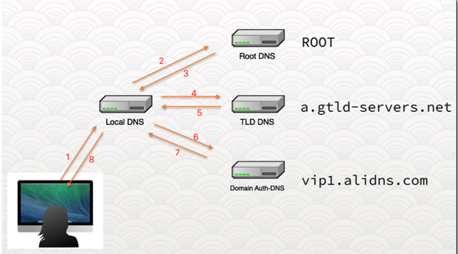
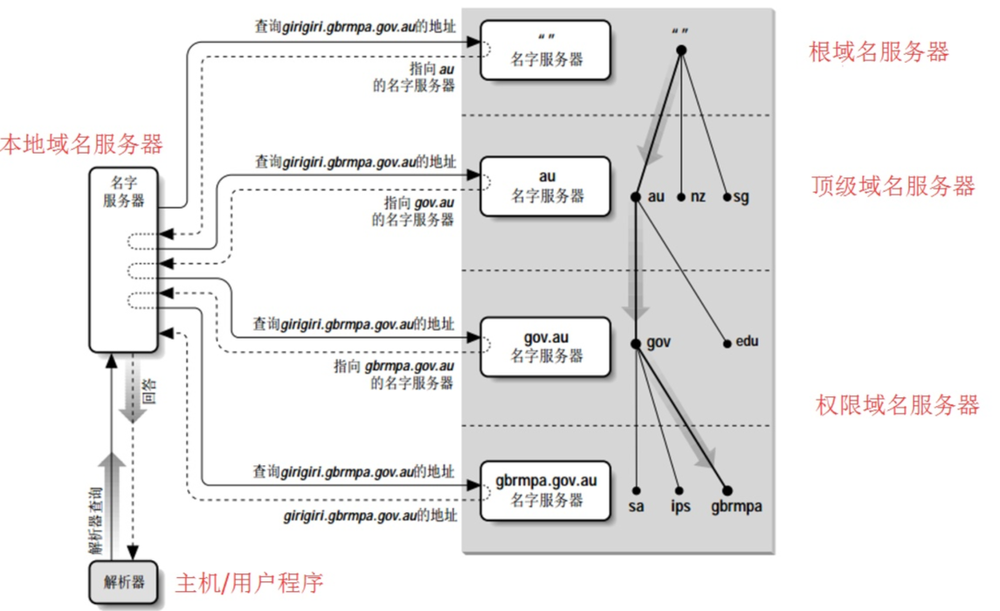
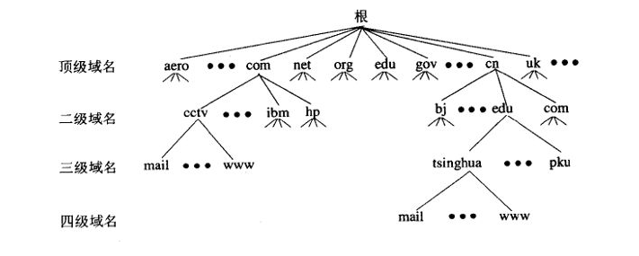

# DNS

## DNS 报文

报文头结构:

```shell
    +--+--+--+--+--+--+--+--+--+--+--+--+--+--+--+--+
    |                      ID                       |
    +--+--+--+--+--+--+--+--+--+--+--+--+--+--+--+--+
    |QR|  Opcode  |AA|TC|RD|RA|   Z    |   RCODE    |
    +--+--+--+--+--+--+--+--+--+--+--+--+--+--+--+--+
    |                    QDCOUNT                    |
    +--+--+--+--+--+--+--+--+--+--+--+--+--+--+--+--+
    |                    ANCOUNT                    |
    +--+--+--+--+--+--+--+--+--+--+--+--+--+--+--+--+
    |                    NSCOUNT                    |
    +--+--+--+--+--+--+--+--+--+--+--+--+--+--+--+--+
    |                    ARCOUNT                    |
    +--+--+--+--+--+--+--+--+--+--+--+--+--+--+--+--+
```

- ID
   > 客户端设置, 响应报文会原样返回.
   > 用于客户端区分不同的请求应答.

- QR(Question OR Respone)
  > 区分报文时请求报文还是应答报文.
  > 0: Question
  > 1: Response

- OPcode: 查询种类
  > 用于客户端设置查询的种类, 响应报文会原样返回.
  > 0: 标准查询
  > 1: 反向查询
  > 2: 服务器状态查询
  > 3 ~ 15: 暂时保留

- AA(Authoritative Answer): 授权应答
  > 服务端设置, 用于表示响应报文是否为授权服务器返回.
  > 可能是本地 Cache 的缓存.

- TC(Trun Cation): 截断
  > 标识报文体是否因为超过长度而被截断.

- RD
  > 客户端设置, 是否期望使用递归查询.

- RA
  > 服务端设置, 是否支持递归查询.
  > 0: 不支持递归查询.
  > 1: 支持递归查询.

- RCODE(Response Code): 响应码
  > 0: 没有错误
  > 1(Format Error): 请求报文格式错误
  > 2(Server Failure): 服务端错误
  > 3(Name Error): 解析的域名不存在(址对授权域名解析服务器有意义)
  > 4(Not Implemented): 服务器不支持查询类型
  > 5(Refused): 拒绝
  > 6 ~ 15: 暂未设置

- QDCOUNT
  > 报文请求段中的问题记录数;
  > 报文应答段中的回答记录数;
  > 报文授权段中的授权记录数;
  > 报文附加段中的附加记录数;

### Non-authortative answer

为加快 DNS 的查询速度, 一般会在服务端缓存一段时间, 所以有可能 DNS 会返回缓存在 Cache 中的内容, 那么此时就会将 AA 响应设置为 0 , 也就是是这里显示的 Non-authoritative answer

### 递归查询

> 递归 DNS（也称本地 DNS 或者缓存 DNS）用于域名查询. 递归 DNS 会迭代权威服务器返回的应答, 直至最终查询到的 IP 地址, 将其返回给客户端, 并将请求结果缓存到本地.
> 对用户发出的域名解析请求, 递归 DNS 必须给出一个最终的 IP 地址结果
> 完整的递归DNS 查询流程需要 DNS 服务器从根域名 “.” 服务器, 顶级域名服务器（例如“.com”）, 一级域名服务器（例如“example.com”）等一级一级递归查询,
> 直到最终找到权威服务器取得结果, 并返回给客户. 同时, 递归服务器根据域名 TTL, 缓存查询结果, 便于相同域名重复查询.
> 递归 DNS 的访问过程如下图所示（递归 DNS 在图中表示为 Local DNS）



### 迭代查询

服务端没有缓存客户端的记录, 返回其他服务器的地址给客户端.
由客户端从新去查询, 直到获取准确结果.

### 域名解析

1. 在浏览器中输入 www.qq.com 域名, 操作系统会先检查自己本地的 hosts 文件是否有这个网址映射关系, 如果有, 就先调用这个IP地址映射, 完成域名解析.

2. 如果hosts里没有这个域名的映射, 则查找本地DNS解析器缓存, 是否有这个网址映射关系, 如果有, 直接返回, 完成域名解析.

3. 如果 hosts 与本地 DNS 解析器缓存都没有相应的网址映射关系, 首先会找 TCP/IP 参数中设置的首选 DNS 服务器, 在此我们叫它<font color=red>本地 DNS 服务器</font>, 此服务器收到查询时, 如果要查询的域名, 包含在本地配置区域资源中, 则返回解析结果给客户机, 完成域名解析, 此解析具有权威性.

4. 如果要查询的域名, 不由本地 DNS 服务器区域解析, 但该服务器已缓存了此网址映射关系, 则调用这个 IP 地址映射, 完成域名解析, 此解析不具有权威性.

5. 如果本地 DNS 服务器本地区域文件与缓存解析都失效, 则根据本地 DNS 服务器的设置（是否设置转发器）进行查询, 如果未用转发模式, 本地 DNS 就把请求发至 13 台根 DNS, 根 DNS 服务器收到请求后会判断这个域名 (.com) 是谁来授权管理, 并会返回一个负责该顶级域名的服务器的一个 IP. 本地 DNS 服务器收到 IP 信息后, 将会联系负责 .com 域的这台服务器. 这台负责 .com 域的服务器收到请求后, 如果自己无法解析, 它就会找一个管理 .com 域的下一级 DNS 服务器地址 (qq.com) 给本地DNS服务器. 当本地 DNS 服务器收到这个地址后, 就会找 qq.com 域服务器, 重复上面的动作, 进行查询, 直至找到 www.qq.com 主机.

6. 如果用的是转发模式, 此 DNS 服务器就会把请求转发至上一级 DNS 服务器, 由上一级服务器进行解析, 上一级服务器如果不能解析, 或找根 DNS 或把转请求转至上上级, 以此循环. 不管是本地 DNS 服务器用是是转发, 还是根提示, 最后都是把结果返回给本地 DNS 服务器, 由此 DNS 服务器再返回给客户机.



## DNS 域名结构



- 根域
  > 位于域名空间最顶层, 一般用一个 “.” 表示

- 顶级域
  > 一般代表一种类型的组织机构或国家地区, 如 net; com; org; edu; gov; mil; cn;

- 二级域
  > 用来代表顶级域内的一个特定的组织, 国家顶级域下面的二级域名由国家网络部门统一管理.
  > 如 .cn 顶级域名下面设置的二级域名: .com.cn; .net.cn; .edu.cn...

- 子域
  > 二级域下所创建的各级域统称为子域, 各个组织或用户可以自由申请注册自己的域名

- 主机
  > 主机位于域名空间最下层, 就是一台具体的计算机.
  > 如 www; mail 都是具体的计算机名字, 可用www.sina.com.cn.; mail.sina.com.cn. 来表示.
  > 这种表示方式称为 FQDN (完全合格域名), 也是这台主机在域名中的全名.

- 本地 DNS
  > 这类服务器不属于上面的层次结构, 当一个主机(个人电脑)发出DNS请求时, 查询请求就被发送到本地域名服务器, 本地域名服务器负责回答这个查询, 或者代替主机向域名空间中不同层次的权威域名服务器查询, 再把查询的结果返回给主机.

- 权威 DNS
  >  权威 DNS 是特定域名记录（例如“example.com”）在域名注册商处所设置的 DNS 服务器
  > 用于特定域名本身的管理（增加, 删除, 修改等）.
  > 权威 DNS 服务器只对自己所拥有的域名进行域名解析, 对于不是自己的域名则拒绝访问.
  > 比如, 向“example.com”的权威 DNS 服务器查询“test.com”的域名肯定会查询失败.

## DNS 资源记录(Rsource Record)

> RR 定义了域名服务器上存储的数据的类型.
> RR 通用结构为 `(name, [TTL], class, type, value)`

### SOA(Start of Authority) 记录

SOA 用于标识一个区域的开始, SOA 记录的 value 值用于控制这个区域的.
每个区域的数据库文件都必须包括一个 SOA 记录, 并且必须是其中的第一个资源记录, 用以标识DNS服务器管理的起始位置.
SOA 说明能解析这个区域的 dns 服务器中哪个是主服务器.

```shell
# SOA 记录结构
DOMAIN.NAME.    IN      SOA     Hostname.Domain.Name. Mailbox.Domain.Name. (
                                1        ;    serial number
                                86400    ;    refresh in seconds (24 hours)
                                7200     ;    retry in seconds (2 hours)
                                2592000  ;    expire in seconds (30 days)
                                345600)  ;    TTL in seconds (4 days)
```

### NS(Name Server) 记录

NS 用于标识区域的 DNS 服务器. 即: 负责此 DNS 区域的权威名称服务器用哪一台 DNS 服务器来解析该区域. 一个区域有可能有多条 NS 记录, 例如 zz.com 有可能有一个主服务器和多个辅助服务器.

```shell
# NS 记录结构
DOMAIN.NAME.    IN      NS      Hostname.Domain.Name.
```

### A(Address) 记录

A 记录也称为主机记录, 是主机域名到 IP 地址的映射, 用于正向解析.
一个域名可以映射为多个 IP, 一个 IP 也可以映射为多个域名.

```shell
# A 记录结构
Host.domain.name.    IN      A       xx.xx.xx.xx(IPv4 address)
```

### HINFO(Host Information) 记录

HINFO 记录可以用于记录主机的硬件类型和操作系统信息.
HINFO 记录对于主机来说是可选的, 但是拥有额外信息通常是有用的.
注意: 每个主机最多只能有一条 HINFO 记录.

```shell
Host.DOMAIN.NAME.       IN      HINFO   "CPU type" "Operating System"
```

### TXT(Text) 记录

TXT 记录用于记录主机相关的文本信息(可以为任意值). 一个主机可以拥有任意条 TXT 记录.

```shell
# TXT 记录结构
Host.DOMAIN.NAME.  IN  TXT  "system manager: melvin@host.domain.name"
                   IN  TXT  "melasu"
```

### MX(Mail Exchange) 记录

MX 用于告知邮件服务器进程将邮件发送到指定的另一台邮件服务器.
主机可以成为自己的 MX, MX 所指向的服务也可以是其他域的主机.
一个主机可以有多条 MX 记录.

```shell
# MX 记录格式
Host.domain.name.       IN      MX      nn      Otherhost.domain.name.
                        IN      MX      nn      Otherhost2.domain.name.
```

### CNAME(Canonical Name) 记录

CNAME 用于存储主机的别名信息.

```shell
# CNAME 记录结构
alias.domain.name.      IN      CNAME   otherhost.domain.name.
```

### PTR(Pointer) 记录

PTR 与 A 记录作用相反, 用于通过 IP 反向获取域名.
PTR 只存在于反向解析域中. 每个户联网地址必须只有一个PTR记录

```shell
# 主机gadzooks.poetry.arizona.edu的IP地址为128.196.47.55, 则必须有PTR记录:
55.47.196.128.IN-ADDR.ARPA.     IN     PTR     gadzooks.poetry.arizona.edu.
```
