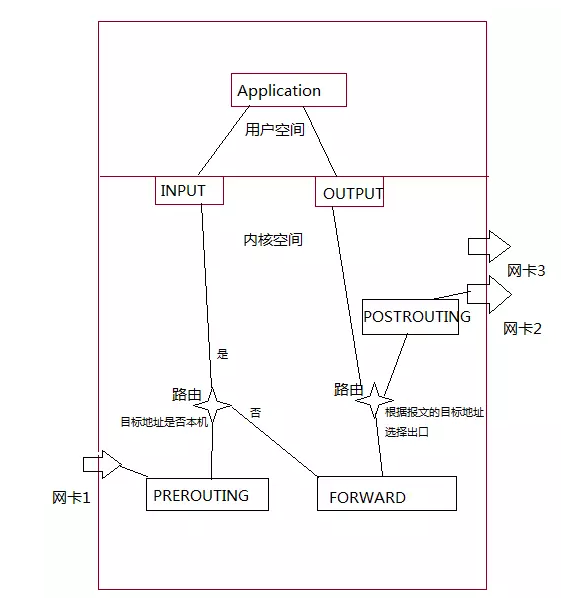

# iptables

## 常用命令

```shell
# 清空链中所有规则，没有指定链默认清空所有链中的规则
iptables -F [chain]

# 为规则链设置策略
iptables -P ${chain} ${target}

# 创建一个新链
iptables -N ${chain}

# 删除指定链(该链不能被其它规则引用，该链中不能有规则)，没有指定时删除所有自定义链
iptables -X ${chain}

# 重命名链
iptables -E ${old_name} ${new_name}

# 列出链中所有规则,如果没有指定链，则列出表中所有链中的规则，默认为 filter 表
iptables  [-t table] -L [chain]

# 在链的末尾追加一条规则
iptables -A ${rule}

# 在链中指定位置处插入规则，没有指定默认位置为 1
iptables -I [num=1] ${rule}

# 删除指定规则
iptables -D ${chain} ${rule}

# 删除 1-n 条规则
iptables -D ${num}

# 替换第 n 条规则规则
iptables -R ${num} ${rule}
```

## 规则(Policy)

> 一条规则就是 条件 + 动作 的组合
> 规则定义了对符合条件的数据包的行为
> 一条规则由五部分组成

1. target 使用iptables -j 指定
   > 规则中的行为/动作，表示如何处理符合该条件的流量
   > target有 8 类
   - ACCEPT: 允许数据包通过
   - DROP: 直接丢弃数据包，不给客户端任何响应
   - REJECT: 丢弃数据包，并给客户端一条响应信息
   - SNAT: Source Network Address Transmission
   - MASQUERADE: SNAT 的一种特殊形式，适用于动态的、临时会变的 IP 上
   - DNAT: Destinate Network Address Transmission
   - REDIRECT: 在本机上做端口映射
   - LOG: 在 /etc/log/messages 中留下记录，不对数据包做任何操作

2. prot 使用iptables -p 指定
   > 规则中的条件：数据包使用的协议(tcp/udp/udplite/icmp/icmpv6/esp/ah/sctp/mh/all)
3. source 使用iptables -s 指定
   > 规则中的条件：数据包中的源IP地址或网段或主机名
4. destination 使用 iptables -d 指定
   > 规则中的条件：数据包中的目的地址或网段
5. source_port 使用 iptables --sport 指定
   > 规则中的条件：数据包中的源端口号
6. destination_port 使用iptables --dport 指定
   > 规则中的条件：数据包中的目的端口号

## 规则链

规则链:
  特定场景下执行的规则集合，按规则插入顺序一次对数据进行匹配，匹配成功就执行相应规则对应的 target，如果该链中的所有规则都不匹配，则使用默认规则进行处理。

- PREROUTING
  > 在对数据包做路由选择之前，应用此链的规则。
- INPUT
  > 当收到访问防火墙本地地址的数据包时，应用此链的规则
- OUTPUT
  > 当防火墙本机向外发出数据时，应用此链的规则。
- FORWARD
  > 当收到要通过防火墙发送给其他网络地址的数据包时，应用此链的规则。
- POSTRUOTUNG
  > 在对数据包做路由选择之后，应用此链的规则。



## 表

> 用于完成特定功能的规则链的集合
> 表的处理优先级： RAW --> MANGLE --> NAT --> FILTER

### FILTER

> 功能：过滤数据包(防火墙)
> 使用的规则链：INPUT, FORWARD, OUTPUT

### NAT

> 功能：network address transmission。转发数据包
> 使用的规则链：PREROUTING, [INPUT, ]OUTPUT, POSTROUTING

### MANGLE

> 功能：对数据内容进行修改后重新封装
> 使用的规则链：PREROUTING, INPUT FORWARD, OUTPUT, POSTROUTING

### RAW

> 功能：关闭NAT表上启用的连接追踪机制
> 使用的规则链：PREROUTING, OUTPUT

## 数据包的几种流向

- 流入本机
  > PREROUTING --> INPUT

- 由本机流出
  > OUTPUT --> POSTROUTING

- 转发
  > PREROUTING --> FORWARD -->POSTROUTING
