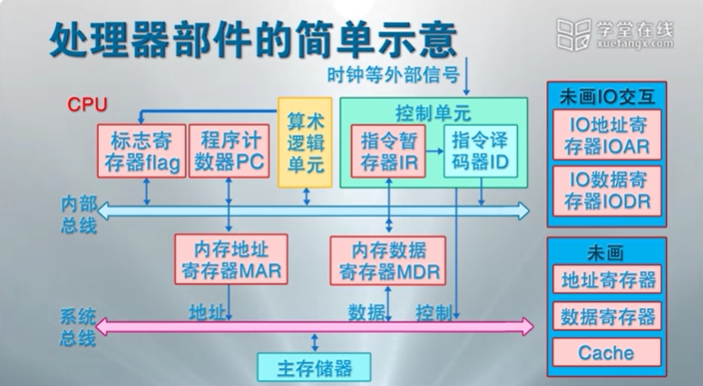
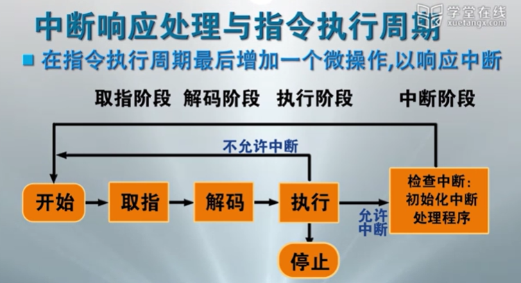
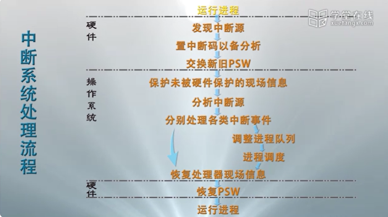

# 处理器

## 处理器部件

### 运算逻辑单元(算数逻辑单元)

### 控制单元

- ID(指令译码器)
   > 负责具体的解释指令的实行

- IR(指令暂存器)

### PC(程序计数器)

> 指向下一条要执行的指令的内存地址.

### flag(标志寄存器)

> 存储运算单元计算出的结果.

### 内存数据访问

- MAR(内存地址寄存器)

- MDR(内存数据寄存器)

### 内部总线

> 连接上述 CPU 的内部组件

### 系统总线

- 地址

- 数据

- 控制

### 访问内存数据过程

1. MAR 通过地址总线获取数据在内存中的地址, MDR 通过数据总线获取数据的值

2. 通过控制总线发出信号, 完成数据的读取与写回

## 寄存器(register)

### 用户程序可见寄存器

用户程序可见寄存器可以使程序减少访问主存储器的次数, 提高指令执行的效率.
所有程序都可以使用(用户程序, 系统程序), 包含:

- 数据寄存器(通用寄存器)

- 地址寄存器
  - 索引寄存器
  - 栈指针寄存器
  - 段地址寄存器

### 控制与状态寄存器

用于控制处理器的操作;
主要被具有特权的操作系统程序使用, 以控制程序的执行.

- 程序计数器(PC)

- 指令寄存器(IR)

- 条件码(CC)
   > CPU 为指令操作结果设置的位, 标志正/负/零/溢出等结果.

- 标志位
   > 中断位, 中断允许位, 中断屏蔽位, 处理器模式位, 内存保护位...

### 程序状态字(PSW)

`PSW` 指记录当前程序运行的动态信息, 通常包含:

- 程序计数器, 指令寄存器, 条件码

- 中断字, 标志位...

## 指令

机器指令是计算机系统执行的基本命令, 是中央处理器执行的基本单位.
指令由一个或多个字节组成, 包括操作码字段, 一个或多个操作数地址字段, 以及一些表征机器状态的状态字以及特征码.
机器指令完成各种算数逻辑运算, 数据传输, 控制流跳转征码.

### 指令执行过程

CPU 根据 PC 取出指令, 放入 IR, 并对指令译码, 然后发出各种控制指令, 执行微操作系列, 从而完成一条指令的执行

一种指令的执行步骤:

1. 取指: 根据 PC 从存储器或者告诉缓冲存储器中取出指令到 IR.

2. 解码: 解译 IR 中的指令来决定其执行行为

3. 执行: 连接到 CPU 部件, 执行运算, 产生结果并写回, 同时在 CC 里设置运算结论标志; 条抓指令操作 PC, 其它指令递增 PC 值.

### 特权指令与非特权指令

核心资源相关的指令只能被操作系统程序使用, 如启动 I/O 指令, 置 PC 指令等等.

- 特权指令
   > 只能被操作系统内核使用的指令

- 非特权指令
   > 能被所有程序使用的指令

### 运行模式

计算机通过设置处理器模式实现特权指令管理.
现代计算机系统一般都设置了四个不同的处理器运行模式.
一般只是用 0 模式和 3 模式.

- `0`: 操作系统内核可使用的指令.

- `1`: 系统调用可使用的指令.

- `2`: 共享库程序可使用的指令.

- `3`: 用户程序可使用的指令

### 处理器模式切换

- 用户模式 --> 内核模式
   > 中断, 异常, 系统异常等事件可以触发用户模式到内核模式的转换

- 内核模式 --> 用户模式
   > 内核处理完成之后, 调用中断返回指令触发内核模式到用户模式的转换.

## 中断

中断是指程序执行过程中, 遇到急需处理的事件时, 暂时中止 CPU 上现行的程序的运行,
转去执行相应的事件处理程序, 待处理完成后再返回原程序被中断处或调度其他程序执行的过程.

操作系统是"中断驱动"的; 中断是激活操作系统的唯一方式.

- 狭义中断
   > 来源于处理器之外的中断事件, 即与当前运行指令无关的中断事件, 如 I/O 中断, 时钟中断, 外部信号中断.

- 异常(CPU 内部中断)
   > 当前指令引起的中断事件, 如地址异常, 算数异常, 处理器硬件故障.

- 系统异常
   > 执行陷入指令而触发系统调用引起的中断事件, 如请求设备, 请求 I/O , 创建进程等.

- 广义中断
   > 狭义中断 + 异常

## 中断源

### 处理器硬件故障中断异常

- 引发原因
   > 由处理器, 内存储器, 总线等硬件故障引起.

- 处理原则
   > 保护现场, 停止设备, 停止 CPU, 向操作员报告, 等待人工干预.

### 程序性中断事件

- 引发原因
   > 处理器执行机器指令引起.

- 除数为零.

- 非法指令
   > 如用户态使用特权指令, 地址越界, 非法存取等指令异常. 会导致进程终止.

- 终止进程指令

- 虚地址异常

### 自愿性中断事件(系统异常)

- 引发原因
   > 处理器执行陷入指令请求 OS 服务引起; 在操作系统中又被称为系统调用.

- 请求分配外设, 请求 I/O 等

- 处理流程
   > 陷入 OS, 保护现场, 根据功能号查入口地址, 跳转具体处理程序.

### I/O 中断事件

- 引发原因
   > 外围设备报告 I/O 状态的中断事件.有 I/O 完成, I/O 出错, I/O 异常.

### 外部中断事件

- 引发原因
   > 外围设备发出的信号引起的中断事件

- 时钟中断

- 设备报道与结束中断

- 鼠标/键盘信号中断

- 关机/重启中断

## 中断系统

中断系统是计算机系统中响应和处理中断的系统, 包括硬件子系统和软件子系统两部分.

中断响应由硬件子系统完成.

中断处理由软件子系统完成.

中断响应过程:

1. 发现中断源, 提出中断请求
   1. 发现中断寄存器中记录的中断.
   2. 决定这些中断是否被屏蔽.
   3. 当有多个要响应的中断源时, 根据规定的优先级选择一个.

2. 中断当前程序的执行
   - 记录当前程序的执行位置 (PSW/PC) 到核心栈.

3. 转向操作系统的中断处理程序
   1. 保存未被硬件保护的处理器状态.
   2. 通过分析中断进程的 PSW 中断码字段, 识别中断源.
   3. 分别处理发生的中断事件.
   4. 恢复正常操作.

## 中断装置

计算机系统中发现并响应中断/异常的硬件装置称为中断装置.

### 中断控制器(响应处理器外部设备产生的中断事件/狭义中断事件)

中断控制器:

CPU 中的一个控制部件, 包括中断控制逻辑线路和中断寄存器.

中断执行过程:

1. 外部设备向中断控制器发出中断请求(IRQ), 在中断寄存器中设置已发生的中断.

2. 指令处理器结束前, 会检查中断寄存器, 若有不被屏蔽的中断产生, 则改变处理器内操作
  的顺序, 引出操作系统中的中断处理程序.

### 陷阱与系统陷阱

陷阱与系统陷阱是指令的逻辑线路的一部分

执行指令出现异常后, 会根据异常情况转向操作系统的异常处理程序.

出现虚地址异常后, 需要重新执行指令, 往往越过陷阱独立设置页面异常处理程序.

执行陷入指令后, 越过陷阱处理, 触发系统陷阱, 激活系统嗲用处理程序.

- 处理器内的异常
   由指令的控制逻辑和实现线路发现和响应, 相应机制称为**陷阱**.

- 请求 OS 服务的系统异常
   处理器执行**陷入指令**时直接触发, 相应机制称为**系统陷阱**.

## 多中断的响应与处理

### 中断屏蔽

当计算机检测到中断时, 中断装置通过中断屏蔽位决定是否响应已发生的中断.

可以通过中断屏蔽机制来选择是否响应某个具体的中断.

### 中断优先级

当计算机同时检测到多个中断时, 中断装置响应中断的顺序.是的处理器有优先度的响应中断.
不同类型的操作系统有不同的中断优先级.

一种可能的处理次序:

1. 处理机硬件故障中断事件.

2. 自愿性中断事件.

3. 程序性中断事件.

4. 时钟中断等外部中断事件.

5. 输入输出中断事件.

6. 重启动和关机中断事件.

### 中断的嵌套处理

**可以通过中断屏蔽来避免嵌套中断的发生**
当计算机响应中断后, 在中断处理过程中, 可以再响应其他的中断.

操作系统支持中断嵌套. 但是操作系统是性能攸关程序, 且中断响应处理有硬件要求, 考虑系统效率和现实代价的问题, 中断的嵌套处理应该限制在一定的层数内, 如 3 层.

由于嵌套的存在, 因此会存在先响应的中断后处理的情况.
