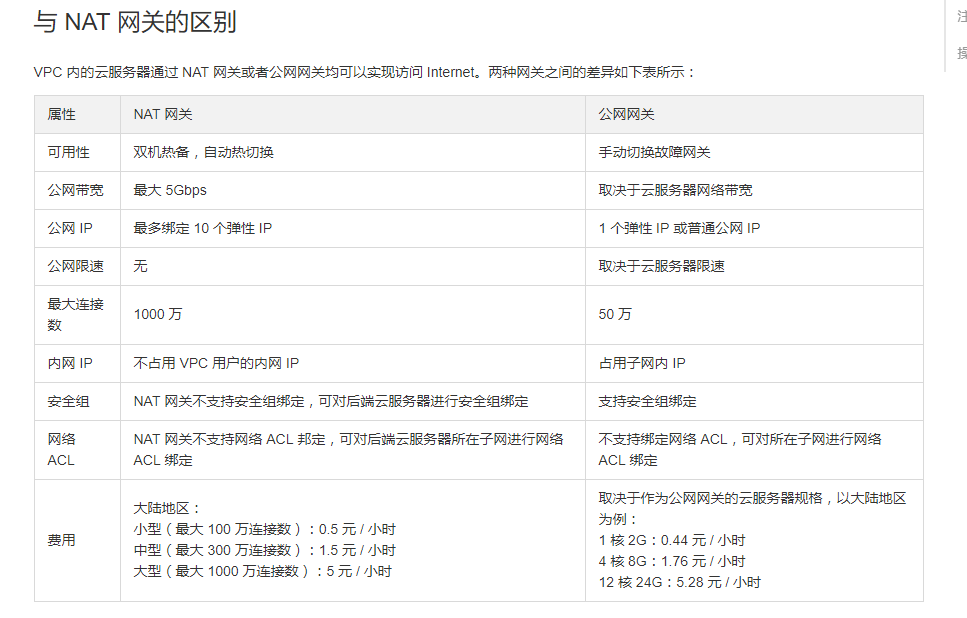

### 私有网络的基本配置管理
> 创建私有网络，使得网络内的实例/子网可以相互通信
> 私有网络至少要有一个子网
- 修改CVM内网IP方式
  1. 弹性网卡（辅助网卡）
  2. 主网卡不能删除  

- 弹性公网IP
> 不会跟随实例的生命周期而销毁

- 删除私有网络
> 子网中没有IP被占用
> 网络中没有绑定实力
> 释放辅助IP

### 私有网络中网络连通配置
#### 配置连接Internet
- 通过公网IP
- 创建公网网关（CVM）：最大支持100Mbps的带宽：与转发流量的CVM不能在同一个网段
> 创建公网网关步骤： 创建网关子网  --> 购买公网网关  --> 创建普通子网路由表  -->  创建网关子网路由表
> 通过公网网关连接Internet
> 在子网路由表中添加一条规则  dest: 0.0.0.0/0  下一跳: 公网网关
- NAT网关（双机热备，自动容灾）：最大支持5Gbps的带宽
> 配置路由表与公网网关类似
> 新建端口转发
- 绑定弹性公网IP
> 绑定后不收费
> 没绑定按小时手陪

#### 连接企业数据中心
- VPN（走公网）
  1. 提供速度快，先买现用
  2. 走公网，受公网影响大
> 创建VPN网关  --> 创建对端网关 --> 创建VPN通道  --> 加载配置文件 --> 设置路由表 --> vpn通道激活

- 专线连接
  1. 提供速度慢，大约20个工作日
  2. 私有网路，安全、快捷
> 创建物理专线 --> 创建专线网关 --> 创建专线通道 --> 配置路由表 --> 设置告警

#### 创建对等连接
- 同账号创建对等连接
> 创建对等连接 --> 在两端设置路由表

- 跨账号创建对等连接
> 创建对等连接 --> 接受对等连接 --> 在两端设置路由表

### 私有网络安全管理
#### 创建网络ACL
- 编辑入站出站规则
> 创建后规则自动应用至网络中的所有子网

### 试题

#### 单选
62.1分在腾讯云中创建和配置路由表时，下列说法不正确的是（ ）？

创建了VPC后，系统会创建一个默认路由表，所有新建的子网都会关联到默认路由表。

每个路由表只能关联到同一私有网络中的多个子网，每个子网有且只能关联一个路由表。

有默认路由和自定义路由两种类型的路由规则。

路由规则需要定义四个参数：分别是目标端、下一跳参数、下一跳类型、下一跳ID。

55.1分您本地数据中的网站经常受到同行竞争者的攻击，造成业务频繁中断，您应该采用腾讯云中哪种方案解决这种频繁但是流量不大的攻击？

购买负载均衡分摊攻击流量压力

使用云监控尝试解决问题

购买大于攻击流量的带宽

购买CVM并购买公网IP

53.1分您在腾讯云中新部署了一批CVM，不希望这批CVM直接面临公网，但是又希望它们可以和互联网连接，您应该采用哪种方案处理此问题？

尝试使用VPN访问CVM

为这批CVM开通云与公司之间的专线链路

购买公网网关用于互通

购买BGP高防包保护安全

51.1分以下关于跨地域网络设计的描述中，正确的选项是？

将同一个子网部署道多地域可以提供网络性能

同一个子网可以跨地域部署

同一个子网不可以跨地域部署

将同一个子网部署道多地域可以提供容灾能力

46.1分目前您打算在腾讯云和本地数据中心共同部署您的业务，您的业务对链路质量要求比较高，不允许出现阻塞或抖动，您应该采用哪种方案使得腾讯云和本地数据中心保持互通？

VPN连接

使用私有网络

专线接入

公网连接

44.1分当出现以下应用场景时： 1. 当您的某台服务器无法正常提供服务时 2. 在任何云服务器出现故障时，只需启动另一个实例并重新映射它，从而快速响应实例故障 3. 因为动态 DNS 映射把 DNS 名称映射到 IP 地址，传播这个映射变化到整个 Internet 可能需花费 24 小时，从而产生更多的时间成本 应该使用下列哪种连接方式来实现此应用场景所对应的需求？

公网网关

NAT网关

弹性公网IP

弹性网卡

43.1分您企业在腾讯云中有很多资源，您希望开发人员只拥有其所在的开发相关云资源的读写权限，测试人员只拥有其所在的测试环境相关云资源的读写权限，以上需求通过腾讯云哪项服务可以做到？

CVM管理

CAM

网络ACL

安全组

41.1分您本地维护一个集团的IT基础架构，经常需要在全国范围内的各个分支之间复制大量的文件，由于公网传输质量不高，总是传输失败，您应该用腾讯云哪种解决方案来解决此问题？

将您的业务分不同可用区部署在腾讯云中，使用腾讯云内网互通

使用对象存储加CDN来加速数据复制

购买专用宿主机专门用于处理数据复制

使用腾讯云动态加速网络来加速数据的复制

40.1分您得到来自业务部门的通知，半年后业务转型，服务器的访问请求将由稳定请求变为经常发生瞬间大幅波动的请求，您应该选择腾讯云哪种解决方案来处理此问题？

前端放置腾讯云负载均衡来解决瞬间大请求的问题

包年包月CVM搭配自动弹性伸缩按需计费的CVM解决瞬间大波动的问题

CVM搭配CDN来解决请求过多，其他用户无法访问的问题

按照峰值批量部署多台CVM用于业务运行

31.1分您经常需要使用密钥来加解密，但是密钥文件都是存放在本地，您担心密钥文件可能会被窃取，腾讯中哪项服务可以对密钥再次进行加密？

CDN

KMS

CFS

WAF

30.1分当您本地的数据中心受到特大流量攻击时，腾讯云是如何保护您的业务的？

在腾讯云中购买BGP高防IP，配置IP到本地数据中心的转发，然后将高防IP配置为业务IP

在腾讯云中开启BGP高防，将本地数据中心的流量镜像一份到腾讯云

在本地数据中心修改路由，将所有的流量都转发到腾讯云的CVM

在腾讯CVM上开启流量转发功能

28.1分访问管理（CAM，Cloud Access Management）是腾讯云提供的一套Web服务，CAM主要有三个功能，下列选项中不属于CAM功能的是（ ）？

通过权限管理实现不同企业间云资源共享

最终一致性

更精细化的权限管理

根账号资源的授权访问

27.1分下列关于辅助网卡的描述中，正确的是（ ）？

创建云主机时联动创建的网卡

用户自行创建的网卡

辅助网卡不支持解绑

辅助网卡不支持绑定

26.1分您做为腾讯云的资源管理员，希望通过API的方式进行批量资源管理，腾讯云通过哪项服务对您进行API授权？

网络ACL

主机安全

安全组

密钥管理

22.1分下列关于公有云相比私有云对比中，哪个不是公有云的特点？

提供海量低成本的存储服务

完全拥有高性能自有物理固定资产

多租户按需按量自动获取

提供弹性且高性能业务设计

20.1分以下关于私有网络IP地址容量的说法，正确的是？

私有网络创建之后不支持更改其大小

私有网络创建之后支持通过控制台更改其大小

私有网络大小调整需要提供工单

私有网络默认提供无限大容量

18.1分假设用户为域名www.example.com配置了IP白名单，白名单内容如下：1.1.1.1、2.2.2.0/24、3.3.0.0/16，那么下列客户中会返回403页面的是

2.2.2.2

2.2.3.2

1.1.1.1

3.3.3.3

16.1分有关NAT网关与公网网关的对比，描述正确的是？

公网网关可以绑定的弹性IP数量与NAT网关一样

NAT网关的可用性比公网网关高

NAT网关的使用成本比公网网关更低

NAT网关就是一类特殊的CVM

13.1分您公司的CVM位于VPC网络环境，通过公网网关访问Internet，随着业务发展，并发连接数峰值预计将达到200万，您需要采取什么策略来保证系统的稳定可靠？

购买中型 NAT网关

为单实例购买巨量带宽

购买大型 NAT网关

购买小型 NAT网关

12.1分您在腾讯云中北京和上海都拥有您的业务，现在要求北京和上海直接要保持互联，您应该用腾讯云中哪种方式进行互联？

专线接入

公网连接

VPN连接

对等连接

10.1分以下关于云服务器和私有网络关联问题，描述正确的是？

云服务器在关联私有网络后不可以变更

云服务器无法关联到私有网络

云服务器在关联私有网络后可以变更

云服务器关联非本地域私有网络可以提高网络能力

1.1分您的网站运营于腾讯云之上，经常受到各种大流量攻击，您希望能屏蔽掉恶意流量后放行正常的流量，以上需求可以通过腾讯云哪种产品解决？

您可以通过部署精细化网络ACL来解决

您可以通过部署精细化安全组来解决

您可以通过部署网站WAF来解决

您可以通过部署BGP高防来做解决
#### 多选
为避免密钥多人共享造成风险，应采取下列哪几种方式进行规避？

以上皆无

创建平行账号

创建权限策略

创建子账号

35.1分出现下列哪几种情况时，实例关联的公网IP地址将释放？

当实例关机时，腾讯云将会释放公网IP地址

当实例销毁时，腾讯云将会释放其公网IP地址

弹性公网 IP 地址 与实例关联和取消关联时。实例关联弹性公网 IP 地址时，腾讯云将释放实例原有的公网 IP 地址

当实例调整规格时，腾讯云将会释放公网IP地址

34.1分高防IP包括以下哪几个产品功能？

<云外用户接入

多协议支持

攻击数据查询

完整 DDoS 防御

32.1分创建私有网络时，系统自动为其生成一个默认路由表，下列关于默认路由表说法中，正确的是（ ）？

在默认路由表中可以添加和删除规则

没有选择自定义路由表将会自动匹配默认路由表

默认路由表中不能删除规则

无法删除默认路由表

29.1分以下关于安全组与网络 ACL 的区别中，描述正确的是？

安全组是有状态的，网络ACL是无状态的

网络ACL和安全组没有相似之处

以上皆无

安全组是实例级别、网络ACL是子网级别

25.1分使用腾讯云私有网络，可以做以下哪些事情？

自定义网段划分、IP地址和路由策略

通过私有网络提高服务器性能

自定义的逻辑隔离网络空间

通过IPsec VPN/专线连通私有网络与本地数据中心

23.1分在腾讯云中专线的接入支持以下哪几个方式？

双线热备的接入方式

以上皆无

无法建立专线

无单点的接入方式

11.1分大禹网络安全可以提供以下哪几种功能？

DNS劫持

安全认证

网页防篡改

DDoS 防护

8.1分腾讯云上的路由表有以下哪几个类型？

默认路由表

混合路由表

自定义路由表

平台路由表

5.1分下列连接方式中能够连接企业数据中心的是（ ）？

VPN连接

基础网络互连

对等连接

专线接入

1.1分在腾讯云中，专线接入包括以下哪几个组成部分？

网关新能

专线网关

专线通道

物理专线