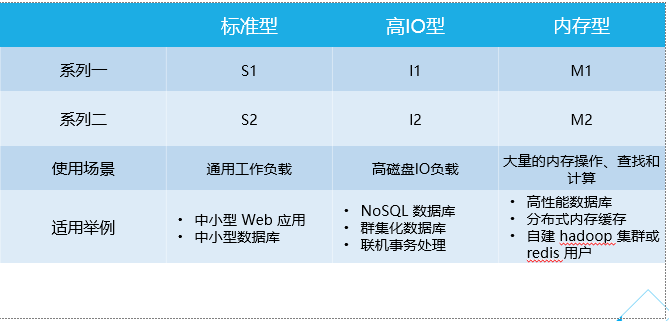
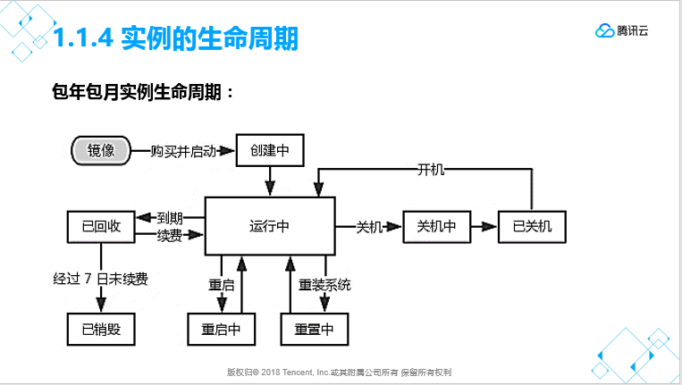
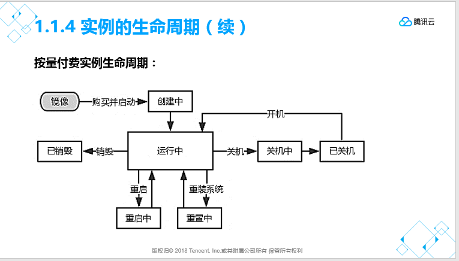

### 云服务器实例
#### 类别

#### 实例的生命周期

#### 自定义创建实例
> 自定义创建实例分四步，分别为：
  1. 选择地域与机型
  > 自定义创建实例步骤一：选择地域与机型。包括包年包月和按量计费两种计费模式，多个可选地域，每个地域下一个或多个可用区，系列1和系列2两种硬件配置，其中系列1可选2种机型，系列2可选5种机型。此处选择包年包月，广州地区，广州二区，系列1，标准型S1，1核1G的配置。

  2. 选择镜像
  > 自定义创建实例步骤二：选择镜像。在此步骤中，我们可以在“已选配置”中看到上一步选择的配置项。选择镜像的操作步骤，包括镜像提供方、操作系统和系统版本3个选项。在镜像提供方处，可以选择公共镜像、自定义镜像、共享镜像及服务市场中的镜像。每个镜像提供方下，都有相应的操作系统供选择，但自定义镜像需要我们之前进行过镜像的自定义才有相应的选项，共享镜像也需要存在共享过的镜像才有相应的选项。最后在系统版本处，选择我们需要的操作系统对应的版本，即可完成此步骤。
  此处选择公共镜像，Windows Server操作系统，2012 R2数据中心版 64位中文版。
  
  3. 选择存储与网络
  > 自定义创建实例步骤三：选择存储与网络。在此步骤中，我们可以在“已选配置”中看到以上两个步骤中选择的配置项。选择存储与网络的操作步骤，包括系统盘、数据盘、网络类型、宽带计费模式、带宽、服务器数量、购买时长和自动续费8个选项。系统盘：可选择本地硬盘和云硬盘。本地硬盘固定为50GB，购买成功后，系统盘不支持更换介质，使用本地硬盘的服务器暂不支持升级CPU/内存/硬盘。云硬盘固定为50GB，系统盘不支持更换介质，适用于大文件顺序读写场景，如日志流水、流媒体业务，数据仓储等。数据盘：可以选择0-500GB的数据盘生命周期与服务器实例相同。网络类型：可选择基础网络或私有网络。基础网络与私有网络不能互通，购买后不能更换网络类型。带宽计费模式：按带宽计费或按使用流量。带宽：可选择0-200Mbps的带宽，建议勾上分配免费公网IP，不然无法进行远程连接。然后选择服务器数量、购买时长以及是否自动续费，步骤三即可完成。
  此处选择本地硬盘，数据盘30GB，基础网络，按带宽计费，带宽1Mbps，服务器数量1台，购买时长1个月，不选择自动续费。

  4. 设置信息
  > 自定义创建实例步骤四：设置信息。在此步骤中，我们可以在“已选配置”中看到以上三个步骤中选择的配置项。设置信息的操作步骤，包括所属项目、主机名、登录方式、安全组、安全加固和云监控6个选项。所属项目：选择默认项目或已定义的项目名称。主机名：可以创建实例后更改主机名或立即命名。登录方式：可在此处设置密码，或者让腾讯云自动生成密码。安全组：可选择已经存在的安全组或者新建安全组。安全组是用来限定该实例使用什么样的规则。然后勾选免费开通安全加固和云监控，步骤四即可完成。
  此处选择立即命名：SERVER01，设置密码，安全为已经定义过的Windows安全组，勾选免费开通安全加固和云监控。

### CVM实例配置管理
#### 重装操作系统
- 部署操作系统的方式分成两种，分别是首次部署和重新安装。
  1. 首次部署实例的操作系统时，只需要在购买实例的时候，选择所需的镜像提供方，然后在相应的镜像提供方下选择需要的操作系统及操作系统版本，新建实例后，操作系统就会自动完成安装。
  2. 若发现系统出现故障，或者想把系统还原到初始状态，可以使用重新安装操作系统的方式。

##### 重新安装操作系统概述
- 前提条件：
  1. 同平台重装
  > 如：Linux 重装为 Linux；Windows 重装为 Windows 。在任何地域云服务器都可以进行同平台重装。
  2. 不同平台重装：仅支持境内及香港地域
  > 如：Linux 重装为 Windows；Windows 重装为 Linux 。
- 目前新增的所有云硬盘实例和本地盘实例均支持进行不同平台重装系统。部分存量的 20GB 本地盘实例暂时不支持控制台上进行跨平台重装，使用这些本地盘实例的用户，需要您 提交工单 进行申请。
- 重装准备：系统盘中的内容会在重装后丢失，需在重装前完成系统盘中重要信息的备份。需要保留系统运行数据的情况下，强烈建议您在重装系统前 创建自定义镜像 ，并选择该镜像进行重装。
- 镜像选择建议：建议使用腾讯云提供的镜像或自定义镜像进行重装，不建议使用来源不明的镜像和其他来源。重装系统盘时，请不要进行其他操作。
- 重装时间：一般来说操作后 10-30 分钟时间。
- 实例物理特性：实例的公网 IP 不会改变。
- 计费相关：调整系统盘大小时（仅支持云硬盘），将按云硬盘的收费标准进行收费。详细内容可以参考 硬盘价格 。
- 后续操作：重装系统盘后，数据盘的数据会保留不受影响，但需要重新挂载才能使用。

> 进入重装系统的页面，需要选择重装镜像的来源。默认是重装原来的操作系统，也可以选择其他镜像提供方的操作系统进行重新安装。如果重新安装的过程中，需要进行系统盘的扩展，那么必须增加相应的费用，本地磁盘是不能扩容的，云硬盘可以。重装后，服务器系统盘内的所有数据将被清除，恢复到初始状态；服务器数据盘的数据不会丢失，但需要手动挂载才能使用。

#### 实例升降配
##### 配置升级：
> 当用户的业务扩大，需要提升云服务器的硬件配置时，可以通过配置调整实现。对于所有云服务器类型，配置升级的生效时间均为即时生效，即当用户升级配置并支付可能产生的费用后，云服务器将立即按新的配置运行。升级次数无限制。
- 升级步骤：
  1. 登录 腾讯云，单击左侧【云主机】。
  2. 对于要调整配置的 CVM 实例，在右侧操作栏，单击【更多】->【云主机设置】->【调整配置】。
  3. 在调整配置弹出框中，选定升级后的 目标 CPU 核数 和 目标内存容量 后，单击 确定。核对订单无误后确认支付，完成支付即可即时调整实例配置。

##### 配置降级
> 当用户的业务缩减，需要降低云服务器的硬件配置时，可以在控制台通过配置调整实现。
> 对于不同类型的云服务器，具体的降级方式不同。
- 包年包月实例配置降级：
>购买了包年包月的云服务器实例后，用户随时可以进行配置降级。每个云服务器实例累计只能进行 1 次降配。
> 截止配置降级的时刻，用户实际支付费用的剩余价值与目标配置剩余价值的差值若大于零，则将该差值折算为目标配置所支持的时长来延长该服务器的到期时间；若该差值小于或等于零，将不会调整用户云服务器到期时间（通常为用户支付时使用折扣或代金券情况）。
- 按量计费实例配置降级：
> 购买了按量计费的云服务器实例后，用户随时可以降配。降级次数无限制。
> 操作：与升配的操作相类似。

#### 实例销毁
- 手动销毁方式：
> 包年包月类型实例支持未到期自助销毁，销毁后该实例将在回收站保留7天，也可在回收站中彻底销毁；按量计费类型实例支持手动销毁。
- 自动销毁方式：
> 包年包月类型实例在回收站中 7 个自然日未恢复会自动销毁；按量计费类型实例余额小于 0 状态持续 24 小时后自动销毁。规定时间内完成 续费 可继续使用。
- 实例数据：
> 挂载的本地盘和非弹性云硬盘都将一并销毁，数据丢失，请提前备份。弹性云盘不受影响。
- 计费相关：
> 实例的状态一旦变为销毁中或已销毁时，就不再产生与该实例相关的费用。
- 弹性 IP ：
> 被销毁实例的弹性 IP（含辅助网卡上的 IP）会继续保留，闲置 IP 会产生费用。如无需保留，请及时释放。

### 自动化部署
#### 云API
> 云API 是腾讯云开放生态的基石。通过API，您可以以接口的形式访问腾讯云的各类资源，以此构建自己的资源管理系统、自动化运维系统、售卖平台、开发工具等。
- 云API优势：
  1. 快速使用云产品：通过云API，只需执行对应API命令行工具即可快速操作云产品
  2. 高效地使用云产品功能：在熟练的情况下，使用一些频繁使用的功能，使用云API可以极大的提高效率
  3. 批处理和操作集成：通过API可以组合功能，实现更高级的功能
  4. 易于自动化， 易于远程调用， 兼容性强，对系统要求低

#### 操作流程
> 自动化部署操作流程包括4个大步骤：新建API密钥、API调试、下载并安装SDK工具包，最后通过API查询和创建实例。
1. 新建API密钥
> 登录API密钥管理控制台的网址：https://console.qcloud.com/capi，也可以直接在管理中心的安全凭证页面获得。在控制台中，可以看到API密钥和项目密钥两个页面。使用云API请在调用前使用API密钥获取签名， 否则将无法调用API。项目密钥目前支持的服务包括：万象优图、优图人脸识别等服务。 请在调用上述服务的API前， 使用项目ID和密钥获取鉴权签名，否则将无法使用上述服务。

2. 调试API
> 打开腾讯云API v2.0 调试工具，按照调试工具的提示，完成腾讯云API的调试。
> 调试工具的作用：
  1. 此工具旨在帮助开发者验证调用 腾讯云API 2.0 接口时传入的 Signature 参数是否正确；
  2. 此工具也可以用来测试和验证腾讯云API 2.0 的接口功能；
  3. 使用此工具操作服务器与在腾讯云管理平台操作的效果相同；
  4. 使用此工具购买腾讯云产品与在腾讯云管理平台操作的效果相同。

3. 下载安装SDK

4. 通过API创建、查询CVM

### 云硬盘概述
#### 本地硬盘概述：
> 本地盘是与云服务器实例处于同一台物理服务器上的存储设备，具有高读写 IO、低时延的特性。
> 本地盘来自 CVM 实例所在物理机的本地存储，是从 CVM 实例所在的物理机上划分的一块存储区域。系统盘和数据盘都支持选择本地盘，且购买高 IO 机型时仅支持选择 SSD 本地盘。
- 生命周期：本地盘的创建仅跟随云服务器实例。因此，本地盘跟随云服务器的生命周期而启动或终止。
- 购买：本地盘仅能在启动云服务器时一同启动。因此，购买本地盘仅能在购买云服务器实例时指定。
- 普通本地盘和SSD本地盘性能对比：
  1. 普通本地盘：吞吐峰值 40 -100 以上 MB/s，IOPS 数百至 1000；
  2. SSD本地盘：吞吐峰值 290 MB/s （4K 随机读），IOPS 75000 （4K 随机读深度 -32），访问时延小于 3 ms。

#### 云硬盘
> 云硬盘（Cloud Block Storage）是腾讯云提供的用于CVM实例的持久性数据块级存储。每个云硬盘在其可用区内自动复制，云硬盘中的数据在可用区内以多副本冗余方式存储，避免数据的单点故障风险。云硬盘为您提供处理工作所需的稳定可靠低延迟存储，通过云硬盘，您可在几分钟内调整存储容量，且所有这些您只需为配置的资源量支付低廉的价格。
- 应用场景：
  1. 避免单点故障：传统存储的硬件故障，会导致核心业务中断数十小时。云硬盘CBS高效支持虚拟机热迁移，您可在原物理服务器故障前提前热迁移，避免物理故障造成业务中断。
  2. 支持海量数据分析：云硬盘多线程访问能力优秀，高效支持Hadoop-Mapreduce和HDFS。高效应对TB/PB级数据的离线处理，广泛应用于数据分析、挖掘、商业智能等领域。
  3. 支持核心SQL：腾讯云SSD云盘，基于全SSD存储介质、CBS分布式架构，实现了超强性能与超高可靠性的集合，轻松支撑业务侧高吞吐量的DB请求。

##### 挂载云硬盘
- 非弹性云硬盘(即生命周期跟随 CVM 实例的云硬盘)在创建时将自动连接至创建的 CVM 实例上，且不可以更改；同时用户可以手动将弹性云盘挂载到同一可用区中的任意实例上，可以在挂载时确定每个实例还能挂载多少云硬盘。
  1. 生命周期：
  2. 非弹性云硬盘 随云服务器实例创建而创建，随其销毁而销毁。您可以在创建实例时购买非弹性云盘并使用。
- 弹性云盘 独立于云服务器实例，不受实例运行影响。您可以将多块云硬盘连挂载至同一个实例，也可以将云硬盘从实例中断开并挂载到另一个实例。

##### 云硬盘扩容
> 云硬盘是云上可扩展的存储设备，用户可以在创建云硬盘后随时扩展其大小，以增加存储空间，同时不失去云硬盘上原有的数据。要达到扩容并使用扩容空间的目的，用户需要扩容实体云硬盘大小，然后扩展其上的文件系统以识别新近可用的空间。    
> 如果云硬盘的最大容量（4T）都无法满足您的需求，您可以使用 RAID 跨多个物理硬盘来创建一个逻辑上的超大空间。有关更多信息，请参阅 配置云硬盘 RAID 组。    
> 如果您的硬盘分区为 MBR 格式，扩容到超过 2TB 大小时 MBR 分区格式已不支持。建议您新建一块数据盘，使用 GPT 分区后通过复制的方式将数据拷贝至新盘上。    
> 通过云硬盘控制台扩容CBS数据盘：对于已经连接到了实例的弹性云盘先执行卸载云硬盘操作；    
> 扩容类型为云硬盘的系统盘：系统盘类型为云硬盘时，支持对系统盘的扩容，但仅可以通过对云服务器进行重装系统操作。

##### 更换系统盘
- 系统盘更换的前提条件：
> 系统盘为云盘的云服务器，重装系统时可以调高系统盘大小，不可以降低系统盘大小。
> 系统盘为本地盘的云服务器，重装系统时，根据当前系统盘大小的不同，默认重装后的值也不同。如，当前系统盘大小是 20GB 及以下的，将默认重装至 20GB ；如果当前系统盘大小是 20GB 以上的，将默认重装至 50GB 。
> 可以选择先制作镜像，再通过镜像重装系统，从而达到扩容系统盘的目的。
> 选择的小镜像，不影响系统盘大小，最低均为 50GB 。

### 镜像操作
#### 自定义镜像
> 在创建镜像之前，若想把数据盘里面的数据都保留下来，供之后根据镜像创建的实例使用，那么必须先对数据盘进行快照。
- 数据盘做快照的步骤：
  1. 登录云硬盘控制台 。
  2. 选中需要完成快照操作的云硬盘，在【操作】页面，单击【创建快照】。
  3. 在弹出的创建云硬盘快照的页面，输入快照的名称即可。
  注意：为了保证快照能完整的捕获磁盘数据内容，建议制作快照前，进行以下操作： 
  4. 数据库业务：Flush & Lock Table 
  5. 文件系统：Sync 操作，将内存数据强制刷入磁盘内

- 创建自定义镜像的操作步骤：
  1. 登录云主机控制台 。
  2. 关机实例。勾选需要关机的实例，单击上方【关机】。
  3. 在需要制作镜像的实例右侧单击【更多】，单击【制作镜像】。
  4. 在弹出框中，输入“镜像名称”和“镜像描述”，单击【确定】提交创建。
  5. 鼠标移至控制台右上角【最近操作（时钟图标）】，即可查看创建进度。
  6. 创建成功后，单击左侧导航栏【镜像】，或单击【最近操作（时钟图标）】中镜像 ID ，即可跳转至镜像列表查看详细信息。
  7. 若需要购买与之前相同镜像的服务器。在镜像列表中，镜像右侧单击【创建云主机】。

#### 复制镜像
> 概述：复制镜像功能帮助用户快速跨地域部署相同的云服务器实例。您可以跨地域复制镜像，然后通过复制在新地域下的镜像创建云服务器。
- 复制说明：
  1. 复制的镜像须为自定义镜像，需先创建自定义镜像，操作方法详见 创建自定义镜像 。
  2. 复制镜像支持广州、北京、上海、香港等国内区域，暂不支持复制到多伦多、新加坡地区、硅谷地区、法兰克福地区。
  3. 跨地域复制镜像暂不收费。
  4. 大于 50GB 的自定义镜像暂不支持跨地域复制。
  5. 复制镜像等待时间为 10 分钟到 30 分钟。

#### 共享自定义镜像
- 共享自定义镜像有一定的限制：
  1. 每个镜像最多可以共享给 50 个用户。
  2. 共享镜像不能更改名称和描述，仅可用于创建云服务器实例。
  3. 共享给其他用户的镜像不占用自身镜像配额。
  4. 共享给其他用户的镜像可以删除，但需先取消该镜像所有的共享，取消共享操作详见 取消共享自定义镜像。获取的共享镜像不可删除。
  5. 镜像支持共享到对方账户相同地域内；若需共享到不同地域，需先复制镜像到不同地域再进行共享。已共享镜像
  6. 不可将获取的镜像共享给其他用户。
  7. 根据上述步骤，完成共享自定义镜像的相关操作。

### 试题
#### 单选
3.1分您目前拥有一个磁盘读写特别密集的数据库集群，本地数据中心的磁盘总是无法响应，造成业务卡顿，您应该采用腾讯云上哪种类型的CVM来满足您的需求？

高I/O型CVM

计算型CVM

标准型CVM

内存型CVM

5.2分您就职于金融企业中，IT数据合规、安全等要求非常高，您又希望使用腾讯云服务来替代本地数据中心，您应该选择哪种产品来满足此要求？

购买专用宿主机用于承载业务

购买单独的云硬盘用作数据盘

购买CVM用于承载业务

购买容器服务用于隔离

7.1分您购买了专用宿主机用于承载您的业务，购买后发现无法直接使用，可能是以下哪种原因造成的？

专用宿主机购买后需要联系客服进行初始化

专用宿主机需要先挂载云硬盘才可以启动装系统

需要在专用宿主机上创建专用子机后才可真正使用

专用宿主机购买后24小时后才可以使用

8.1分CVM为您提供安全可靠的弹性计算服务。 只需几分钟，您就可以在云端获取和启用 CVM，来实现您的计算需求。但是CVM的操作系统如何进行备份，也是客户所关注问题之一，以下哪一选项可以高效地对CVM的操作系统进行备份？（）

对CVM的系统盘进行文件系统同步

对CVM的系统盘进行快照备份

使用传统备份软件进行操作系统备份

对CVM的系统盘进行CDP备份

9.1分云主机支持销毁，下列关于云主机销毁的说法，不正确的是（ ）？

包年包月类型实例支持手动销毁。

销毁后云主机将不会再产生费用。

回收站中的云主机7天后会被自动销毁。

销毁云主机后本地盘和弹性IP都会丢失。

11.1分客户小王在 2018年 3 月 1 日使用后付费按小时结算的云服务器 1 小时，费用为 4 元，其有 4 张代金券均满足条件可抵用： 代金券 A：面额 10 元，余额 10 元，2018 年 3 月 9 日到期（本次可抵扣 4 元） 代金券 B：面额 10 元，余额 8 元，2018 年 3 月 9 日到期（本次可抵扣 4 元） 代金券 C：面额 20 元，余额 5 元，2018 年 3 月 9 日到期（本次可抵扣 4 元） 代金券 D：面额 20 元，余额 2 元，2018 年 3 月 9 日到期（本次可抵扣 2 元） 本次扣费时系统会选用哪张代金券？

D

C

B

A    
> 代金券使用规则：在满足适用产品、适用付费方式、适用场景、适用条件的待使用代金券中，系统会根据过期时间的先后、同一时间过期的根据可抵扣金额从大到小、可抵扣金额相同的根据券的余额从小到大 进行排序，选用代金券进行抵扣。

14.1分由于一年前网站刚起步时，选择的CVM实例规格太小，现在网站步入正轨，现有实例不满足业务需求，做为管理员，您应当如何处理此问题？

 在云平台中，变更CVM规格

创建更高规格的CVM，将原有CVM中的数据迁移到新CVM

部署更高规格的CVM，将所有访问请求转移到新的CVM

CVM一旦创建就无法变更规格

15.1分您上线了一个新的网站项目，流量需求变的不确定，目前云主机公网总出口带宽10MB，有的时候流量会高于15MB，有的时候流量会低于5MB，您应该采用腾讯云哪种技术用最优的方式来解决带宽需求不稳定的问题？

屏蔽掉高并发的请求流量以节约带宽

与腾讯云商务部门洽谈协商解决

前端采用负载均衡器分流流量以减轻流量很高时后端压力

使用“按使用流量”计费的带宽替代掉“按带宽计费”的带宽，并设置合理的带宽上限

17.1分关于云服务器镜像的相关操作配置，下列说法不正确的是（ ）？

配置流程按顺序操作分别是：创建自定义镜像>复制镜像>共享自定义镜像>取消镜像共享并删除镜像

在创建镜像之前，若想把数据盘里的数据都保留下来供之后镜像创建实例使用，必须先对数据盘进行快照。

域环境下，需要执行sysprep制作镜像，以防止SID重复。

关机实例，创建镜像可能会导致镜像与当前实例部署环境不一致，最好创建镜像前执行sync操作。

23.1分随着时间的推移，您发现你腾讯云CVM的云硬盘磁盘空间不足了，您应当怎么做才能让磁盘保持足够的空间？

将原CVM数据备份到本地，通过专线连接高速上传至新CVM

选择指定的云硬盘，点击扩容

在原CVM上做快照，然后基于快照创建云硬盘并且挂载到新CVM

新建一个带有大量空间的CVM，并将原有CVM中的数据迁移至新CVM

24.1分目前您在规划服务器部署，您预计此服务器将至少运行3年，您应该用腾讯云哪种方式来部署CVM可以成本更低？

使用按需计费的CVM

使用COS来存储数据

使用带有本地硬盘的CVM

一次性购买3年的CVM

25.1分您腾讯云上有一个特制的操作系统镜像，您的业务都要基于此镜像开展，您应当如何处理才能让此镜像在腾讯云的多个地域用于创建CVM?

在所需的地域分别上传一份

选择自定义镜像，然后开启跨可用区复制

在原有区域基于此镜像启动CVM，并迁移至所需区域

选择自定义镜像，然后开启跨地域复制

29.1分以下关于云主机和弹性云盘挂载问题，描述正确的是？

云主机和所需挂载弹性云盘可以不在一个地域

云主机和弹性云盘不在同项目且不在同一可用区下不可以挂载

云主机和弹性云盘不在同项目且不在同一可用区下也可以挂载

以上皆无
> 您可以将弹性云硬盘（作为云服务器的数据盘使用）挂载到同一可用区中的任意云服务器上使用，每台云服务器最多支持挂载 20 个数据盘。

34.1分当云服务器的配置不满足需求时，应该采取下列哪种操作

删除当前云服务器，然后创建更高配置的云服务器

调整云服务器的规格

云服务器无法调整配置

选中当前云服务器的云硬盘，选择扩容

36.1分腾讯云COS提供的存储类别，包括以下哪几项？ a. 低频存储 b. 标准存储 c. 高频存储 d. 近线存储 e. 离线存储

bde

abc

bd

ab

58.1分您的企业目前处于上升期，准备搭建一个网站用于业务，但是在选择磁盘大小时遇到了问题，无法预测应该选用多大的空间用于业务，您应该选用腾讯云哪种解决方案可以应对数据量不确定的问题？

购买专用宿主机专门用于数据存储

创建带有本地盘的腾讯云CVM

创建带有云硬盘的腾讯云CVM

#### 多选

15.1分以下关于云主机配置降级的描述中，正确的是？

包年包月云主机无法降级

 按量计费的云主机无降级次数限制

每台包年包月云主机最多可以降级1次

每台包年包月云主机每月最多可以降级1次

20.1分以下关于云主机的磁盘部分，描述正确的是？

 当数据盘、系统盘为云硬盘时，提供硬件配置（CPU，内存）调整功能

无论如何，配置不允许调整，因为有损失数据的风险

以上皆无

当数据盘、系统盘为本地盘时，硬件配置（CPU，内存）不可升降

21.1分在对共享镜像执行删除操作前，有哪几个注意事项？

以上皆无

 删除自定义镜像后，无法通过此镜像创建实例，但不影响已启动的实例

公共镜像也可以被删除

已共享的镜像无法删除，需要先取消所有共享后才可删除

31.1分当广州地域需要使用上海地域中的一个镜像时，以下哪几项的描述是正确的？

大于 20GB 的自定义镜像暂不支持跨地域复制

大于 50GB 的自定义镜像暂不支持跨地域复制

将自定义镜像复制到上海地域

镜像复制产品是按照镜像个数来收费的
