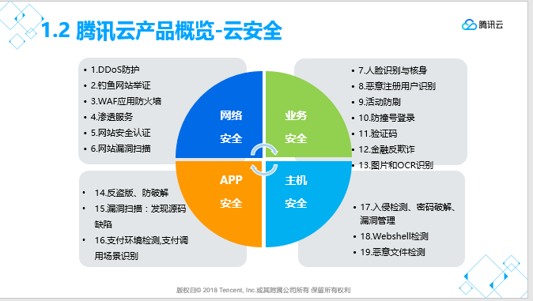
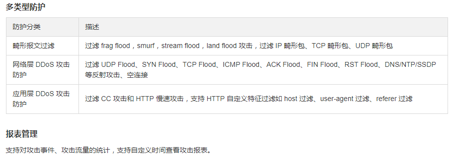
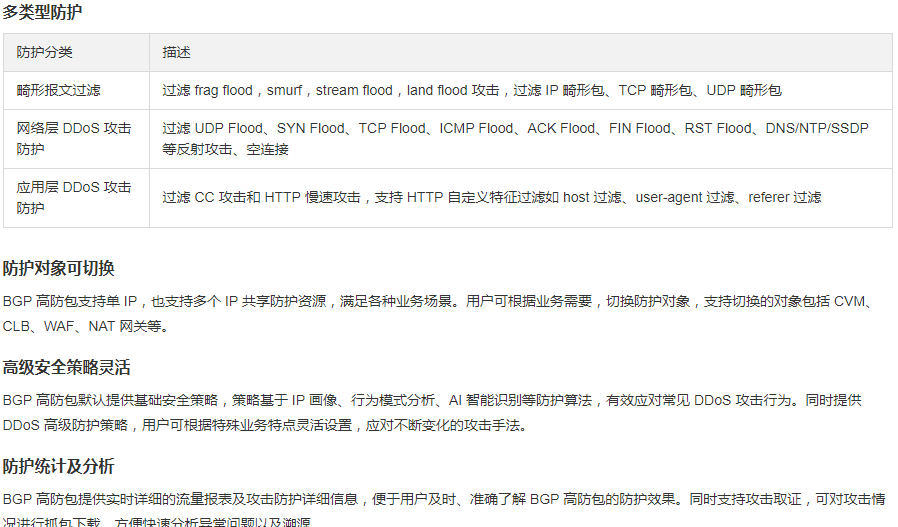
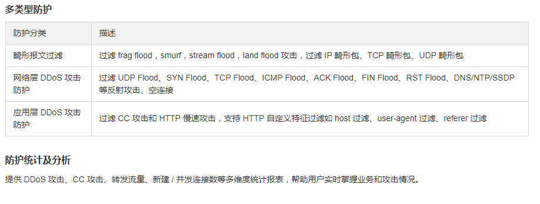
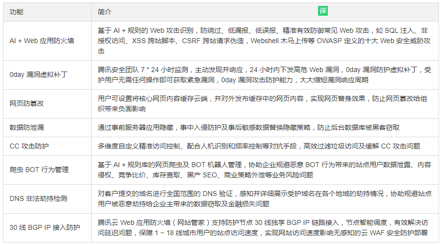
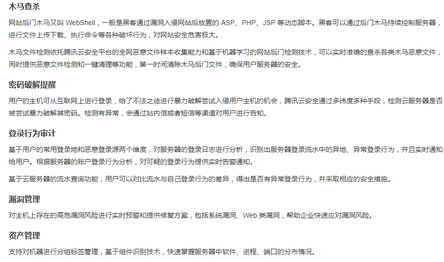

### 腾讯云产品
#### 资源
- 计算资源
> 比如：CVM、GPU等提供弹性计算功能的云服务器，黑石容器服务，弹性伸缩功能和负载均衡的功能。
- 存储和CDN资源
> 比如：腾讯云的存储服务支持对象存储，文件存储，云硬盘存储等，以及内容分发网络CDN，动态加速网络等功能。
- 网络资源
> 比如：私有网络，专线接入网络，跨地域互联网，弹性网卡，NAT网关和VPN连接等。
- 数据库资源
> 比如：支持关系型数据库，文档型数据库，列式数据库，分布式云数据库等，还支持弹性缓存，以及数据传输服务。

### 计算产品
#### 云服务器（Cloud Virtual Machine，CVM）
> 云服务器CVM提供安全可靠的弹性计算服务。 只需几分钟，就可以在云端获取和启用 CVM，来实现计算需求。随着业务需求的变化，可以实时扩展或缩减计算资源。CVM 支持按实际使用的资源计费，节约计算成本。使用 CVM 可以极大降低软硬件采购成本，简化IT运维工作。
#### GPU云服务器（GPU Cloud Computing）
> GPU云服务器是基于GPU的应用于视频编解码、深度学习、科学计算等多种场景的快速、稳定、弹性的计算服务，提供和标准云服务器一致的管理方式。出色的图形处理能力和高性能计算能力提供极致计算性能，有效解放计算压力，提升产品的计算处理效率与竞争力。
#### FPGA 云服务器（FPGA Cloud Computing）
> FPGA云服务器是基于FPGA（Field Programmable Gate Array）现场可编程阵列的计算服务，只需单击几下鼠标即可在几分钟内轻松获取并部署FPGA计算实例。可以在FPGA实例上编程，为应用程序创建自定义硬件加速。提供可重编程的环境，可以在FPGA实例上多次编程，而无需重新设计硬件，能更加专注于业务发展。
#### 专用宿主机 （Cvm Dedicated Host ）
> 专用宿主机CDH可以以独享宿主机资源方式购买、创建云主机，以满足资源独享、安全、合规需求；购买专用宿主机后，可在其上灵活创建、管理多种自定义规格的独享型云主机。
> **应用场景：金融、保险、证券等**
#### 黑石-混合云Plus(CPM)
> 黑石-混合云 Plus 是提供物理服务器(Cloud Physical Machine)按需购买、按量付费的裸金属云服务，提供云端专用的高性能、安全隔离的物理集群。使用该服务，只需确定配置和数量，获取服务器时间将被缩短至4小时，服务器供应及运维工作交由腾讯云，可专注于业务创新。

### 网络产品

#### 负载均衡
> 负载均衡（Cloud Load Balancer）是对多台云服务器进行流量分发的服务。负载均衡可以通过流量分发扩展应用系统对外的服务能力，通过消除单点故障提升应用系统的可用性。

##### 多协议转发
- 四层负载均衡
  1. TCP
  2. UDP
- 七层负载均衡
  1. HTTP
  2. HTTPS

##### 流量分配算法
- 加权轮询
- 加权最小连接数
- 源地址散列调度算法

##### 跨地域可用区容灾
- 同地域跨多可用区部署
> 应对机房级别的故障

#### 私有网络
> 腾讯云私有网络（Virtual Private Cloud，VPC）是一块在腾讯云上自定义的逻辑隔离网络空间，与在数据中心运行的传统网络相似，托管在腾讯云私有网络内的是在腾讯云上的服务资源，包括 、负载均衡、云数据库等云服务资源。
> 在腾讯云上的私有网络不仅可以灵活访问 Internet，而且有丰富的接入方式连接企业自有数据中心，助力快速部署混合云。同时，腾讯云私有网络对等连接和基础网络互通功能可以轻松连接内网资源，帮助轻松实现全球同服和两地三中心容灾。此外，腾讯云私有网络上的网络 ACL和安全组多维度全方位保证网络安全性。

#### 专线接入
> 专线接入提供了一种快速安全连接腾讯云与本地数据中心的方法，用户可以通过一条物理专线一次性打通位于多地域的腾讯云计算资源，实现灵活可靠的混合云部署。
#### 弹性网卡
> 弹性网卡是一种虚拟的网络接口，您可以将云主机绑定弹性网卡接入网络。弹性网卡在配置管理网络、搭建高可靠网络方案时有较大帮助。
> ** 弹性网卡具有私有网络、可用区和子网属性，只可以绑定相同可用区下的云服务器。一台云服务器可以绑定多个弹性网卡，具体绑定数量将根据主机规格而定。 **
#### NAT网关（NAT Gateway）
> NAT网关（NAT Gateway）是一款私有网络（VPC）访问Internet的高性能网关，支持SNAT代理转发，提供双机热备、自动切换能力，最大支持5Gbps的带宽吞吐能力、1000万以上的并发连接数、10个弹性IP绑定，满足海量Internet访问诉求。
- SNAT转发
> SNAT（源地址转换）将IP数据包的源地址转换成另外一个地址，为私有网络内没有公网IP的实例（CVM、数据库等）提供代理上网功能，可以规避实例（CVM、数据库等）直接暴露公网IP带来的安全风险。
- 高性能转发
  1. 带宽吞吐可达5Gbps
  2. 最大连接数可达1000W
- 自动容灾
> 双机热备、自动容灾，99.99%服务可用性，保证业务稳定畅行。
- 监控警告
  1. 可视化监控
  2. 自定义告警

#### 跨地域互联
> 大带宽、高质量合规的数据同步服务，支持跨地域私有网络互联、跨地域基础网络互联。跨地域互联：提供高速、稳定、安全的跨地域数据同步服务，助力实现两地三中心这样的容灾方案

#### VPN连接
> 通过IPsec加密的数据通道连接企业数据中心、腾讯云。安全可靠的加密通信，助力实现异地容灾和混合云的部署。

- 安全可靠地通信
  1. 使用IKE（秘钥交换协议）和Ipsec对传输数据进行加密，基于公网建立了安全可靠的通信隧道。
  2. 采用双机热备架构，故障秒级切换，保障业务无间断运营，可靠性高。
- 快速部署弹性服务
> VPN连接支持从企业的数据中心接入到腾讯云的私有网络中，可以在私有网络中部署弹性伸缩服务，从而满足应用和业务的灵活伸缩，节省企业IT设备成本。
- 监控告警
> 可视化展示多项关键数据指标的监控信息，如：出带宽、入带宽，让您完全掌握VPN网关和通道的运行状态以及健康状况，帮助快速定位和解决问题。
> 可以设置自定义告警，当指标超过一定阈值时自动告警，告警消息会通过邮件及短信通知，帮助及时预警风险。
> 监控和告警服务无需额外收费，当故障发生时，能帮助快速定位和解决问题。

### 腾讯云存储产品
#### 云硬盘
> 云硬盘（Cloud Block Storage）是腾讯云提供的用于CVM实例的持久性数据块级存储。每个云硬盘在其可用区内自动复制，云硬盘中的数据在可用区内以多副本冗余方式存储，避免数据的单点故障风险。云硬盘提供处理工作所需的稳定可靠低延迟存储，通过云硬盘，可在几分钟内调整存储容量，且所有这些只需为配置的资源量支付低廉的价格。
#### 归档存储
> 归档存储（Cloud Archive Storage）是面向企业和个人开发者提供的高可靠、低成本的云端离线存储服务。 可以将任意数量和形式的非结构化数据放 入CAS，实现数据的容灾和备份。

#### 文件存储
> 文件存储（Cloud File Storage）提供了可扩展的共享文件存储服务，可与腾讯云的 CVM 等服务搭配使用。CFS 提供了标准的 NFS 文件系统访问协议，为多个 CVM 实例提供共享的数据源，支持无限容量和性能的扩展，现有应用无需修改即可挂载使用，是一种高可用、高可靠的分布式文件系统，适合于大数据分析、媒体处理和内容管理等场景。

- CFS应用场景：
  1. 企业文件存储
  > 在拥有众多员工的企业中，员工办公需要共享和访问相同的数据集。管理员可以通过 CFS 创建文件系统，以便组织中的个人访问，还可为用户和组在文件或目录级别上设置权限。
  2. 流媒体处理
  > 视频编辑、影音制作、广播处理、声音设计和渲染等媒体工作流程通常依赖于共享存储来操作大型文件。CFS 强大的数据一致性模型加上高吞吐量和共享文件访问，可以缩短完成上述工作所需的时间。
  3. Web服务及内容管理
  > CFS 作为一种持久性强、吞吐量高的文件系统，可用于各种内容管理系统，为网站、在线发行、存档等各种应用服务提供数据源文件。
  4. 大数据应用
  > CFS 具备大数据应用程序所需的规模和性能，其计算节点高吞吐量、写后读一致性以及低延迟文件操作的功能及特性，特别适合服务器日志集中处理和分析。

#### 对象存储
> 对象存储（Cloud Object Storage）是面向企业和个人开发者提供的高可用，高稳定，强安全的云端在线存储服务。可以将任意数量和形式的非结构化数据放入COS，并在其中实现数据的管理和处理。COS支持标准的Restful API接口，可以快速上手使用，按实际使用量计费，无最低使用限制。

>概述：COS主要存储是数据为非结构化数据，如视频、音频、图片、文件等。用户可通过调用API的方式，简单、快速接入，实现所有数据管理和处理的功能，同时也可通过COS的web控制台，对存储内容进行管理。COS对象存储服务适合网站、移动应用APP及各类企业业务场景。
- 对象存储的应用场景：
  1. 多点上传的UGC场景
  > 面对有大量 UGC 内容生成的业务场景，对象存储服务 COS 的大容量 IO 吞吐能力，使得 COS 相比传统的模式有效地解决了多点并发上传的问题，COS 自动选择就近节点上传，大幅度缩短了终端上传图片和文件的排队时间，同时也提高了文件上传的成功率。
  2. 频繁IO的网盘场景
  > 面对上传和下载比较频繁的网盘场景，对象存储服务 COS 相比原有的 NAS 设备，有更好的扩展性，COS 能够随着用户数据量的提高而自动扩容；对于并发访问的情况，COS 相比传统的 NAS 设备有更充足的带宽支持，避免了访问时延长或者服务不可用的情况出现。
  3. 海量数据归档及备份
  > 面对冷数据存储的场景，COS 为您提供了一套分级存储的方案，针对那些访问频率比较低，同时对访问速度要求不高的数据，建议将数据保存在低频存储中，如此可以在不降低数据耐久性的前提之下，降低存储费用约40%，为保存档案和备份资料提供了一个海量低价的空间。
  4. 热点资源分发下载
  > 面对视频点播源、游戏资源等热点文件下发的场景，COS 结合 CDN 使用，使您灵活应对大流量和高并发的业务场景。可以使用 COS 作为源站，将热点资源放在 COS 中，然后通过 CDN 将资源下发给终端用户。这样一来，降低了下发的流量费用，降低了终端访问的时延，同时腾讯强大的带宽支持完全不用考虑由于流量过大而导致业务无法访问。

### 存储网关
> 存储网关（Cloud Storage Gateway）是一种混合云存储方案，旨在帮助企业或个人实现本地存储与公有云存储的无缝衔接。无需关心多协议本地存储设备与云存储的兼容性，只需要在本地安装云存储网关即可实现混合云部署，并拥有媲美本地性能的海量云端存储。

### 私有云存储
> 腾讯云私有云存储 CSP（Cloud Storage on Private）是面向企业提供可扩展、高可靠、强安全、低成本的 PB 级海量数据存储能力。提供客户机房私有部署、腾讯云机房专区部署两种方式，满足客户多种场景需求，并保障客户对系统 100% 可控。

### 云数据迁移服务(CDM)

### 日志服务(CLS)

### 集中式数据库
#### CDB
> 云数据库（Cloud DataBase CDB）是腾讯云提供的关系型数据库云服务，基于PCI-e SSD存储介质，提供高达245509 QPS的强悍性能。CDB 支持MySQL、SQL Server、TDSQL(兼容mariaDB)引擎，PostgreSQL等，相对于传统数据库更容易部署、管理和扩展，默认支持主从实时热备，并提供容灾、备份、恢复、监控、迁移等数据库运维全套解决方案。

##### 关系型数据库云服务器
> CDB提供云上的关系型数据库，可以 支持MySQL、SQL Server、TDSQL(兼容mariaDB)引擎，PostgreSQL等
- 数据迁移
  1. 基于CDB提供的数据传输工具CDT，可轻松将海量数据迁移上云。
  2. 提供命令行和WEB两种方式管理数据库，并支持批量数据库管理、权限设置和SQL导入。
  3. 提供多种数据导入途径完成初始化。每日自动生成备份数据，云数据库根据备份文件提供3天内任意时间点回档。
- 高可用
  1. 提供主从数据实时热备、确保线上数据安全。同时通过多份备份机制保存多天的数据，提高在灾难情况下的数据可靠性。
  2. 实时双机热备，3日内无损恢复 ，5日冷备数据dump。
  3. 提供宕机自动检测和故障自动迁移。主备切换和故障迁移过程对用户透明。
  4. 多维度监控、自定义资源阈值告警，提供慢查询分析报表和SQL完整运行报告。

#### CRS
> 弹性缓存 Redis（Cloud Redis Store）是腾讯云打造的兼容 Redis 协议的缓存和存储服务，提供主从版和集群版。丰富的数据结构能帮助您完成不同类型的业务场景开发。支持主从热备，提供自动容灾切换、数据备份、故障迁移、实例监控、在线扩容、数据回档等全套的数据库服务。
注：CRS中包括Redis和Memcached，其中Redis已有分布式的版本

- 兼容Redis协议：
> Redis是什么？Redis是一个开源的使用ANSI C语言编写、支持网络、可基于内存亦可持久化的日志型、Key-Value数据库，并提供多种语言的API。简单点说就是一个内存高速缓存数据库。互联网企业一般用于存储“热”数据。CRS基于Redis开发，为企业提供高速云缓存服务。
- 主从热备，自动容灾
> CRS分为新一代版本、主从版、集群版，新一代 Redis 是腾讯云自研的一款 Redis 产品，高度兼容 Redis 协议，容量为 32G 到 384G，主从版采用主从热备的架构，当主机出现故障时，会自动检测到故障，服务切换到备机，无需担心数据丢失和服务中断；集群版为腾讯自研成熟的分布式架构，数据通过一致性 hash 算法的方式将数据分布存储到多台物理机，达到超大容量的技术能力，理论上容量可达到无上限，用户无需关注底层细节。
- 备份回档、平滑扩容
> 备份回档：实例数据定时自动备份，提高数据可靠性。同时集群版服务附带流水系统，每个实例的所有写操作都会通过流水系统写到日志中，在 Web 控制台上进行操作，即可恢复三天内任意时间点的数据。
> 平滑扩容：当存储容量不足时，通过云数据库的 WEB 管理中心点击操作实现一键扩容，扩容后的实例将继承原有实例的 IP 和全部配置，后续将会实现自动扩容，整个过程中业务访问无感知。

### 分布式数据库
> DCDB 是支持自动水平拆分的高性能分布式数据库架构——即业务显示为完整的逻辑表，数据均匀的拆分到多个分片中；目前已兼容MySQL协议；DCDB的每个分片默认采用主从架构，提供灾备、恢复、监控、不停机扩容等全套解决方案，适用于TB或PB级的海量数据场景
#### MongoDB
> 文档数据库MongoDB（Cloud MongoDB Service）是腾讯云基于全球广受欢迎的MongoDB打造的高性能NoSQL数据库，100%完全兼容MongoDB协议(同时高度兼容DynamoDB协议)，提供稳定丰富的监控管理，弹性可扩展、自动容灾，适用于文档型数据库场景，无需自建灾备体系及控制管理系统。
#### TData
> TData 一体机是融合了高性能计算、热插拔闪存、Infiniband 网络的数据库解决方案，能满足用户在 OLAP、 OLTP 以及混合负载等各种应用场景下的极限性能需求，支持各种主流数据库（MySQL 、Oracle 、PostgreSQL 、SQL Server）

#### HBase
> 列式数据库HBase（Cloud HBase Service）是腾讯云基于全球广受欢迎的HBase打造的高性能、可伸缩、面向列的分布式存储系统，100%完全兼容HBase协议， 适用于写吞吐量大、海量数据存储以及分布式计算的场景，提供稳定丰富的集群管理，弹性可扩展的系统服务。
#### TiDB
> HTAP数据库TiDB（HTAP Database for TiDB）是腾讯云基于国内最新的 NewSQL 开源数据库TiDB打造的一款同时支持联机事务处理（OLTP）和 联机分析处理（OLAP）两种业务类型的分布式数据库产品，支持强一致性的分布式事务，在线弹性扩容，异地多活及自动故障恢复，同时兼容 MySQL 协议，使迁移使用成本降到极低。
#### 传输服务
> 数据传输服务（Data Transmission Service，DTS）提供以数据库为中心的数据迁移、同步及订阅服务。它可以帮助轻松安全地将数据库迁移上云，也支持不同实例间的连续数据复制。基于 binlog 日志的数据订阅还支持将云数据库的数据更新通过实时流式传输的方式传输到数据仓库。数据传输服务 DTS 可帮助在业务不停服的前提下轻松完成数据库迁移，利用实时同步通道轻松构建异地容灾的高可用数据库架构，帮助用户将复杂的数据交互工作承担下来，让用户可以专注于上层的业务开发。

### 腾讯云安全

> 安全是腾讯云的基因，是腾讯云实现服务价值的根本保障。安全性、稳定性、海量服务、大数据能力、贴心服务等是企业拥抱云计算最为关心的几大因素，其中又以安全性最为关键。
> 腾讯云安全生态的实现，得益于腾讯云在安全领域积累了丰富的经验，并拥有深厚的互联网安全基因。用户基数庞大的产品QQ和微信子诞生伊始，就和“安全”两字联系在一起，两个字联系在一起，这两块业务每天都在极大地帮助和促进腾讯积累云安全方面的经验。
> “可信、可靠、保障、贴心”，是腾讯云提供服务的核心理念，覆盖从物理环境、访问控制、配置管理、应急响应、安全审计、持续监控、供应链等多个环节的安全控制要求，提供多维度安全防护。腾讯云安全提供19项安全服务，构建企业的安全体系，实现互联网安全的纵深防御体系。

#### 网络安全DDoS防护（大禹系统）
> DDoS(Distributed Denial of Service)

##### DDoS基础防护
> DDoS 基础防护是腾讯云免费为云服务器（Cloud Virtual Machine，CVM）、负载均衡（Cloud Load Balancer，CLB）等资源提供的基础 DDoS 防护能力，满足日常安全运营需求。普通用户可享受 2Gbps 防护，VIP 用户 可享受 10Gbps 防护。DDoS 基础防护默认开启，实时监控网络流量，发现攻击立即清洗，为腾讯云上公网 IP 秒级开启防护。

- 主要功能

##### BGP高防包
>BGP 高防包是针对业务部署在腾讯云内的用户提升 DDoS 防护能力的付费产品。BGP 高防包直接对腾讯云上 IP 生效，无需更换 IP，购买后只需绑定需要防护的 IP 即可使用，具备接入便捷、零变更等特点。BGP 高防包支持单 IP 防护，同时提供多 IP 共享防护资源，满足多个 IP 地址都需要提升防护能力的需求。    
>腾讯云 BGP 高防包提供独享包与共享包两种类型的高防包，用户可根据需求自行选择：    
>  独享包：提供一个 IP 独享防护能力。     
>  共享包：提供多个 IP 共享防护能力。

- 主要功能

##### BGP高防IP
> BGP 高防 IP 是针对游戏、金融以及网站等业务遭受大流量 DDoS 攻击导致用户服务不可用的情况而推出的付费防护服务。用户通过配置高防 IP，将攻击流量引流到高防 IP 进行清洗，确保源站业务的稳定可用。    
> BGP 高防 IP 使用公网代理的接入方式，支持 TCP，UDP，HTTP，HTTPS 和 HTTP2 等协议，覆盖金融、电商、游戏等各类业务。    

- 主要功能

##### 高防IP专业版
> 高防 IP 专业版是 DDoS 防护（大禹）基于腾讯丰富业务攻击防护实践积累，为互联网业务提供高可用、高性价比的应对 DDoS 攻击的安全防护产品，可解决超大流量的 DDoS 攻击。
> 相比 BGP 高防 IP，高防 IP 专业版支持跨地域 T 级大流量抗 DDoS 攻击，最高防护带宽可达 1.7T。高防 IP 专业版采用 CNAME 智能调度，实现多线路防护，即使遭遇封堵也能灵活切换，充分保障业务连续性。用户购买时无需考虑地域资源，只需按所需> 防护能力购买一个高防 IP 专业版实例，即可实现中国大陆地域内不同运营商线路的快速访问和 DDoS 防护需求。
> 通过配置高防 IP 专业版服务，将用户源站服务器所有访问流量牵引至高防 IP 集群并清洗攻击流量，并将过滤后的正常流量返回至源站服务器，从而保障用户业务稳定可用。

- 主要功能

##### 棋盾牌
> 棋牌盾是一款面向业务频繁遭受 DDoS 攻击、CC 攻击的游戏行业用户推出的针对性产品。棋牌盾采用业界独有的 IP 轮询技术，将业务分散至一批棋牌盾 IP，并配以灵活的用户隐藏和流量调度策略，低成本地抵御大流量攻击，确保核心业务不受影响。

- 主要功能

#### 业务安全（天御安全）
> 天御业务安全防护包含产品注册保护、登录保护、活动防刷和验证码服务。 

- 注册保护
> 注册保护服务（RegisterProtection）针对网站、App 等线上注册场景，预先识别恶意注册风险并通知开发者进行处理，从源头降低作恶风险，保证您的业务健康发展。 

- 登录保护
> 登录保护服务（LoginProtection）针对网站和 App 的用户登录场景，为开发者发现异常登录并提出相应的防护建议，降低恶意用户登录给业务带来的恶意风险。

- 活动防刷
>  活动防刷服务（ActivityAntiRush）针对电商、O2O、P2P、游戏、支付等行业，通过防刷引擎在促销活动中精准识别出 “羊毛党”，避免企业被刷带来的巨大经济损失。 

- 验证码服务
> 验证码服务（Captcha）为网站、App 开发者提供安全智能的验证码，减少交互，最大程度地保护业务安全并避免验证码难以识别的问题。

#### 应用安全
##### 移动应用安全
> 移动应用安全提供了移动应用的一站式安全解决方案。您只需上传签名过的安装包，就能享受安全检测、应用加固、渠道监控以及安全 SDK 等一系列功能。应用安全可帮助您防止应用被盗版破解，及时发现应用漏洞，监控应用正盗版分发等，有效捍卫移动应用所有者利益。

##### web应用防火墙(WAF)
> 腾讯云 Web 应用防火墙（网站管家）（Web Application Firewall）是一款基于 AI 的一站式 Web 业务运营风险防护方案。以腾讯云强大的安全大数据能力以及 19 年自营业务 Web 安全防护经验，能给予网站有效的安全保证。
> 腾讯云网站管家可以有效防御 SQL 注入、XSS 跨站脚本、木马上传、非授权访问等 OWASP 攻击。此外还可以有效过滤 CC 攻击、检测 DNS 链路劫持检测、提供 0day 漏洞补丁、防止网页篡改等多种手段全方位保护网站的系统以及业务安全。

- 主要功能

#### 主机安全（云镜）
> 主机安全（云镜）是一款针对于云上主机安全防护的防御产品，为云主机提供多层次全方位的系统防护技术，其融合了腾讯多年积累的海量威胁情报数据、漏洞信息。通过利用机器学习，为用户提供黑客入侵检测和漏洞风险预警等安全防护服务，主要包括密码破解拦截、异地登录提醒、木马文件查杀、高危漏洞检测等安全功能，解决当前服务器面临的主要网络安全风险，帮助企业构建服务器安全防护体系，防止数据泄露。

- 主要功能
