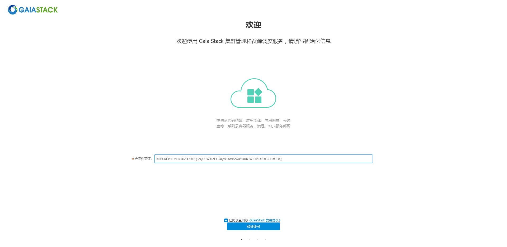
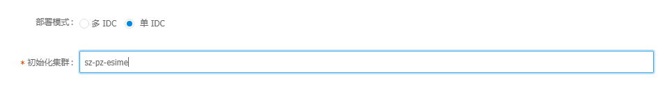
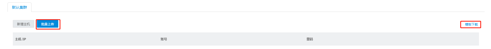
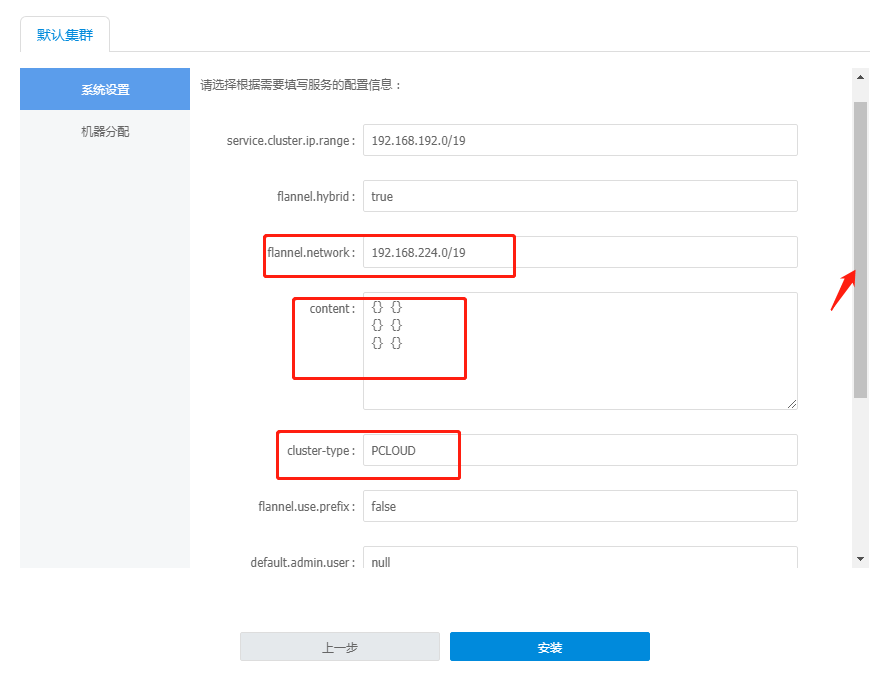
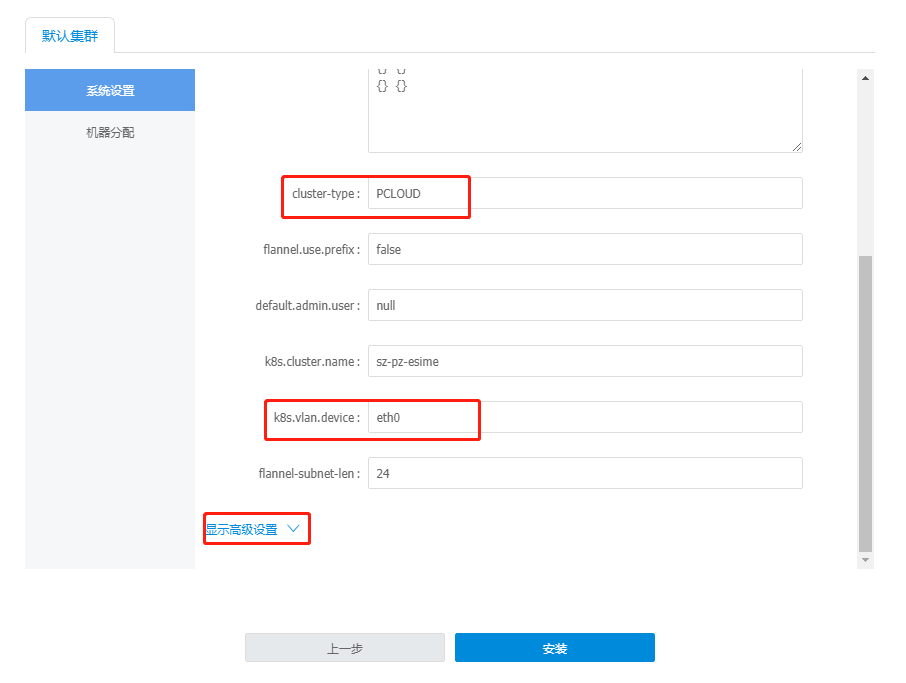
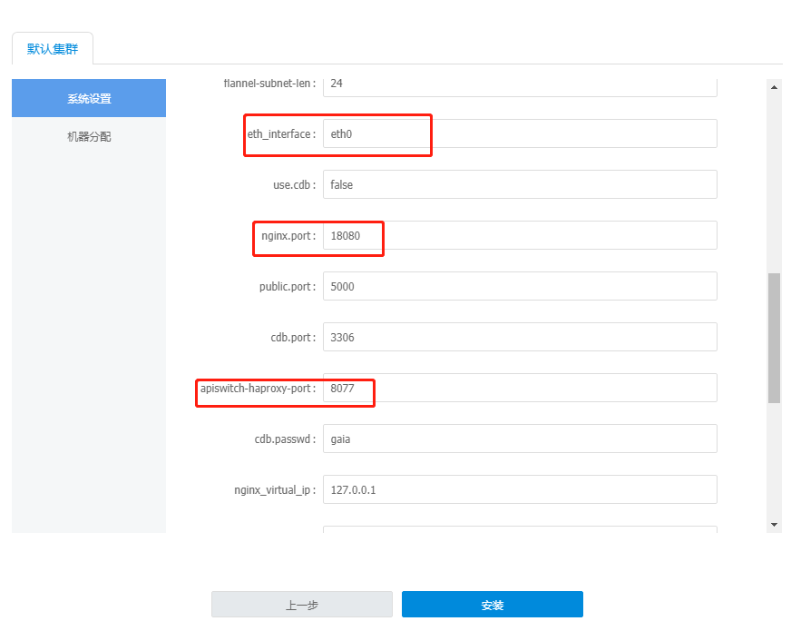
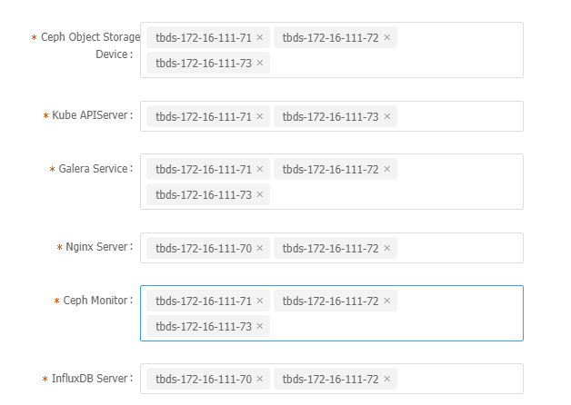
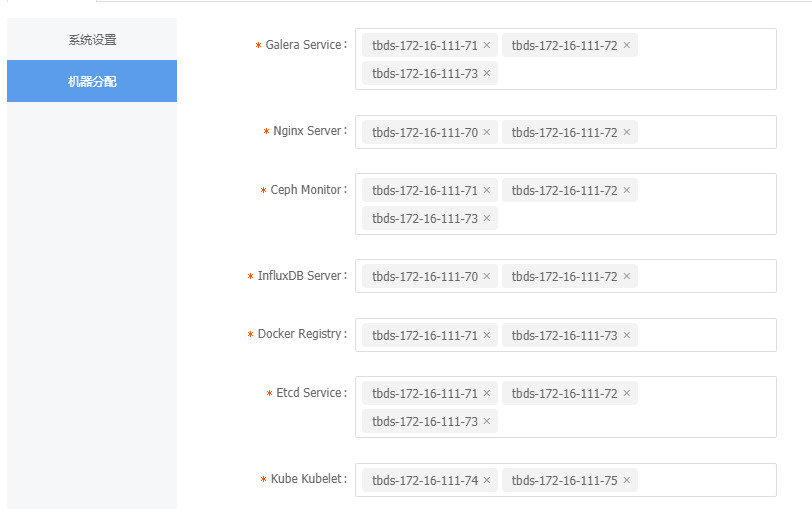

## 机器分配
### 机器配置
> 总共7台，2个20核CPU，256G内存, Raid 6*480G SATASSD, 2 X 10 G网口
### 部署原则
> 整体上，4台master(其中两台nginx server做global层master,两台集群层master(k8s apiserver))，5台机器部署kubelet(k8s 计算节点)    
> 存在混布情况，从nginx,apiserver中各选一台进行混布kubelet，从而实现5计算节点    
### 装机说明
> 7台机器分别编号1~7    
> 操作系统统一为CentOS7.5.1804，手动安装需要选择英文版，软件选择开发者工具     
> /data 目录需要格式化为 xfs    
> sshd端口修改为 36000   
> ( 手动安装 dcos_agent, 配置barad告警，磁盘告警要包含root分区和data分区)    
> ( 设置 cpu 超线程)    
> 装机前执行ntpdate，将时区修改至东八区    
> 计算节点的/etc/resolv.conf 修改 nameserver nginx1_ip \n options timeout:1    

### 机器分配  
- 机器 1   
> 部署节点，门户节点, /data目录存放gaia-yum源, docker-mirror,公共yum源     
> 部署以下组件：    
  - TBDS，部署工具
  - nginx server
  - influxDB server

- 机器 2 
> k8s管理节点， 公共yum源     
> 部署以下组件     
  - kube-apiserver
  - ceph object storage
  - ceph monitor
  - docker registry
  - MetaDB server（主）
  - etcd service

- 机器 3 
> nginx节点， 计算节点node5    
> 部署以下组件    
- nginx server
- influxDB server
- ceph object storage
- ceph monitor
- etcd service
- kubelet

- 机器 4
> k8s管理节点， 计算节点node4    
- kube-apiserver
- ceph object storage
- ceph monitor
- etcd
- docker registry
- MetaDB （备）
- kubelet

- 机器 5/6/7
> 计算节点   
> 部署kubelet    
 
# 部署
## 物料包准备
1. ansible_r1813.tar.gz
```
#ansible --version
ansible 2.4.2.0
  config file = /etc/ansible/ansible.cfg
  configured module search path = [u'/root/.ansible/plugins/modules', u'/usr/share/ansible/plugins/modules']
  ansible python module location = /usr/lib/python2.7/site-packages/ansible
  executable location = /usr/bin/ansible
  python version = 2.7.5 (default, Apr 11 2018, 07:36:10) [GCC 4.8.5 20150623 (Red Hat 4.8.5-28)]
```
2. centos-mini-common-1102.tar.gz
3. docker-mirror-1102.tar.gz
4. gaia-mirror-2.8.1102.tar.gz
5. tce-gaiastack-transfer.tar.gz
6. license
> KRBUKLJYFUZDAMJZ-F4YDQLZQGUWXIZLT-OQWTAMB2GUYDUNJW-HI4DEOTCHE5GIYQ    

## 环境初始化，时钟同步
> bash +x gaia-mirror-2.8/tools/host_env_init.sh    
> 完成之后重启

## 部署节点（TBDS）yum 源配置
1. 安装依赖 `yum install -y createrepo httpd`
2. 创建 yum 仓库 `createrepo /data/gaia-mirror-2.8 && ln -s /data/gaia-mirror-2.8 /var/www/html/gaia-mirror-2.8`  
3. 修改 httpd 服务端口为 18888 `sed -i "s:Listen 80:Listen 18888:g" /etc/httpd/conf/httpd.conf`，重启 httpd 服务 systemctl restart httpd
4. 配置 TBDS yum 源
```
cat<< EOF |tee /etc/yum.repos.d/TBDS.repo
[TDP-2.2]

name=TBDS

baseurl=http://172.16.111.70:18888/gaia-mirror-2.8

enabled=1

gpgcheck=0

priority=1
EOF
```
> 清除 yum 缓存 yum clean all   
> 重新生成缓存 yum makecache   
5. 安装 TBDS
> ansible gaia -m shell -a 'mkdir -p /etc/yum.repos.d/backup '   
> ansible gaia -m shell -a 'yum clean all && yum makecache'   
> yum install tbds-portal -y   
> tbds-portal setup-gaiastack eth0   
  > 1. mysql tbds使用
  > 2. jdk
  > 3. tomcat
  > tbds-portal log 查看日志   
> tbds-portal start    

> cd /data/tce-gaiastack-transfer/tce-deploy   
> cp cases.json /usr/local/tbds-portal/conf/cases.json   
> cp gaia_host.json /usr/local/tbds-portal/conf/gaia_host.json    
> cp metainfo.xml /var/lib/tbds-server/resources/stacks/TDP/2.2/services/KUBERNETES/metainfo.xml    
> cp apiserver.xml /var/lib/tbds-server/resources/stacks/TDP/2.2/services/KUBERNETES//configuration/apiserver.xml    
> <font color=red>tbds-portal</font> restart   
> <font color=red>tbds-server</font> restart    
  
## gaiastack 安装
1. 建立隧道，172.16.111.70:80 --> 127.0.0.1:18080，访问127.0.0.1:18080/install 进行gaiastack安装
2. 输入前面准备好的 license 并验证

3. 选择单部署模式，并输入系群名称 城市缩写-地区缩写-集群名称

4. 上传主机列表 ip user password
> 选择下载模板，并根据模板填参数如./hostlist.txt   
> 选择批量上传

5. 修改配置，规划主机
> nginx_virtual_ip 改为 172.16.111.77   
> haproxy_virtual_ip 改为 172.16.111.78   





> 开始安装  

6. 端口转发设置
> 在nginx节点执行   
```
cat << EOF |tee /etc/nginx/conf.d/port_forward.conf
server {
    listen      18081;
    server_name  web.gaiastack.hua-cloud.com.cn;

    error_log  logs/jianhang_error.log;
    access_log logs/jianhang_access.log;

    charset utf-8;
    proxy_set_header Host $host;
    proxy_set_header X-Real-IP   $remote_addr;
    proxy_set_header REMOTE-HOST $remote_addr;
    proxy_set_header X-Forwarded-For $proxy_add_x_forwarded_for;
    client_max_body_size 512m;
    client_body_buffer_size 256k;
    proxy_connect_timeout 30;
    proxy_send_timeout 30;
    proxy_read_timeout 60;
    proxy_buffer_size 256k;
    proxy_buffers 4 256k;
    proxy_busy_buffers_size 256k;
    proxy_temp_file_write_size 256k;
    proxy_next_upstream error timeout invalid_header http_500 http_503 http_404;
    proxy_max_temp_file_size 128m;

    location / {
        proxy_set_header X-Real-IP       $remote_addr;
        proxy_set_header Host            $host;
        proxy_set_header X-Forwarded-For $proxy_add_x_forwarded_for;
        proxy_pass       http://172.16.111.77:18080;
    }

    error_page   500 502 503 504  /50x.html;
    location = /50x.html {
        root   html;
    }
}

server {
    listen      18081;
    server_name  apiswitch.gaiastack.hua-cloud.com.cn;

    error_log  logs/jianhang_error.log;
    access_log logs/jianhang_access.log;

    charset utf-8;
    proxy_set_header Host $host;
    proxy_set_header X-Real-IP   $remote_addr;
    proxy_set_header REMOTE-HOST $remote_addr;
    proxy_set_header X-Forwarded-For $proxy_add_x_forwarded_for;
    client_max_body_size 512m;
    client_body_buffer_size 256k;
    proxy_connect_timeout 30;
    proxy_send_timeout 30;
    proxy_read_timeout 60;
    proxy_buffer_size 256k;
    proxy_buffers 4 256k;
    proxy_busy_buffers_size 256k;
    proxy_temp_file_write_size 256k;
    proxy_next_upstream error timeout invalid_header http_500 http_503 http_404;
    proxy_max_temp_file_size 128m;

    location / {
        proxy_set_header X-Real-IP       $remote_addr;
        proxy_set_header Host            $host;
        proxy_set_header X-Forwarded-For $proxy_add_x_forwarded_for;
        proxy_pass       http://172.16.111.78:8077;
    }

    error_page   500 502 503 504  /50x.html;
    location = /50x.html {
        root   html;
    }
}
EOF
```
> 并在ssh工具中添加一条转发规则 127.0.0.1:18081 --> nginx_ip:18081   

7. 加载镜像
> 在后端 Docker registry 组件节点，执行：bash +x /gaia/docker-registry/mirror-download.sh；    
8. 生成证书
> 在其中一个 apiserver(注：只有一台 ha 上有make-ca-cert命令) 节点上执行：make-ca-cert 172.16.111.71 172.16.111.73 172.16.111.78 192.168.192.1    
> 将 /etc/kubernetes 下所有文件拷贝至另外一个 apiserver 节点   
> 将/etc/kubernetes/ca.crt 拷贝至所有node节点 /etc/kubernetes 目录下，重启haproxy,k8s服务    
9. 验证功能
> 验证 keystone   
  > 进入master节点执行 source /tmp/admin_openrc && openstack user list   
> 验证 ceph   
  > 进入 ceph 节点 执行 ceph -s 查看集群状态    
> 验证 docker-registry   
  > push 一个镜像验证是否能够成功    


TBDS nginx influxDB apiserver metadata docker_registry ceph ceph_monitor etcd kubelet

zk hdfs cdb ckv kafka es mq memcache

zk hdfs ckv es   cdb kafka mq memcache

cdb
> 环境初始化  mysqlclient zk mysql&apache dbmaster monitor_collector ha_scheduler ping cdbgw backup_scheduler backup_mounter backupd cdb_oss check
> zk -i -n -t 
> monitor_collector -c
> ha_scheduler -h 
> ping -p
> cdb_gw -g
> backup_schduler -p 
> backupd -k
> -o -r -y
> 创建集群 插入机器元数据 上架机器 创建实例 创建用户（可读可写，只读）
es
> oss_master
> oss_agent
> etcd
> 创建region 创建set 上架机器 创建集群
ckv
> ckv_oss
> ckv_master
> ckv_cache
> dumpserver
> 创建region 上架Set 上架Cache 创建实例（上架业务） 上架dumpserver