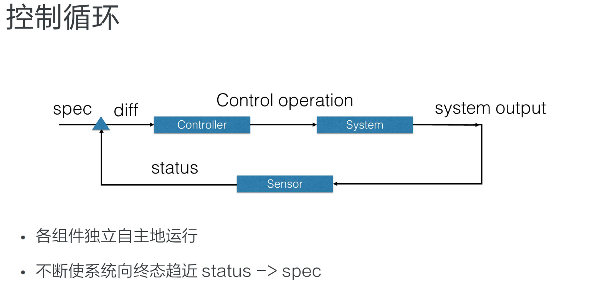
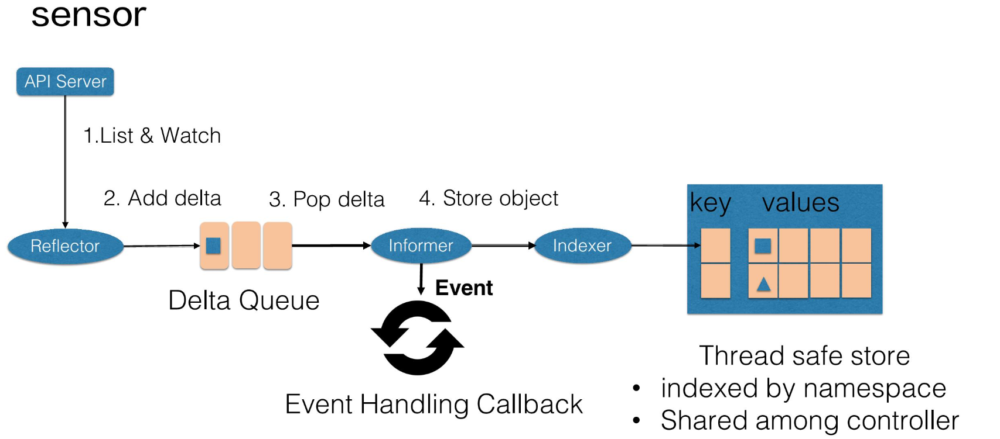
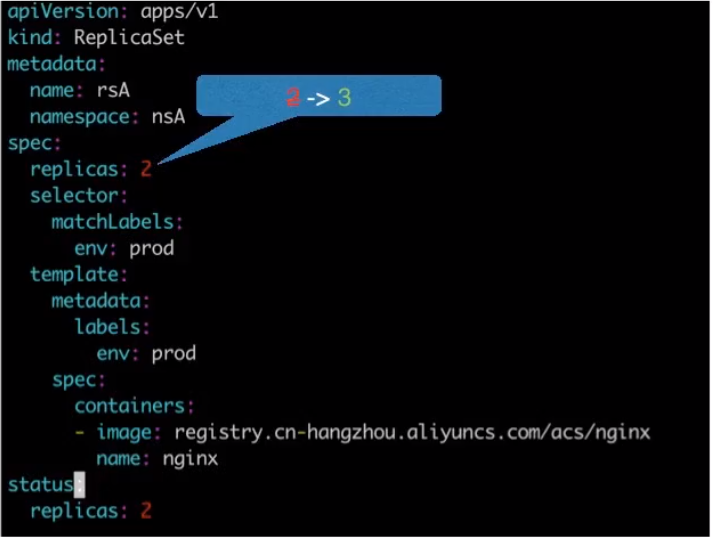
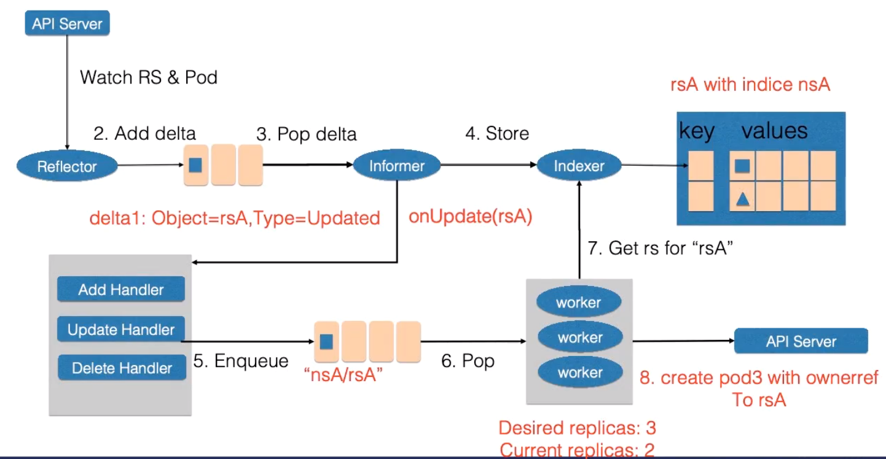
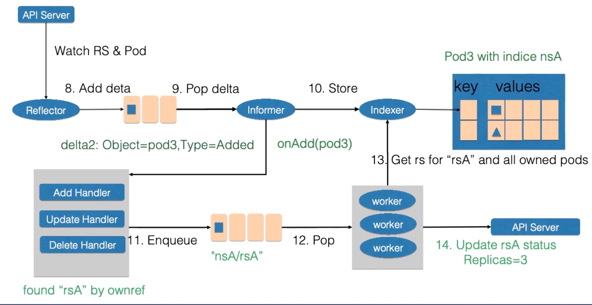

# 控制器管理器及控制器

## 控制循环

控制器通过控制循环, 使对象的 status 不断向 spec 变化, 从而使对象达到用户期望的状态.
控制循环由以下三个逻辑组件组成:

1. 控制器(Controller)
   > 控制器通过给对象的 status 和 spec 做 diff, 并决定对对象的操作.
   > 相应的控制操作执行完成后会产生对应的输出.

2. 被控制的对象

3. 传感器(Sensor)
   > 传感器通过调用系统接口, 获取资源的数据.
   > 并将资源信息与资源事件存入队列中.



### Sensor

传感器主要由 Reflector(反射器), Informer(通知器), Indexer(指示器) 组成.

1. 获取资源(对象)状态
   > Reflector 通过 list/ watch api-server 来获取资源的数据.
   > list: Controller 重启和 watch 中断时实现对资源的全量更新.
   > watch: 在多次 list 之间进行资源的增量更新.


2. Add Delta
   > Reflector 获取资源数据后, 将包含资源对象及相应事件类型的记录
   > (记作: {key: obj, value: event_type})存入 Delta Queuq.
   > Delta Queque 可以保证队列中同一个对象只有一条记录.

3. Pop delta and Store object
   > Informer 不断从 Delta Queue 中弹出对象记录. 并执行两个操作
   1. 通过 obj, event_type 获取并调用相应的 EventHandler
     > Informer 会根据资源的 evnet_type(新增/更新/删除等操作)
     > 调用相应控制器的 EventHandler
   2. 将资源对象交给 Indexer
     > Indexer 将资源对象(对象的最新状态)记录在缓存中.
     > 缓存默认以资源对象的命名空间作为 key, 并且可以被多个 Controller 共享.



### Controller

- 事件处理函数(EventHandler)
   >  对于需要处理的事件, 会创建一个相应的 item
   > (item 以 相应资源的名称和 namespcae 为索引)
   > 并将 item 压入工作队列.
- worker
   > 由 worker 池中的一个 worker 进行处理.
   > 从 workqueue 中弹出相应的 item
   > 并执行相应的同步操作(rsc.syncReplicaSet).

### 控制循环举例 -- 扩容







### 控制器循环(RS Controller)

RS 的控制器的 Run 方法的工作为:

    从 workqueue 获取 要处理的 item, 并执行 rsc.syncReplicaSet 方法.
    其中 item 由 Informer 调用 rsc 的 EventHandler 压入 workqueue 中.

```go
// rsc 与 Informer 关系
// rsc 的构造函数会传入 pod 和 rs 的 Informer
// 用于将 EventHandler 传给 Informer
func NewReplicaSetController(rsInformer appsinformers.ReplicaSetInformer, podInformer coreinformers.PodInformer, kubeClient clientset.Interface, burstReplicas int) *ReplicaSetController {
   ...
	return NewBaseController(rsInformer, podInformer,...)
}

func NewBaseController(rsInformer appsinformers.ReplicaSetInformer, podInformer coreinformers.PodInformer, kubeClient clientset.Interface, burstReplicas int,
	gvk schema.GroupVersionKind, metricOwnerName, queueName string, podControl controller.PodControlInterface) *ReplicaSetController {
   ...
	// 将事件处理函数 (rsc 中定义) 传给 Informer
	// 使 Informer 可以调用相应的事件处理函数
	rsInformer.Informer().AddEventHandler(cache.ResourceEventHandlerFuncs{
		AddFunc:    rsc.addRS,
		UpdateFunc: rsc.updateRS,
		DeleteFunc: rsc.deleteRS,
	})
	rsc.rsLister = rsInformer.Lister()
	rsc.rsListerSynced = rsInformer.Informer().HasSynced

	// 添加 podInformer.Informer() --> cache.SharedIndexInformer
	// 通过 sharedIndexInformer 可以获取/添加 Indexer
	// sharedIndexInformer 继承于 sharedInformer(SI)
	// SI 通过 AddEventHandler 添加事件处理函数. 使 SI 可以处理事件.
	podInformer.Informer().AddEventHandler(cache.ResourceEventHandlerFuncs{
		AddFunc: rsc.addPod,
		// This invokes the ReplicaSet for every pod change, eg: host assignment. Though this might seem like
		// overkill the most frequent pod update is status, and the associated ReplicaSet will only list from
		// local storage, so it should be ok.
		UpdateFunc: rsc.updatePod,
		DeleteFunc: rsc.deletePod,
	})
	rsc.podLister = podInformer.Lister()
	rsc.podListerSynced = podInformer.Informer().HasSynced

	rsc.syncHandler = rsc.syncReplicaSet

	return rsc
}

// rsc 中会定义 rsc.addRS rsc.addPod 等 EventHandlers.
// 这些 EventHandlers 会根据逻辑(增删改)生成相应的 item 并压入 workqueue.
// 如下为 EventHandler, 详见 replica_set.go
func (rsc *ReplicaSetController) addRS(obj interface{}) {
	// 构造 worker 调用的 item
	// item 由 rs 的名字和 namespcae 标识
	rs := obj.(*apps.ReplicaSet)
	klog.V(4).Infof("Adding %s %s/%s", rsc.Kind, rs.Namespace, rs.Name)
	// 将 item 压入工作队列中
	rsc.enqueueRS(rs)
}

// callback when RS is updated
func (rsc *ReplicaSetController) updateRS(old, cur interface{}) {
	oldRS := old.(*apps.ReplicaSet)
   curRS := cur.(*apps.ReplicaSet)
   ...
	rsc.enqueueRS(curRS)
}

func (rsc *ReplicaSetController) deleteRS(obj interface{}) {
	rs, ok := obj.(*apps.ReplicaSet)
	...
	rsc.queue.Add(key)
}

// When a pod is created, enqueue the replica set that manages it and update its expectations.
func (rsc *ReplicaSetController) addPod(obj interface{}) {
   pod := obj.(*v1.Pod)
   ...
}

// When a pod is updated, figure out what replica set/s manage it and wake them
// up. If the labels of the pod have changed we need to awaken both the old
// and new replica set. old and cur must be *v1.Pod types.
func (rsc *ReplicaSetController) updatePod(old, cur interface{}) {
	curPod := cur.(*v1.Pod)
	oldPod := old.(*v1.Pod)
	...
}

// When a pod is deleted, enqueue the replica set that manages the pod and update its expectations.
// obj could be an *v1.Pod, or a DeletionFinalStateUnknown marker item.
func (rsc *ReplicaSetController) deletePod(obj interface{}) {
   pod, ok := obj.(*v1.Pod)
   ...
	rsc.queue.Add(rsKey)
}

```

```go
// rsc.Run() 方法流程解析

// 启动 RS Controller: kubernetes\pkg\controller\replicaset\replica_set.go
// Run begins watching and syncing.
// RS 控制循环入口
func (rsc *ReplicaSetController) Run(workers int, stopCh <-chan struct{}) {
	defer utilruntime.HandleCrash()
	defer rsc.queue.ShutDown()

	controllerName := strings.ToLower(rsc.Kind)
	klog.Infof("Starting %v controller", controllerName)
	defer klog.Infof("Shutting down %v controller", controllerName)

	if !cache.WaitForNamedCacheSync(rsc.Kind, stopCh, rsc.podListerSynced, rsc.rsListerSynced) {
		return
	}

   // workers: worker 资源池的大小
   // 同时有 wokers 个 woker 处理工作队列中的事件.
	for i := 0; i < workers; i++ {
      // wait.Until(f func(), period time.Duration, stopCh <-chan struct{})
      // 无限循环执行函数 f
		go wait.Until(rsc.worker, time.Second, stopCh)
	}

	<-stopCh
}

// worker 函数通过运行 worker 线程来执行工作队列中的事件, 并标记已完成.
// 同一个 key 的 event 在工作队列中不会重复出现.
// worker runs a worker thread that just dequeues items, processes them, and marks them done.
// It enforces that the syncHandler is never invoked concurrently with the same key.
func (rsc *ReplicaSetController) worker() {
   // 实际上调用的是 rsc.processNextWorkItem
	for rsc.processNextWorkItem() {
	}
}

// rsc.processNextWorkItem
func (rsc *ReplicaSetController) processNextWorkItem() bool {
   // worker 从队列中获取 event
   // queue: workqueue.NewNamedRateLimitingQueue(workqueue.DefaultControllerRateLimiter(), queueName),
	key, quit := rsc.queue.Get()
	if quit {
		return false
	}
	defer rsc.queue.Done(key)

   // 控制器的核心操作, 最终调用的是 rsc.syncReplicaSet.
	err := rsc.syncHandler(key.(string))
	if err == nil {
      // 停止跟踪 key 所代表的项
		rsc.queue.Forget(key)
		return true
	}

	// 同步失败时, 执行以下操作
	utilruntime.HandleError(fmt.Errorf("sync %q failed with %v", key, err))
   /*
   // AddRateLimited AddAfter's the item based on the time when the rate limiter says it's ok
   AddRateLimited 如果队列中数量已达最大值, 则稍后添加进队列, 这个时间由前一个带加入的项添加进去之后确定
    func (q *rateLimitingType) AddRateLimited(item interface{}) {
   	q.DelayingInterface.AddAfter(item, q.rateLimiter.When(item))
    }
   */
	rsc.queue.AddRateLimited(key)

	return true
}

// syncReplicaSet will sync the ReplicaSet with the given key if it has had its expectations fulfilled,
// meaning it did not expect to see any more of its pods created or deleted. This function is not meant to be
// invoked concurrently with the same key.
func (rsc *ReplicaSetController) syncReplicaSet(key string) error {
	startTime := time.Now()
	defer func() {
		klog.V(4).Infof("Finished syncing %v %q (%v)", rsc.Kind, key, time.Since(startTime))
	}()

	namespace, name, err := cache.SplitMetaNamespaceKey(key)
	if err != nil {
		return err
	}
	rs, err := rsc.rsLister.ReplicaSets(namespace).Get(name)
	if errors.IsNotFound(err) {
		klog.V(4).Infof("%v %v has been deleted", rsc.Kind, key)
		rsc.expectations.DeleteExpectations(key)
		return nil
	}
	if err != nil {
		return err
	}

	rsNeedsSync := rsc.expectations.SatisfiedExpectations(key)
	selector, err := metav1.LabelSelectorAsSelector(rs.Spec.Selector)
	if err != nil {
		utilruntime.HandleError(fmt.Errorf("error converting pod selector to selector: %v", err))
		return nil
	}

	// list all pods to include the pods that don't match the rs`s selector
	// anymore but has the stale controller ref.
	// TODO: Do the List and Filter in a single pass, or use an index.
	allPods, err := rsc.podLister.Pods(rs.Namespace).List(labels.Everything())
	if err != nil {
		return err
	}
	// Ignore inactive pods.
	filteredPods := controller.FilterActivePods(allPods)

	// NOTE: filteredPods are pointing to objects from cache - if you need to
	// modify them, you need to copy it first.
	filteredPods, err = rsc.claimPods(rs, selector, filteredPods)
	if err != nil {
		return err
	}

	var manageReplicasErr error
	if rsNeedsSync && rs.DeletionTimestamp == nil {
		manageReplicasErr = rsc.manageReplicas(filteredPods, rs)
	}
	rs = rs.DeepCopy()
	newStatus := calculateStatus(rs, filteredPods, manageReplicasErr)

	// Always updates status as pods come up or die.
	updatedRS, err := updateReplicaSetStatus(rsc.kubeClient.AppsV1().ReplicaSets(rs.Namespace), rs, newStatus)
	if err != nil {
		// Multiple things could lead to this update failing. Requeuing the replica set ensures
		// Returning an error causes a requeue without forcing a hotloop
		return err
	}
	// Resync the ReplicaSet after MinReadySeconds as a last line of defense to guard against clock-skew.
	if manageReplicasErr == nil && updatedRS.Spec.MinReadySeconds > 0 &&
		updatedRS.Status.ReadyReplicas == *(updatedRS.Spec.Replicas) &&
		updatedRS.Status.AvailableReplicas != *(updatedRS.Spec.Replicas) {
		rsc.queue.AddAfter(key, time.Duration(updatedRS.Spec.MinReadySeconds)*time.Second)
	}
	return manageReplicasErr
}

func (rsc *ReplicaSetController) claimPods(rs *apps.ReplicaSet, selector labels.Selector, filteredPods []*v1.Pod) ([]*v1.Pod, error) {
	// If any adoptions are attempted, we should first recheck for deletion with
	// an uncached quorum read sometime after listing Pods (see #42639).
	canAdoptFunc := controller.RecheckDeletionTimestamp(func() (metav1.Object, error) {
		fresh, err := rsc.kubeClient.AppsV1().ReplicaSets(rs.Namespace).Get(rs.Name, metav1.GetOptions{})
		if err != nil {
			return nil, err
		}
		if fresh.UID != rs.UID {
			return nil, fmt.Errorf("original %v %v/%v is gone: got uid %v, wanted %v", rsc.Kind, rs.Namespace, rs.Name, fresh.UID, rs.UID)
		}
		return fresh, nil
	})
	cm := controller.NewPodControllerRefManager(rsc.podControl, rs, selector, rsc.GroupVersionKind, canAdoptFunc)
	return cm.ClaimPods(filteredPods)
}
```

```go
// 从工作队列中获取/压入数据依赖的接口
rsc.queue workqueue.NewNamedRateLimitingQueue(workqueue.DefaultControllerRateLimiter(), queueName),

// NNRLQ 最终返回的是实现了 RateLimitingInterface 接口的对象
// rateLimitingType 实现了该接口
func NewNamedRateLimitingQueue(rateLimiter RateLimiter, name string) RateLimitingInterface {
	return &rateLimitingType{
		DelayingInterface: NewNamedDelayingQueue(name),
		rateLimiter:       rateLimiter,
	}
}

// rateLimitingType 结构为
// rateLimitingType wraps an Interface and provides rateLimited re-enquing
type rateLimitingType struct {
	DelayingInterface

	rateLimiter RateLimiter
}

// rateLimitingType wraps an Interface and provides rateLimited re-enquing
// rsc.queue 的实际组成部分
// 其中 AddRateLimited NumRequeues Forget 方法由 rateLimitingType 自己实现
// 其余方法交由 NewNamedDelayingQueue(name) 返回的对象实现.
type rateLimitingType struct {
	DelayingInterface

	rateLimiter RateLimiter
}

// NewNamedDelayingQueue constructs a new named workqueue with delayed queuing ability
func NewNamedDelayingQueue(name string) DelayingInterface {
   // 实际调用的是 NewDelayingQueueWithCustomClock 方法
	return NewDelayingQueueWithCustomClock(clock.RealClock{}, name)
}

// NewDelayingQueueWithCustomClock constructs a new named workqueue
// with ability to inject real or fake clock for testing purposes
func NewDelayingQueueWithCustomClock(clock clock.Clock, name string) DelayingInterface {
	ret := &delayingType{
      // Add Len Get Done... 都是由 Interface提供
      // 即: NewNamed(name) 的返回值提供
		Interface:       NewNamed(name),
		clock:           clock,
		heartbeat:       clock.NewTicker(maxWait),
		stopCh:          make(chan struct{}),
		waitingForAddCh: make(chan *waitFor, 1000),
		metrics:         newRetryMetrics(name),
	}

	go ret.waitingLoop()

	return ret
}

// NewNamed 的返回值是 Type 类型
// 因此查找 Type.Add/Get/Done...
func NewNamed(name string) *Type {
	rc := clock.RealClock{}
	return newQueue(
		rc,
		globalMetricsFactory.newQueueMetrics(name, rc),
		defaultUnfinishedWorkUpdatePeriod,
	)
}

// Add marks item as needing processing.
func (q *Type) Add(item interface{}) {
	q.cond.L.Lock()
	defer q.cond.L.Unlock()
	if q.shuttingDown {
		return
	}
	if q.dirty.has(item) {
		return
	}

	q.metrics.add(item)

	q.dirty.insert(item)
	if q.processing.has(item) {
		return
	}

	q.queue = append(q.queue, item)
	q.cond.Signal()
}

// Get blocks until it can return an item to be processed. If shutdown = true,
// the caller should end their goroutine. You must call Done with item when you
// have finished processing it.
func (q *Type) Get() (item interface{}, shutdown bool) {
	q.cond.L.Lock()
	defer q.cond.L.Unlock()
	for len(q.queue) == 0 && !q.shuttingDown {
		q.cond.Wait()
	}
	if len(q.queue) == 0 {
		// We must be shutting down.
		return nil, true
	}

	item, q.queue = q.queue[0], q.queue[1:]

	q.metrics.get(item)

	q.processing.insert(item)
	q.dirty.delete(item)

	return item, false
}

// Done marks item as done processing, and if it has been marked as dirty again
// while it was being processed, it will be re-added to the queue for
// re-processing.
func (q *Type) Done(item interface{}) {
	q.cond.L.Lock()
	defer q.cond.L.Unlock()

	q.metrics.done(item)

	q.processing.delete(item)
	if q.dirty.has(item) {
		q.queue = append(q.queue, item)
		q.cond.Signal()
	}
}

// Type is a work queue (see the package comment).
type Type struct {
	// queue defines the order in which we will work on items. Every
	// element of queue should be in the dirty set and not in the
   // processing set.
	queue []t

   // dirty defines all of the items that need to be processed.
   // 要处理的项的集合
	dirty set

	// Things that are currently being processed are in the processing set.
	// These things may be simultaneously in the dirty set. When we finish
	// processing something and remove it from this set, we'll check if
   // it's in the dirty set, and if so, add it to the queue.
   // 正在处理的项的集合
	processing set

	cond *sync.Cond

	shuttingDown bool

	metrics queueMetrics

	unfinishedWorkUpdatePeriod time.Duration
	clock                      clock.Clock
}

type empty struct{}
type t interface{}
type set map[t]empty
```

### Reflector

Reflector 通过 list/watch 更新 api resources.

```go
// reflector 入口方法, 用户实时监听并更新 api resources 状态/数据.
// Run starts a watch and handles watch events. Will restart the watch if it is closed.
// Run will exit when stopCh is closed.
func (r *Reflector) Run(stopCh <-chan struct{}) {
	klog.V(3).Infof("Starting reflector %v (%s) from %s", r.expectedTypeName, r.resyncPeriod, r.name)
	wait.Until(func() {
		if err := r.ListAndWatch(stopCh); err != nil {
			utilruntime.HandleError(err)
		}
	}, r.period, stopCh)
}
```

Relector 相关数据结构

```go
// Reflector watches a specified resource and causes all changes to be reflected in the given store.
type Reflector struct {
	// name identifies this reflector. By default it will be a file:line if possible.
	name string

	// The name of the type we expect to place in the store. The name
	// will be the stringification of expectedGVK if provided, and the
	// stringification of expectedType otherwise. It is for display
	// only, and should not be used for parsing or comparison.
	expectedTypeName string
	// The type of object we expect to place in the store.
	expectedType reflect.Type
	// The GVK of the object we expect to place in the store if unstructured.
	expectedGVK *schema.GroupVersionKind
	// The destination to sync up with the watch source
	store Store
	// listerWatcher is used to perform lists and watches.
	// 核心方法, 用于 list/watch 资源对象得更新
	listerWatcher ListerWatcher
	// period controls timing between one watch ending and
	// the beginning of the next one.
	period       time.Duration
	resyncPeriod time.Duration
	ShouldResync func() bool
	// clock allows tests to manipulate time
	clock clock.Clock
	// lastSyncResourceVersion is the resource version token last
	// observed when doing a sync with the underlying store
	// it is thread safe, but not synchronized with the underlying store
	lastSyncResourceVersion string
	// isLastSyncResourceVersionGone is true if the previous list or watch request with lastSyncResourceVersion
	// failed with an HTTP 410 (Gone) status code.
	isLastSyncResourceVersionGone bool
	// lastSyncResourceVersionMutex guards read/write access to lastSyncResourceVersion
	lastSyncResourceVersionMutex sync.RWMutex
	// WatchListPageSize is the requested chunk size of initial and resync watch lists.
	// Defaults to pager.PageSize.
	WatchListPageSize int64
}
```

### Informer

Informer 相关数据结构

```go
type SharedInformer interface {
	// AddEventHandler adds an event handler to the shared informer using the shared informer's resync
	// period.  Events to a single handler are delivered sequentially, but there is no coordination
	// between different handlers.
	AddEventHandler(handler ResourceEventHandler)
	// AddEventHandlerWithResyncPeriod adds an event handler to the
	// shared informer using the specified resync period.  The resync
	// operation consists of delivering to the handler a create
	// notification for every object in the informer's local cache; it
	// does not add any interactions with the authoritative storage.
	AddEventHandlerWithResyncPeriod(handler ResourceEventHandler, resyncPeriod time.Duration)
	// GetStore returns the informer's local cache as a Store.
	GetStore() Store
	// GetController gives back a synthetic interface that "votes" to start the informer
	GetController() Controller
	// Run starts and runs the shared informer, returning after it stops.
	// The informer will be stopped when stopCh is closed.
	Run(stopCh <-chan struct{})
	// HasSynced returns true if the shared informer's store has been
	// informed by at least one full LIST of the authoritative state
	// of the informer's object collection.  This is unrelated to "resync".
	HasSynced() bool
	// LastSyncResourceVersion is the resource version observed when last synced with the underlying
	// store. The value returned is not synchronized with access to the underlying store and is not
	// thread-safe.
	LastSyncResourceVersion() string
}
```

Informer 执行流程

```go

func (s *sharedIndexInformer) Run(stopCh <-chan struct{}) {
	defer utilruntime.HandleCrash()

	fifo := NewDeltaFIFO(MetaNamespaceKeyFunc, s.indexer)

	cfg := &Config{
		Queue:            fifo,
		ListerWatcher:    s.listerWatcher,
		ObjectType:       s.objectType,
		FullResyncPeriod: s.resyncCheckPeriod,
		RetryOnError:     false,
		ShouldResync:     s.processor.shouldResync,

		Process: s.HandleDeltas,
	}

	func() {
		s.startedLock.Lock()
		defer s.startedLock.Unlock()

		s.controller = New(cfg)
		s.controller.(*controller).clock = s.clock
		s.started = true
	}()

	// Separate stop channel because Processor should be stopped strictly after controller
	processorStopCh := make(chan struct{})
	var wg wait.Group
	defer wg.Wait()              // Wait for Processor to stop
	defer close(processorStopCh) // Tell Processor to stop
	wg.StartWithChannel(processorStopCh, s.cacheMutationDetector.Run)
	wg.StartWithChannel(processorStopCh, s.processor.run)

	defer func() {
		s.startedLock.Lock()
		defer s.startedLock.Unlock()
		s.stopped = true // Don't want any new listeners
	}()
	s.controller.Run(stopCh)
}
```
