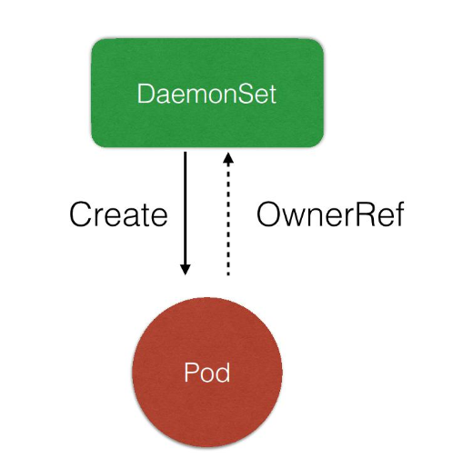
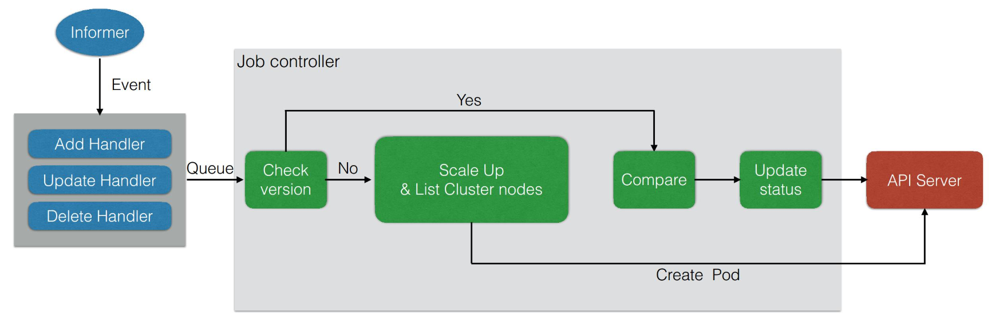

# DaemonSet

## DaemonSet 功能

### 需求来源

如何实现集群中每个节点/指定节点都运行同一个 pod?

需要解决的问题:

1. 如何保证每个节点都运行一个 pod?

2. 如果新节点加入集群, 如何感知并部署相应的 pod?

3. 如果有节点推出, 如何删除对应的 pod?

4. 如果 pod 状态异常, 如何监控并恢复 pod 的状态?

### DaemonSet 作用

1. 保证集群内每一个节点/指定节点都运行一组相同的 pod.

2. 跟踪集群节点状态, 保证新加入的节点自动创建对应的 pod.

3. 跟中集群节点状态, 保证溢出的节点删除对应的 pod.

4. 跟踪 pod 状态, 保证每个节点 pod 处于运行状态.

### 使用场景

1. 集群存储进程: glusterd, ceph

2. 日志收集进程: fluentd, logstash

3. 需要在每个节点运行的监控收集器

## 语法

[daemonset.yaml](./yamls/daemonset.yaml)

```shell
# 查看更新状态
kubectl rollout status ds/${ds-name}
```

### 更新策略

1. RollingUpdate(默认)
  > 当更新 DaemonSet.spec.template 后, 旧的 pod 会被先删除, 然后创建新的 pod.
  > 更新完成一个节点上的 pod 后才会更新下一个节点的的 pod.

2. OnDelete
   > 更新 template 后不会立即更新 pod, 当手动删除旧的 pod 后才会执行更新.


## DaemonSet 架构

### 管理模式


1. DaemonSet Controller 负责根据配置创建 Pod.

2. DaemonSet Controller 跟中 Pod 状态, 根据配置及时重试或继续创建.

3. DaemonSet Controller 会自动添加 affinity&label 来跟中对应的 pod,
   并根据配置在每个节点/指定节点创建 Pod.

4. DaemonSet Controller 监控节点状态, 当节点加入集群会为其创建 Pod,
   当节点删除时会将 Pod 删除.

### DaemonSet Contoller

除了 watch pod/DaemonSet 状态外还会 watch Node 状态.


