# Deployment

## 功能(解决的问题)

### 直接管理 Pod 所面临的问题

1. 如何控制集群中 Pod 的数量

2. 如何为同一类 Pod 更新/回滚版本

3. 发布(更新)过程中如何保证服务的可用性

4. 发布过程中如何实现快速回滚

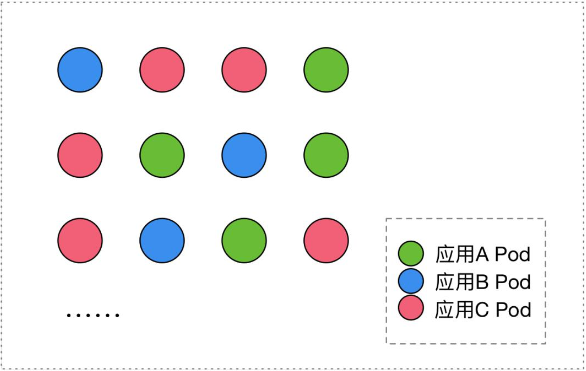

### Deployment 的功能

1. 通过定义一组 Pod 的期望副本数, 使用 Controller 来维持副本数.

2. 通过配置 Pod 的发布方式, Controller 通过给定策略更新 Pod,
   确保更新过程中不可用 Pod 数量在限制范围内.

3. 当发布出现问题时, 支持一键回滚.

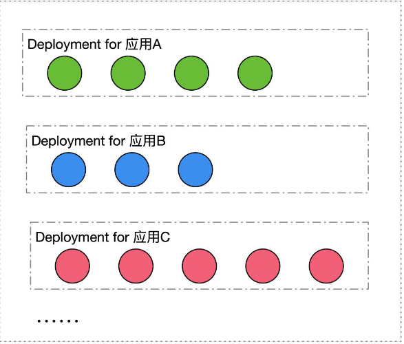

## Deployment 语法

[nginx-deployment.yaml](./yamls/deploy/nginx-deployment.yaml)

```shell
# rs NAME 格式为: ${deploy-name}-{template-hash}
# pod NAME 格式为: ${rs-name}-${random-suffix}

#kubectl get rs
NAME                          DESIRED   CURRENT   READY   AGE
nginx-deployment-779fcd779f   3         3         3       44m

#kubectl get po
NAME                                READY   STATUS    RESTARTS   AGE
nginx-deployment-779fcd779f-7mc7j   1/1     Running   0          41m
nginx-deployment-779fcd779f-pjbmb   1/1     Running   0          41m
nginx-deployment-779fcd779f-pqnnp   1/1     Running   0          41m

# 更新镜像
kubectl set image deployment.v1.apps/${deploy-name} ${container-name}=${img-name:version}
kubectl set image deployment.v1.apps/nginx-deployment nginx=nginx:1.9.1

# 回滚到上个版本
kubectl rollout undo deployment/nginx-deployment

# 查看回滚记录
kubectl rollout history deployment/nginx-deployment

# 回滚到指定版本
kubectl rollout undo deployment/nginx-deployment --to-revision=${version}

# 更新模板与 rs 的关系
```

## Deployment 状态变化

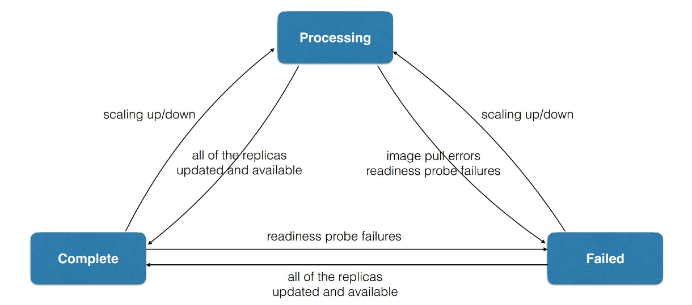

## Deployment 架构

### 管理模式

Deployment 只负责管理不同版本的 ReplicaSet, 由 ReplicaSet 管理 Pod 的副本数.
**每个 ReplicaSet 对应了 Deployment template 的一个版本.**
同一个 ReplicaSet 下的 Pod 版本是相同的.

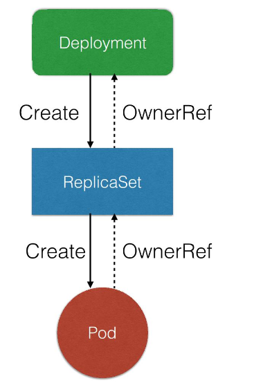

### Deployment 控制器

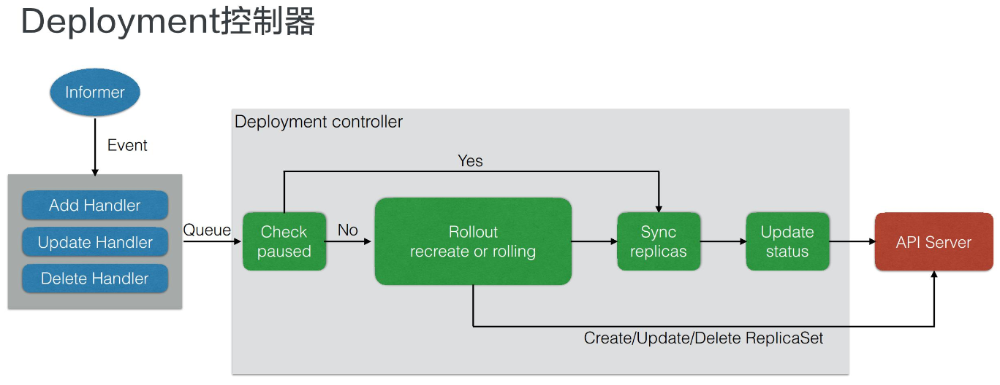

1. Informer watch Event Handler. 收到 Deploy/RS 的 Event 并压入队列中.

2. Deployment Controller 从队列中取出事件. 并 Check Paused.

3. Paused is true
   > 此时只需要对副本数进行同步, 并更新最新状态即可.

4. Paused is false
   > 此时需要做一个新的发布(改变 replicaset)
   > 更新的方式由事件类型决定(有 Update/Create/Delete Rs).

### ReplicaSet 控制

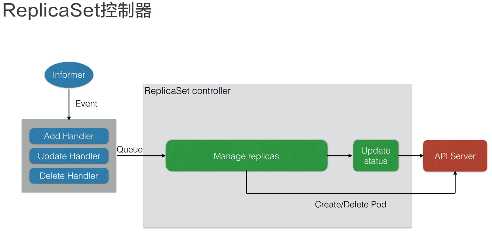

1. Informer watch Event Handler. 收到 RS/Pod 的 Event 并压入队列中.

2. RS Controller 从队列中取出事件.

3. 通过删除/创建 pod 进行副本数的管理.

## 管理操作

### 相关参数

- maxUnavailable
   > 滚动过程中最多有多少个 pod 不可用，默认值是25%

- maxSurge
   > 滚动过程中最多存在多少个 pod 超过期望 replicas 值，默认值是25%

- minReadySeconds
   > 判断 pod avaliable 的最小 pod ready 时间
   > pod avaliable 的前提条件是 pod ready

- revisionHisotryLimit
   > 保留历史版本 RS 的个数(默认为 10)

- paused
   > 标识 Deployment 只做数量维持, 不做新版本发布.

- processDeadlineSeconds
   > 判断 Deployment 状态为 failed 的最大时间.

### 扩容模拟

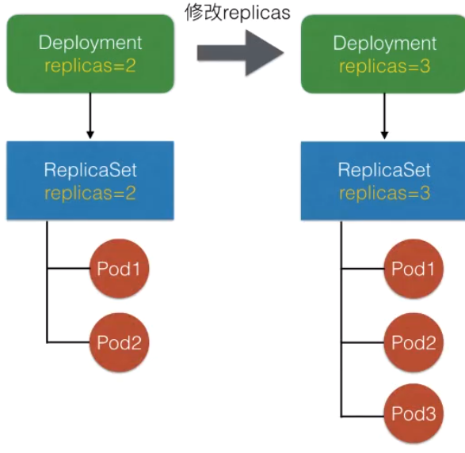

修改了 replicas 后, Controller 会将副本数同步至当前版本的 RS 中, 由 RS 进行扩缩容操作.

### 发布模拟

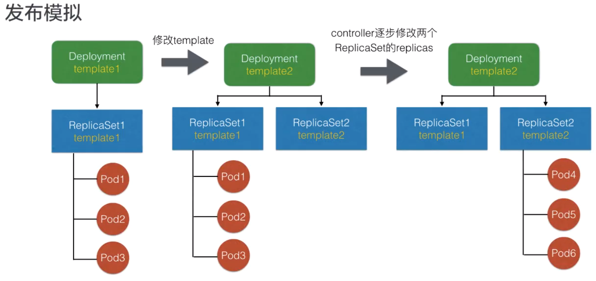

### 回滚模拟

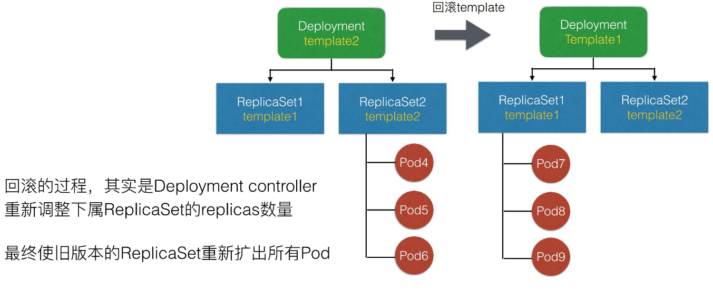

## RS RC 的区别

## 发布策略

### 蓝绿部署

- 定义:
  > 蓝绿部署是不停老版本, 部署新版本然后进行测试.
  > 确认OK, 将流量切到新版本, 然后老版本同时也升级到新版本.

- 步骤
  1. 所有外部请求的流量都打到初始版本上(一开始的状态).
     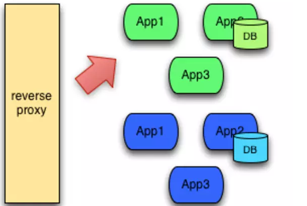
  2. 部署新版本的应用, 并将流量切到新版本应用上.
     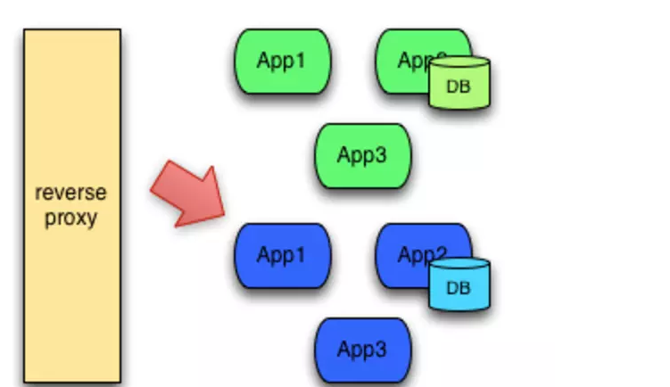
  3. 如果新版本运行正常, 升级旧版本至新版本, 如果有问题则切回旧版本.

- 注意事项
   > 当切换到蓝色环境时，需要妥当处理未完成的业务和新的业务。如果你的数据库后端无法处理，会是一个比较麻烦的问题；
   > 可能会出现需要同时处理“微服务架构应用”和“传统架构应用”的情况，如果在蓝绿部署中协调不好这两者，还是有可能会导致服务停止。
   > 需要提前考虑数据库与应用部署同步迁移 /回滚的问题。
   > 在非隔离基础架构（ VM 、 Docker 等）上执行蓝绿部署，蓝色环境和绿色环境有被摧毁的风险。

### 滚动发布

- 定义:
   > 一般是取出一个或者多个服务器停止服务，执行更新，并重新将其投入使用。周而复始，直到集群中所有的实例都更新成新版本。

- 特点:
   > 这种部署方式相对于蓝绿部署，更加节约资源——它不需要运行两个集群、两倍的实例数。我们可以部分部署，例如每次只取出集群的20%进行升级.

- 缺点:
  1. 没有一个确定OK的环境。使用蓝绿部署，我们能够清晰地知道老版本是OK的，而使用滚动发布，我们无法确定。
  2. 修改了现有的环境。
  3. 如果需要回滚，很困难。举个例子，在某一次发布中，我们需要更新100个实例，每次更新10个实例，每次部署需要5分钟。当滚动发布到第80个实例时，发现了问题，需要回滚，这个回滚却是一个痛苦，并且漫长的过程。
  4. 有的时候，我们还可能对系统进行动态伸缩，如果部署期间，系统自动扩容/缩容了，我们还需判断到底哪个节点使用的是哪个代码。尽管有一些自动化的运维工具，但是依然令人心惊胆战。
  5. 因为是逐步更新，那么我们在上线代码的时候，就会短暂出现新老版本不一致的情况，如果对上线要求较高的场景，那么就需要考虑如何做好兼容的问题。

### 灰度发布/金丝雀发布

- 定义:
   > 灰度发布是指在黑与白之间, 能够平滑过渡的一种发布方式.
   > AB test就是一种灰度发布方式, 让一部分用户继续用A, 一部分用户开始用B, 如果用户对B没有什么反对意见, 那么逐步扩大范围, 把所有用户都迁移到B上面来.
   > 灰度发布可以保证整体系统的稳定, 在初始灰度的时候就可以发现、调整问题, 以保证其影响度, 而我们平常所说的金丝雀部署也就是灰度发布的一种方式.


