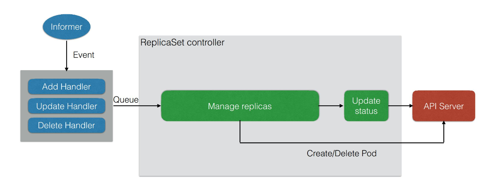

# Deployment

## 功能(解决的问题)

### 直接管理 Pod 所面临的问题

1. 如何控制集群中 Pod 的数量

2. 如何为同一类 Pod 更新/回滚版本

3. 发布(更新)过程中如何保证服务的可用性

4. 发布过程中如何实现快速回滚


### Deployment 的功能

1. 通过定义一组 Pod 的期望副本数, 使用 Controller 来维持副本数.

2. 通过配置 Pod 的发布方式, Controller 通过给定策略更新 Pod, 确保更新过程中不可用 Pod 数量在限制范围内.

3. 当发布出现问题时, 支持一键回滚.


## Deployment 语法

[nginx-deployment.yaml](./yamls/deploy/nginx-deployment.yaml)

```shell
# rs NAME 格式为: ${deploy-name}-{template-hash}
# pod NAME 格式为: ${rs-name}-${random-suffix}

#kubectl get rs
NAME                          DESIRED   CURRENT   READY   AGE
nginx-deployment-779fcd779f   3         3         3       44m

#kubectl get po
NAME                                READY   STATUS    RESTARTS   AGE
nginx-deployment-779fcd779f-7mc7j   1/1     Running   0          41m
nginx-deployment-779fcd779f-pjbmb   1/1     Running   0          41m
nginx-deployment-779fcd779f-pqnnp   1/1     Running   0          41m

# 更新镜像
kubectl set image deployment.v1.apps/${deploy-name} ${container-name}=${img-name:version}
kubectl set image deployment.v1.apps/nginx-deployment nginx=nginx:1.9.1

# 回滚到上个版本
kubectl rollout undo deployment/nginx-deployment

# 查看回滚记录
kubectl rollout history deployment/nginx-deployment

# 回滚到指定版本
kubectl rollout undo deployment/nginx-deployment --to-revision=${version}

# 更新模板与 rs 的关系
```

## Deployment 状态变化


## Deployment 架构

### 管理模式

Deployment 只负责管理不同版本的 ReplicaSet, 由 ReplicaSet 管理 Pod 的副本数.
**每个 ReplicaSet 对应了 Deployment template 的一个版本.**
同一个 ReplicaSet 下的 Pod 版本是相同的.


### Deployment 控制器


1. Informer watch Event Handler. 收到 Deploy/RS 的 Event 并压入队列中.

2. Deployment Controller 从队列中取出事件. 并 Check Paused.

3. Paused is true
   > 此时只需要对副本数进行同步, 并更新最新状态即可.

4. Paused is false
   > 此时需要做一个新的发布(改变 replicaset)
   > 更新的方式由事件类型决定(有 Update/Create/Delete Rs).

### ReplicaSet 控制



1. Informer watch Event Handler. 收到 RS/Pod 的 Event 并压入队列中.

2. RS Controller 从队列中取出事件.

3. 通过删除/创建 pod 进行副本数的管理.

## 管理操作

### 相关参数

- maxUnavailable
   > 滚动过程中最多有多少个 pod 不可用，默认值是25%

- maxSurge
   > 滚动过程中最多存在多少个 pod 超过期望 replicas 值，默认值是25%

- minReadySeconds
   > 判断 pod avaliable 的最小 pod ready 时间
   > pod avaliable 的前提条件是 pod ready

- revisionHisotryLimit
   > 保留历史版本 RS 的个数(默认为 10)

- paused
   > 标识 Deployment 只做数量维持, 不做新版本发布.

- processDeadlineSeconds
   > 判断 Deployment 状态为 failed 的最大时间.

### 扩容模拟


修改了 replicas 后, Controller 会将副本数同步至当前版本的 RS 中, 由 RS 进行扩缩容操作.

### 发布模拟


### 回滚模拟


## RS RC 的区别

## 使用 deploy 实现几种常用的升级策略

### 滚动升级

### 蓝绿部署

### 灰度发布/金丝雀发布
