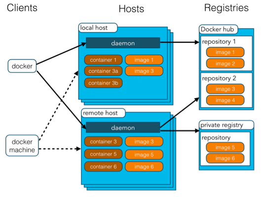

2019.3.25
----
- 删除标签(tag)的两种方式
1. 直接删除镜像，相关的所有tag会被删除` docker rmi -f img_id `
2. 删除repository:tag ` docker rmi repository:tag`
2019.4.25
----
**容器内没有前台进程会自动关闭**
- 查看docker 版本信息
  1. docker version
  2. docker info

- 创建容器 (docker run [opt] img_name [command] [command_args])
  1. -t --tty (添加终端，不添加无法与容器进行交互)
  2. -i --interactive (进入交互模式) 

- 启动停止的容器 (docker start [opt] container_id/name)
  1. -a --attach （尝试启动停止的容器）
  2. -i （进入交互式）

- 查看容器元数据
  1. docker insepct container_id/name

- 向运行中的容器发送命令
  1.docker exec [opt] container_id/name command [command_args]
  2. docker exec -it containerr_id/name /bin/sh 进入容器

- 打包镜像
  1. docker save img_1 img_2 img_3 -o output_file

- 加载镜像
  2. docker load -i tar_file

- 容器的几种状态
  1. created
  2. started
  3. runnig
  4. paused
  5. stopped
  5. deleted

2019.5.15
----
>  docker rm/rmi/stop/start等命令的参数都可以是list
> 如：docker rmi $(docker images -a -q)其中socker images -a -q 通常会返回多个值
- docker架构

- docker ps -q/--quite docker images -q/--quite
> Only display numeric IDs

- 构建镜像
  1. docker commit 
  2. docker build

- docker exec -it container_id /bin/bash
> 进入正在运行的容器

- docker attach
> Usage:  docker attach [OPTIONS] CONTAINER, 打开容器的stdin，如果输入exit会结束容器
> ctrl + p + q 退出不终止容器

- docker cp 
> Copy files/folders between a container and the local filesystem

### docker 网络
- 创建容器时指定容器ip（只能在自定义网络场景中使用）
> run --ip ip_address img

#### docker 默认的四种网络模式
- bridge模式
> docker默认的网络模式，该模式创建容器时会为容器分配一个network namespace,。
> 容器会虚拟出一个自己的网卡，默认会连接到宿主机上一个虚拟网桥docker0上，容器的网关就是docker0的IP

- host 模式
> 该模式创建容器时不会为容器分配一个网络名称空间，而是和宿主机公用一个网络名称空间。
> 容器也不会虚拟出自己的网卡，配置自己的IP等，而是使用宿主机的 IP 和端口

- container 模式
> 该模式新创建的容器和已经存在的一个容器共享网络名称空间
> 因此容器的 IP 端口都是和已存在的容器共享的

- none 模式
> 该模式创建的容器会拥有自己的网络名称空间，但是不会进行任何网络配置。
> 因此这样创建的容器再不进行网络配置的前提下是无法进行网络通信的

#### 其他网络模式
- flannel + etcd
> 需要修改docker启动配置，使其使用flannel进行IP分配
> 每台运行docker守护进程的宿主机运行flannel，并使用etcd保存flannel的数据
> 原理：
  1. 在etcd中规划所有宿主机的docker0子网范围
  2. 每台宿主机上的flanneld进程根据etcd的配置信息，为主机的docker0分配子网，保证所有docker0网段不重复，并将docker0与宿主机IP的映射关系保存至etcd中
  3. 当不同宿主机上的容器需要通信时，首先由flanneld查找etcd并获取目的容器的宿主机的IP
  4. flanneld将源容器发送的报文封装成UPD报文，由宿主机以目的宿主机IP封装成IP报文
  5. 由于目的IP是宿主机IP因此上面封装的IP报文是路由可达的
  6. IP发送到目的宿主机后，由宿主机解析并获取原始数据包，然后通过docker0转发至目的容器