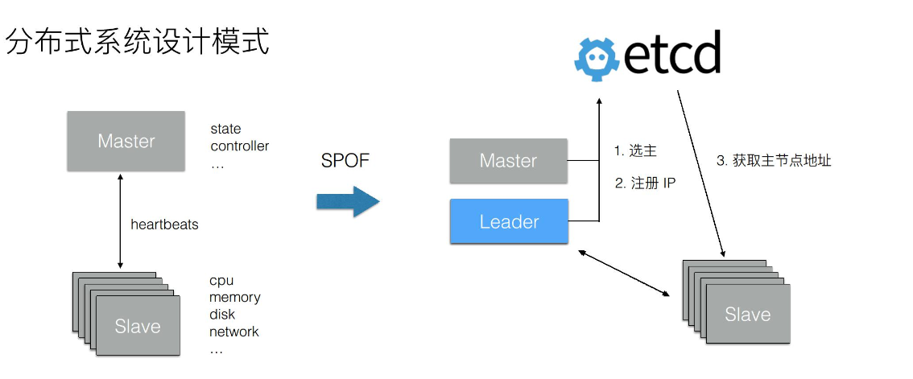

# ETCD

A distributed, reliable key-value store for the most critical data of a distributed system.

## 概念

- Raft: etcd所采用的保证分布式系统强一致性的算法。
- Node: 一个Raft状态机实例。
- Member:  一个etcd实例。它管理着一个Node，并且可以为客户端请求提供服务。
- Cluster: 由多个Member构成可以协同工作的etcd集群。
- Peer: 对同一个etcd集群中另外一个Member的称呼。
- Client:  向etcd集群发送HTTP请求的客户端。
- WAL: 预写式日志，etcd用于持久化存储的日志格式。
- snapshot: etcd防止WAL文件过多而设置的快照，存储etcd数据状态。
  > 默认每 10000 条记录做一次 snap
- Proxy: etcd的一种模式，为etcd集群提供反向代理服务。
- Leader: Raft算法中通过竞选而产生的处理所有数据提交的节点。
- Follower: 竞选失败的节点作为Raft中的从属节点，为算法提供强一致性保证。
- Candidate: 当 Follower 超过一定时间接收不到 Leader 的心跳时转变为 Candidate 开始竞选。
- Index: 数据项编号。Raft中通过term和Index来定位数据。
- term(64bits): 某个节点成为 Leader 到下一次竞选之前，称为一个term(term 编号全局递增).
- revision(64bits): 事务序列号(全局递增, 不受 term 影响)
- create_revision: 数据项创建时的 revision
- mod_revision: 数据项最后一次改变时的 revision
- version: 数据的版本, 每改变一次增加 1.


## Commands

```shell
# 存储/修改数据
etcdctl put ${key} ${value}

# 取数据
etcdctl get ${key}

## 取所有 key-prefix 开头的 key 的数据
etcdctl get ${key-prefix} --prefix

## 取 [key1, key2) 之间的所有数据
etcdctl get ${key1} ${key2}

## 以 json 格式显示数据详细信息
etcdctl get ${key} -w json

# 删除数据
etcdctl del ${key}

# watch 数据
etcdctl watch ${key}
etcdctl watch ${key-prefix} --prefix

# 交互式事务
etcdctl txn -i
```

## Raft consensus algorithm

共识算法(Consensus Algorithm): 分布式数据一致性算法.

Raft 中节点可能存在的状态:

- Follower

- Candidate

- Leader

### Leader 选举

### 日志同步

## Transation(事务)

## Lease(租约)

## 数据存储

磁盘数据存储的结构是 balance tree.

## MVCC & Streaming Watch

## 应用场景


s


## 相关链接:

[Raft 算法演示](http://thesecretlivesofdata.com/raft)

[raft.github.io](https://raft.github.io/)