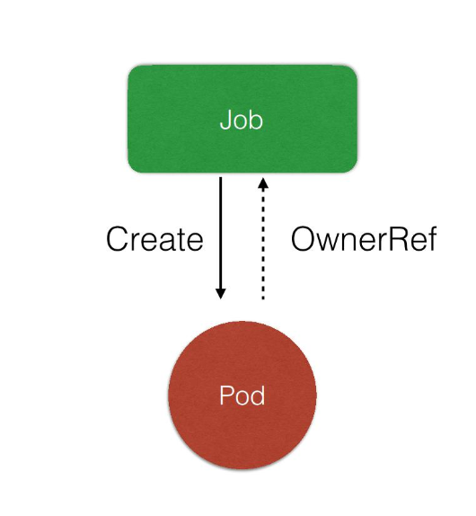
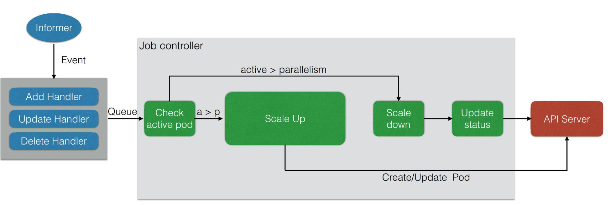

# Job

## Job 功能

### 需求来源

如何通过 Pod 来直接执行**任务**进程?

需要解决的问题:

1. 如何保证 Pod 中的进程正确的结束?

2. 进程执行失败时, 如何进行重试?

3. 如何管理多个相互依赖的进程?

4. 如何并行执行任务, 管理任务队列的大小以及管理并行任务的数量?

### Job 作用

1. 创建一个或多个 Pod 确保指定数量的 Pod 可以成功的运行并结束.

2. 跟踪 Pod 状态, 根据配置及时重试失败的 Pod与重试的次数.

3. 确定依赖关系, 保证上一个任务运行完毕后再运行下一个任务.

4. 控制任务并行度, 并根据配置确保 Pod 队列的大小.

## Job 架构

### 管理模式



1. Job Controller 负责根据配置创建 Pod

2. Job Controller 跟踪 Job 状态, 根据配置及时重试 Pod 或继续创建.

3. Job Controller 会自动添加 lable 来跟踪对应的 pod, 并根据配置并行/串行创建 pod.

### Job 控制器



1. Informer watch/list job/pod resources. 并调用相应的 EventHandler.

2. 检查是否有当前运行的 pod 与期望状态.

3. 如果当前运行 pod 大于期望数, 则 scale down 然后更新状态.

4. 如果小于或者状态不一致, 则更新/添加 pod. 并更新状态.

## CronJob(定时 Job)

定时执行 Job.

主要用于:

- 清理任务

- 构建任务

## 语法

[Job 基本语法](./yamls/job.yaml)

```shell
# 查看 job 状态
kubectl get jobs

# NAME(job-name) COMPLETIONS(完成情况) DURATION(job 运行时长) AGE(job 创建时长)
# job 创建的 pod 的名称的格式: ${job-name}-${random-suffix}
```

### 配置参数

详见[types.go](https://github/kubernetes/kubernetes/pkg/apis/batch/types.go)

```go
// JobSpec describes how the job execution will look like.
type JobSpec struct {

	// Specifies the maximum desired number of pods the job should
	// run at any given time. The actual number of pods running in steady state will
	// be less than this number when ((.spec.completions - .status.successful) < .spec.parallelism),
	// i.e. when the work left to do is less than max parallelism.
	// +optional
	Parallelism *int32

	// Specifies the desired number of successfully finished pods the
	// job should be run with.  Setting to nil means that the success of any
	// pod signals the success of all pods, and allows parallelism to have any positive
	// value.  Setting to 1 means that parallelism is limited to 1 and the success of that
	// pod signals the success of the job.
	// +optional
	Completions *int32

	// Optional duration in seconds relative to the startTime that the job may be active
	// before the system tries to terminate it; value must be positive integer
	// +optional
	ActiveDeadlineSeconds *int64

	// Optional number of retries before marking this job failed.
	// Defaults to 6
	// +optional
	BackoffLimit *int32

	// TODO enabled it when https://github.com/kubernetes/kubernetes/issues/28486 has been fixed
	// Optional number of failed pods to retain.
	// +optional
	// FailedPodsLimit *int32

	// A label query over pods that should match the pod count.
	// Normally, the system sets this field for you.
	// +optional
	Selector *metav1.LabelSelector

	// manualSelector controls generation of pod labels and pod selectors.
	// Leave `manualSelector` unset unless you are certain what you are doing.
	// When false or unset, the system pick labels unique to this job
	// and appends those labels to the pod template.  When true,
	// the user is responsible for picking unique labels and specifying
	// the selector.  Failure to pick a unique label may cause this
	// and other jobs to not function correctly.  However, You may see
	// `manualSelector=true` in jobs that were created with the old `extensions/v1beta1`
	// API.
	// +optional
	ManualSelector *bool

	// Describes the pod that will be created when executing a job.
	Template api.PodTemplateSpec

	// ttlSecondsAfterFinished limits the lifetime of a Job that has finished
	// execution (either Complete or Failed). If this field is set,
	// ttlSecondsAfterFinished after the Job finishes, it is eligible to be
	// automatically deleted. When the Job is being deleted, its lifecycle
	// guarantees (e.g. finalizers) will be honored. If this field is unset,
	// the Job won't be automatically deleted. If this field is set to zero,
	// the Job becomes eligible to be deleted immediately after it finishes.
	// This field is alpha-level and is only honored by servers that enable the
	// TTLAfterFinished feature.
	// +optional
	TTLSecondsAfterFinished *int32
}

type CronJobSpec struct {

	// The schedule in Cron format, see https://en.wikipedia.org/wiki/Cron.
	Schedule string

	// Optional deadline in seconds for starting the job if it misses scheduled
	// time for any reason.  Missed jobs executions will be counted as failed ones.
	// +optional
	StartingDeadlineSeconds *int64

	// Specifies how to treat concurrent executions of a Job.
	// Valid values are:
	// - "Allow" (default): allows CronJobs to run concurrently;
	// - "Forbid": forbids concurrent runs, skipping next run if previous run hasn't finished yet;
	// - "Replace": cancels currently running job and replaces it with a new one
	// +optional
	ConcurrencyPolicy ConcurrencyPolicy

	// This flag tells the controller to suspend subsequent executions, it does
	// not apply to already started executions.  Defaults to false.
	// +optional
	Suspend *bool

	// Specifies the job that will be created when executing a CronJob.
	JobTemplate JobTemplateSpec

	// The number of successful finished jobs to retain.
	// This is a pointer to distinguish between explicit zero and not specified.
	// +optional
	SuccessfulJobsHistoryLimit *int32

	// The number of failed finished jobs to retain.
	// This is a pointer to distinguish between explicit zero and not specified.
	// +optional
	FailedJobsHistoryLimit *int32
}
```
