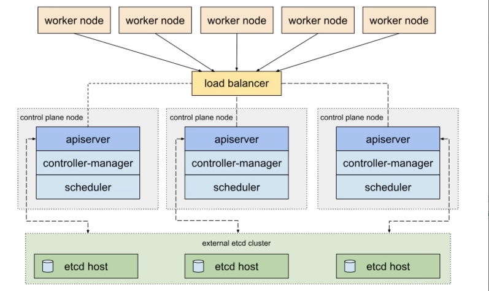

# Kubeadm


## Step

### 初始化设置

1. yum 源配置

2. hostname 设置

3. 内核参数配置
   > `modprobe: FATAL: Module br_netfilter not found.` 问题.
   > 安装 br_netfilter 模块 `yum install -y bridge-utils.x86_64` 后重启.

4. 清空 iptables 规则, 关闭 firewalld, selinux

5. 安装 kubeadm, kubelet, kubectl, docker
   > 需要配置 kubelet 的 cgroup 驱动与 docker 驱动一致(默认为 cgroupfs).

## nginx(haproxy) + keepalived

### 安装

`ansible master -m yum -a'name=nginx state=installed'`
`ansible master -m yum -a'name=keepalived state=installed'`

### 配置

keepalived:

```shell
! Configuration File for keepalived

global_defs {
}

vrrp_instance VI_1 {
    state MASTER          # (BACKUP)
    interface eth0        # 根据实际环境填写
    virtual_router_id 51  # 多个集群时需要修改
    priority 100          # different
    advert_int 1
    authentication {
        auth_type PASS
        auth_pass 1111
    }
    virtual_ipaddress {
        ${VIP}
    }
}
```

nginx:

```nginx
stream {
    upstream kube-apiserver {
       server ${server1}:6443;
       server ${server2}:6443;
       server ${server3}:6443;
    }
    server {
       listen 6443;
       proxy_pass kube-apiserver;
    }
}
```

### Problems

nginx: [emerg] bind() to 172.16.14.146:6443 failed (99: Cannot assign requested address);
需要设置: net.ipv4.ip_nonlocal_bind = 1


## etcd 高可用

kubeadm 有两种集群高可用部署方式, 分别为: 堆叠 etcd, 外部 etcd.

### 堆叠 etcd


Stacked 高可用方式将 etcd 部署在 kubernetes 控制平面上, 静态 Pod 的方式运行 etcd 组件.

每个控制平面上都会部署 apiserver, scheduler, controller-manger 的实例. apiserver 通过负载均衡器暴露给集群中的 worker 节点.
每个控制平面上的 etcd, scheduler, controller-manager 都直接与该平面上的 apiserver 通信.


### 外部 etcd



### kubeadm init

```shell
kubeadm init --image-repository=registry.aliyuncs.com/google_containers \
--control-plane-endpoint=172.16.14.146:6443 \
--pod-network-cidr=10.244.0.0/16 \
--service-cidr=192.168.200.1/24 --upload-certs=true
```

