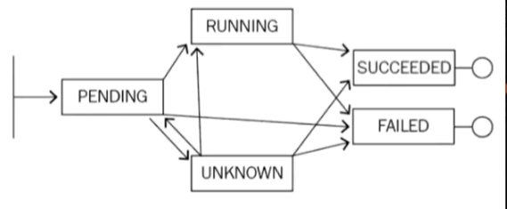
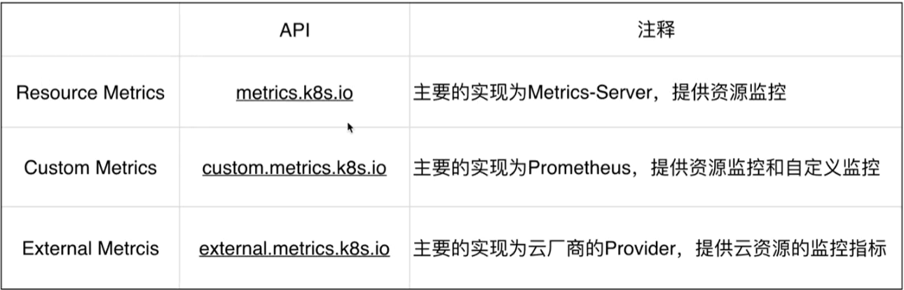
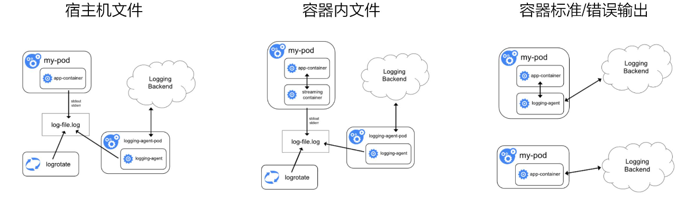
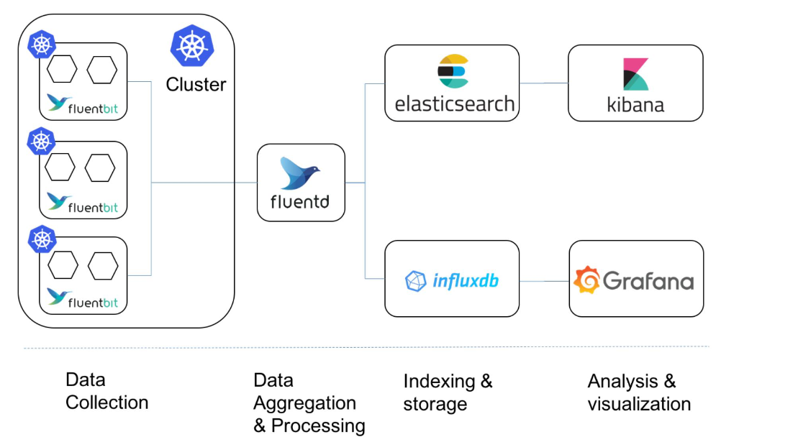

# Kubernetes 应用/服务可观测性

## Observablity

应用状态可以被实时观测.

- 应用健康状态

- 应用资源使用状态

- 应用日志

## Probe

Kubernetes Probe 支持三种不同的探测方式:

- [httpGet](./yamls/probe/httpGet.yaml)
   > 通过发送 httpGET 请求来判断容器状态. 返回 200-399表明服务正常.

- [Exec](./yamls/probe/exec.yaml)
   > 通过执行命令/脚本来检查服务是否正常. 命令/脚本返回 0 则表明服务正常.

- [tcpSocket](./yamls/probe/tcpSocket.yaml)
   > 通过容器的 IP:PORT 进行 TCP 检查. 如果能够建立 TCP 连接则表明服务正常.

Probe 相关参数:

- initialDelaySeconds
   > Pod 启动后延迟多久进行检查, 单位: 秒

- periodSeconds
   > 检查的间隔时间, 默认为 10 秒, 单位: 秒

- timeoutSeconds
   > 探测的超时时间,默认为 1 秒, 单位: 秒.
   > 超时后认为是失败.

- successThershold
   > 探测失败后再次判断成功的阈值, 默认为一次, 单位: 次

- failureThershold
   > 探测失败的重试次数, 默认为 3次, 单位: 次


探测结果:

- Success
   > 容器通过了检查

- Failure
   > 容器为通过检查

- Unknown
   > 没有执行检查

重启策略:

- Always

- OnFailure

- Never

### LivenessProbe

用于判断容器是否存活, 即 Pod 状态是否为 Running, 如果 LivenessProbe 判断容器不健康,
则会触发kubelet**杀掉容器**, 并根据配置的策略判断是否重启容器.
如果默认不配置 LivenessProbe 则任务返回值默认为成功.
适用于支持重新拉起的应用.

### ReadinessProbe

用于判断容器是否启动完成(是否可以正常工作), 即 Pod 的 Condition 是否为 Ready, 如果探测不成功, 则会**将 Pod 从 Endpoint 中移除, 直至下次判断成功, 再将 Pod 挂回到 Endpoint 上**.
适用于启动后无法立即提供服务的应用.

### 使用 Probe 需要注意的事项

1. 调大 timeoutSeconds, 防止在容器压力较高时出现偶发超时.

2. 根据实际情况调整 success/failureThershold 至最佳值.

3. 在容器中执行 shell 脚本一般比在宿主机中慢很多.

4. 使用 tcpSocket 时需要判断遇到 TLS 场景是否会有影响.

## Status



标识应用状态的几个属性:

- Status: Pod 的聚合状态

- State: Container 的聚合状态

- Conditions

- Events: Pod 发生的状态变化事件

## Debug

### Pod 调式

```shell
# 进入容器
kubectl exec -it ${pod-name} [-c ${container-name}] /bin/bash
```

### Service 调试

```shell
# 将本地应用代理至 Service 中
## Telepresence 工具
Telepresence --swap-deployment ${deploy-name}

# 将 Service 代理至本地端口
kubectl port-forwad svc ${svc-name} -n${namespace}
```

### 调试工具(kubectl-debug)

kubectl-debug 工具创建一个新的容器, attach 要调式的 pod 的名称空间.
在不入侵 pod 的情况下, 提供调试工具.

```shell
# 调试
kubectl debug ${pod-name}
```

## Monitor & Alert



### 监控类型

- 资源监控
   > CPU, 内存, 网络等资源的指标

- 性能监控(APM)

- 安全监控
   > 针对安全的监控策略

- 事件监控
   > 异常事件的监控

### Metrics-Server

### Prometheus

### kube-eventer

## Log



### 日志场景

- 主机内核日志

- 容器运行时日志

- Kubernetes 核心组件日志

- Pod/应用 日志

### Fluentd


