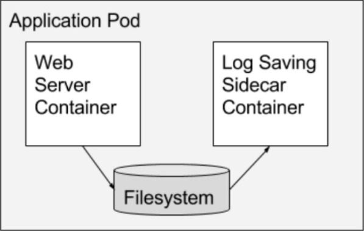
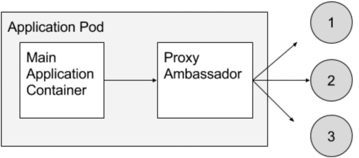
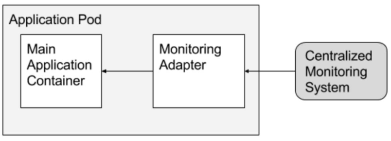
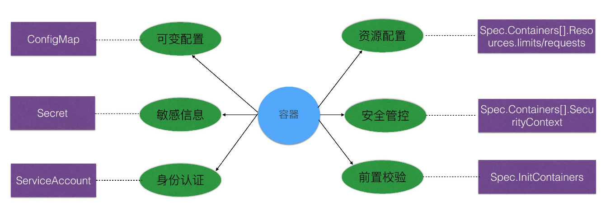

# Pod 笔记

## Pod 是什么

官方介绍:

      A Pod (as in a pod of whales or pea pod) is a group of one or more containers
    (such as Docker containers), with shared storage/network, and a specification for
    how to run the containers. A Pod’s contents are always co-located and co-scheduled,
    and run in a shared context. A Pod models an application-specific “logical host” - it
    contains one or more application containers which are relatively tightly coupled — in
    a pre-container world, being executed on the same physical or virtual machine would mean
    being executed on the same logical host.

翻译:

      Pod 是由一个或多个容器构成的容器组，这些容器共享存储/网络空间(或则资源),
    和使用相同的容器运行策略(故障恢复、镜像拉取原则等). 一个 Pod 中的容器都是一同落地与调度的,
    并且共享上下文环境. Pod 相对其中的容器就像是特定应用的逻辑主机 - Pod 中包含的容器都是
    有紧密联系的 - 对于每个独立容器而言，运行在同一个物理/虚拟机上意味着这些容器运行在同一个逻辑主机上.

## Pod 而不是 Container

### 容器的单进程模型

Linux 容器的“单进程”模型，指的是容器的生命周期等同于 PID=1 的进程（容器应用进程）的生命周期.

### Container 的不足

超亲密关系:

1. 容器之间会发生直接的文件交换

2. 容器之间使用 localhost 或 Socket 文件进行本地通信.

3. 容器之间会发生频繁的 RPC 调用(使用 pod 来减少开销)

4. 容器之间需要共享名称空间.

> 当有多个容器具备超亲密度时, 他们需要相互共享资源以及一同调度.
> 如果以容器为基本调度单元, 会面临多个容器之间协同调度的问题.
> 使用 Pod 可以从根本上解决此类问题, 因为 Pod 中的容器都是一同调度的.
> 即: 只有当计算节点满足 Pod 内所有容器的运行条件时, 才会将容器一同调度至计算节点.

### Pod 解决的问题

1. 网络共享
   > 通过 Infra Container(镜像为: k8s.gcr.io/pause, 大小为 100-200k) 解决.
   > 每一个 Pod 都会启动一个 Infra Container 容器(pause 状态), Pod 内所有容器
   > 都与 Infra Container 共享名称空间, 从而达到所有的容器可以通过 localhost
   > 进行交互.
   > Pod 的生命周期与 Infra Container 生命周期一致.

2. 存储卷共享

### SideCar (边车) 设计模式

通过在 Pod 内定义专门的容器, 来执行对主容器需要的辅助工作.

优点: 解耦, 复用

1. 日志收集
   > 业务容器将日志写入 Volume 里,
   > 日志容器将日志从 Volume 转存至远端存储.
  

2. 代理容器
   > 代理容器对业务容器屏蔽被代理的服务集群
   > 简化业务代码的实现逻辑
   

3. 适配器容器
   > 适配器容器将业务容器暴露出的接口转换为另一种格式
   

## Static Pod(静态 Pod)

静态 pod 在特定节点上直接通过 kubelet 守护进程进行管理, 无法通过 api-server 进行管理(但是可以查看).
静态 pod 的状态监控/管理都是由 kubelet 执行.

### 创建/运行 Static Pod

通过 `kubelet --pod-manifest-path=<the directory>` 或 `kubelet --pod-manifest-path=<directory>` 在 kubelt 启动时,
指定 静态 pod 的配置文件目录/URL. kubelet 会定期进行扫描, 当有文件加入时会创建新 pod, 文件删除时会删除对应的 pod.

## Pod 配置管理

pod 通过资源对应以及相应的 spec 选项进行应用的配置管理,
如 配置文件, 身份认证, 容器资源使用限制等.



### ConfigMap

CM 主要用于管理运行运行所需的配置文件, 环境变量, 命令行参数等应用的**可变配置**.
通过 CM 可以将容器镜像与配置解耦, 从而保障 pod 的可移植性.

[configmap_define](./yamls/pod_management/configmap_define.yaml)

[configmap_use](./yamls/pod_management/configmap_use.yaml)

注意事项:

1. CM 文件大小限制: 1MB(etcd 存储的数据不限制).

2. Pod 只能引用相同 NS 中的 CM.

3. Pod 引用的 CM 不存在时, 无法启动 Pod.

4. 使用 valueFrom 加载 配置时, 部分配置加载失败,  Pod 依然可以正常创建.

5. 只有通过 apiserver 创建的 Pod 可以使用 CM, 如 Static Pod 无法使用 CM.

### Secret

Secret 用于存储密码, token 等敏感资源信息.
使用 base-64 加密算法(相对 CM 更安全, 但也不是很安全)

Secret Type:

```go
  // \kubernetes\pkg\apis\core\types.go
	// SecretTypeOpaque is the default; arbitrary user-defined data
	SecretTypeOpaque SecretType = "Opaque"

	// SecretTypeServiceAccountToken contains a token that identifies a service account to the API
	//
	// Required fields:
	// - Secret.Annotations["kubernetes.io/service-account.name"] - the name of the ServiceAccount the token identifies
	// - Secret.Annotations["kubernetes.io/service-account.uid"] - the UID of the ServiceAccount the token identifies
	// - Secret.Data["token"] - a token that identifies the service account to the API
  SecretTypeServiceAccountToken SecretType = "kubernetes.io/service-account-token"
  // SecretTypeDockercfg contains a dockercfg file that follows the same format rules as ~/.dockercfg
	//
	// Required fields:
	// - Secret.Data[".dockercfg"] - a serialized ~/.dockercfg file
  SecretTypeDockercfg SecretType = "kubernetes.io/dockercfg"
	// SecretTypeDockerConfigJSON contains a dockercfg file that follows the same format rules as ~/.docker/config.json
	//
	// Required fields:
	// - Secret.Data[".dockerconfigjson"] - a serialized ~/.docker/config.json file
  SecretTypeDockerConfigJSON SecretType = "kubernetes.io/dockerconfigjson"
	// SecretTypeBasicAuth contains data needed for basic authentication.
	//
	// Required at least one of fields:
	// - Secret.Data["username"] - username used for authentication
	// - Secret.Data["password"] - password or token needed for authentication
  SecretTypeBasicAuth SecretType = "kubernetes.io/basic-auth"
	// SecretTypeSSHAuth contains data needed for SSH authentication.
	//
	// Required field:
	// - Secret.Data["ssh-privatekey"] - private SSH key needed for authentication
	SecretTypeSSHAuth SecretType = "kubernetes.io/ssh-auth"
	// SecretTypeTLS contains information about a TLS client or server secret. It
	// is primarily used with TLS termination of the Ingress resource, but may be
	// used in other types.
	//
	// Required fields:
	// - Secret.Data["tls.key"] - TLS private key.
	//   Secret.Data["tls.crt"] - TLS certificate.
	// TODO: Consider supporting different formats, specifying CA/destinationCA.
  SecretTypeTLS SecretType = "kubernetes.io/tls"
	// SecretTypeBootstrapToken is used during the automated bootstrap process (first
	// implemented by kubeadm). It stores tokens that are used to sign well known
	// ConfigMaps. They are used for authn.
	SecretTypeBootstrapToken SecretType = "bootstrap.kubernetes.io/token"
```

[secret](./yamls/pod_management/secret.yaml)

[secret_use](./yamls/pod_management/secret_use.yaml)

Secret 注意事项:

1. Secret 文件不能大于 1MB.

2. 考虑到更安全的方式, 可以使用 kubernetes + vault

3. 获取 Secret 建议使用 GET, list/watch 会全部获取.


### ServiceAccount

ServiceAccount 主要用于 **Pod** 在集群中的身份认证.
认证授权信息的存储使用 Secret.

[serviceaccount](./yamls/pod_management/serviceaccount.yaml)

Pod 访问集群认证过程:

1. Pod 创建时 Admission Controller 会根据指定的 ServiceAccount 将对应的
   Secret 挂在到容器目录(/var/run/secrets/kubernetes.io/serviceaccount) 中.

2. 当 Pod 访问集群时, 先使用 ca.crt 校验服务端, 然后用 Secret 中的 token 来认证
   Pod 的身份.

3. Pod 身份被认证后, 通过 RBAC 来配置权限(默认权限为 GET)

### 容器资源配置管理(resources)

[resources](./yamls/pod_management/resources.yaml)

Pod 服务质量 (QoS) 配置: 通过配置不同的服务质量. 当资源不足时会优先驱逐优先级低的 Pod.

- Guaranteed:
  > Pod 中的每个容器必须有 CPU 和 内存的 requests 和 limits, 且必须一样.

- Burstable:
  > Pod 里至少有一个容器有内存或 CPu 的 requests

- BestEffor:
  > 都没有

### Security Context

通过 Security Context 来配置容器的权限/限制行为, 从而保障系统和其他容器的安全.

级别:

1. 容器级别的 Security Context 仅对指定容器生效

2. Pod 级别的 Security Context 对 Pod 内的所有容器生效

3. Pod Security Policies(PSP) 对集群内所有容器生效

权限:

1. Discretionary Access Control: 根据 uid gid 控制文件的访问权限.

2. SELinux: 通过 SELinux 的策略控制用户/进程对文件的访问控制.

3. privileged: 配置容器的特权模式.

4. Linux Capabilities: 给特定进程配置特权模式.

5. AppArmor: 控制可执行文件的访问控制权限(读写文件/目录/网络端口)

5. Seccomp: 控制进程可用的系统调用.

5. AllowPrivilegeEscalation: 控制一个进程是否可以获取比父进程更过的权限.

### InitContainer

通过 InitContainer 来执行业务容器所要的环境初始化操作, 及验证工作.

特点:

1. InitContainer 先于 Container 执行, IC 执行成功后才会启动 Container.

2. Pod 中多个 IC 会按顺序执行, Container 则是并行启动.

3. IC 执行成功后就退出且不再重启.
