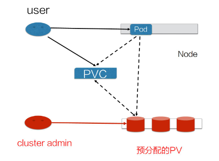
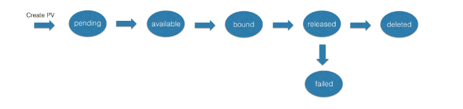
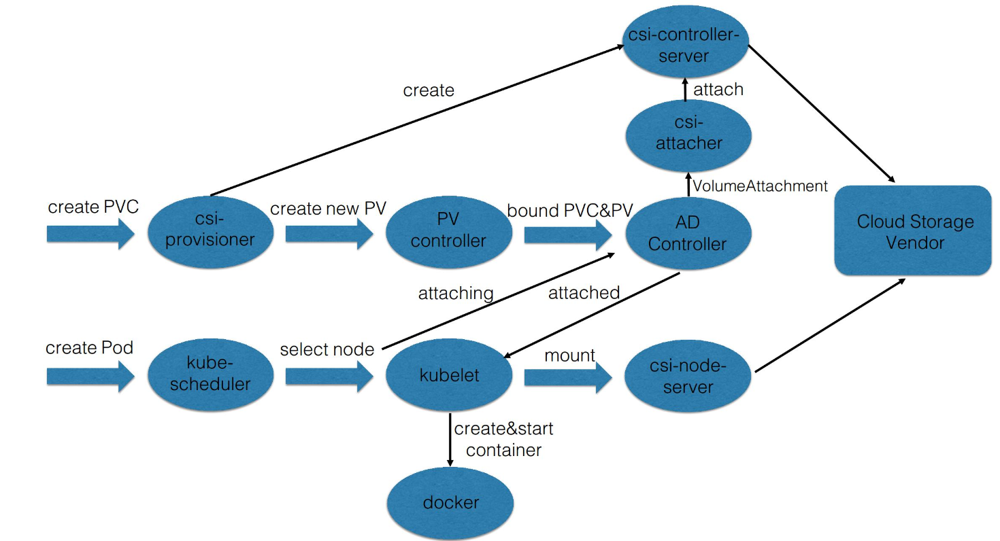

# Kubernets 存储

## 本地存储

### 使用场景(Pod 与 Volume 生命周期相同)

1. 保证容器挂起时数据不丢失.

2. 容器间数据共享.

### emptyDir

运行 pod 时在宿主机上创建临时目录, pod 删除后宿主机目录也删除

### hostPath

将宿主机目录挂载到 pod 上, pod 删除后宿主机目录不变

## 网络存储

- in-tree(kubernetes 内置)

- out-of-tree(与 kubernetes 实现解耦)

## Projected Volume

## PV & PVC

将存储与计算分离, 使用不同 Controller 管理计算与存储资源,
解耦 Pod 与 Volume 的生命周期管理.

### 使用场景

1. Pod 重建销毁(如镜像升级等), 数据保留

2. 宿主机故障迁移

3. Pod 间数据共享

4. 存储卷快照, 扩缩容

### PV PVC

PVC 提供用户申请与使用存储资源的接口, PV 是具体的后端存储.
PersistentVolumeController 将 ${pv-name} 与 ${pvc-name} 绑定.

### Static Volume Provisioning

管理员预分配 PV, 用户通过 PVC 使用具体的 PV.

### Dynamic Volume Provisioning

管理员创建 StorageClass 模板文件, 用于通过 PVC 输入具体的数值.
由模板动态生成相应的 PV.

### PV 状态流转

### PV+PVC 处理流程

