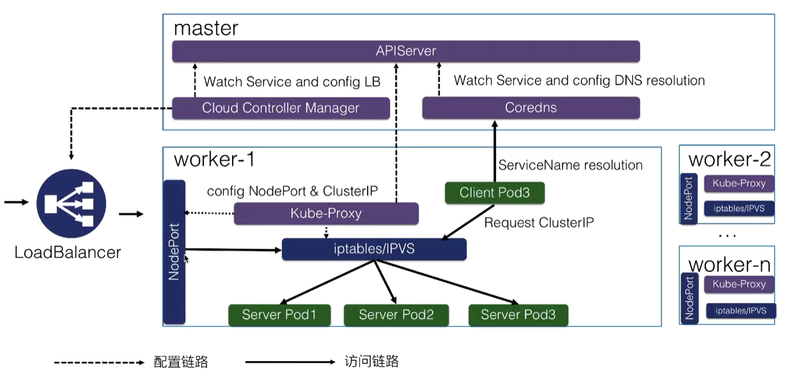

# Kubernetes Service

Kubernetes 中的服务发现与负载均衡.

## Service Discovery

## Type

### ClusterIP

提供了集群内部的服务发现以及负载均衡能力;
内部 Pod 可以通过 ClusterIP 访问指定的应用;
使用 ClusterIP 进行负载均衡;

#### Headless Service

通过 ServiceName 解析值 PodIP 而不是 ClusterIP. 进行负载均衡

[Headless Service](./yamls/headless.yaml)

### NodePort

> 在**所有 node 节点暴露指定端口**，通过 node_ip + nodeport 访问对应的应用，可以实现集群外部访问

### Loadbalancer

> 将服务以公网 IP + port 形式暴露出来
> 有一个很大的缺点(浪费公网 IP)

## 访问

- 直接通过 ${ServiceIP:Port} 进行访问

- 通过 ${ServiceName.namespace} 进行访问(当 ns 为空时，默认在后面追加当前 ns 的名字).

